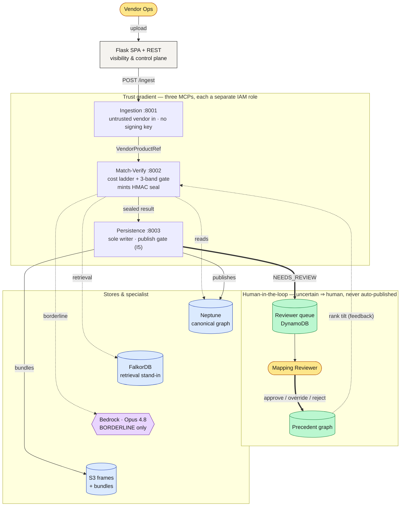
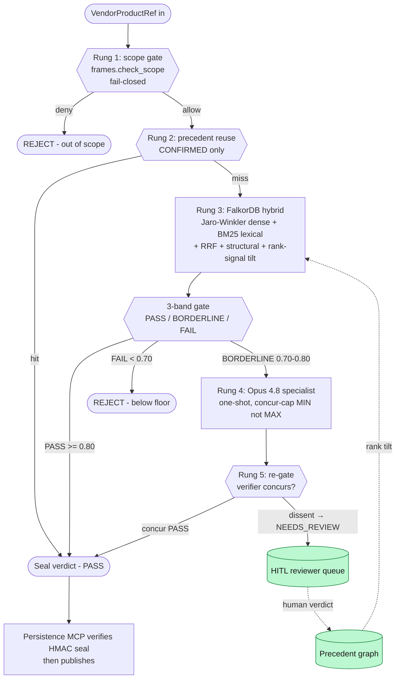
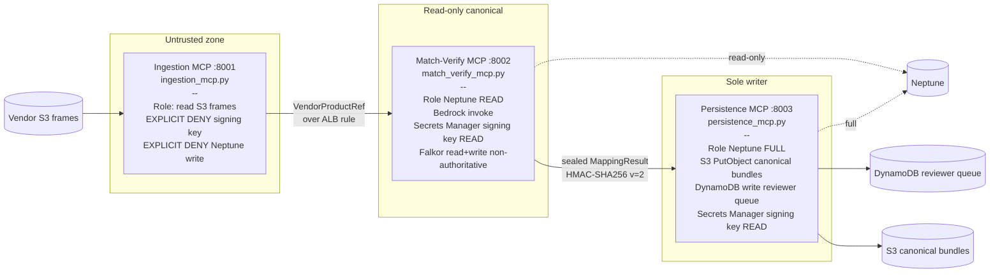
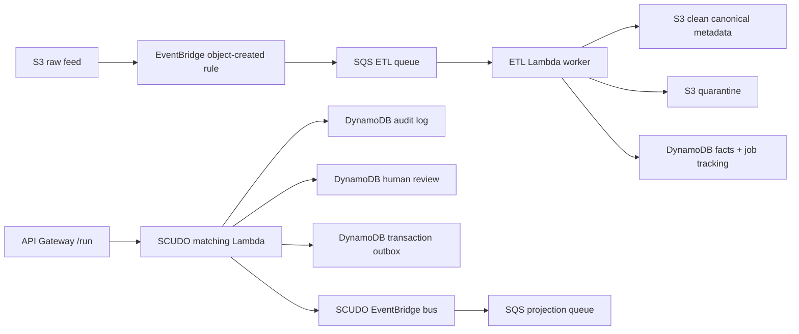
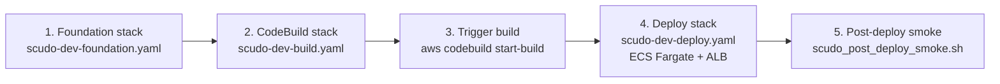

# SCUDO MatchMaker

Deterministic vendor-to-canonical product mapping with a three-MCP trust gradient, a five-rung cost ladder, and a verifier gate.

> **🟢 Live demo:**
> - Formal PoC: https://d1n9fcdyynpn9j.cloudfront.net/cogJPMdemo/
> - Stakeholder: https://dp4ji14se0pct.cloudfront.net/cogJPMdemo/
>
> The SCUDO Matching Comprehension dashboard: the interactive **Upload & Test**
> flow (upload a vendor CSV/JSON → watch it stream live through ETL → matcher),
> **always-visible HITL** (Approve / Override / Reject), and **reviewer-tunable
> confidence bands** (move the borderline window → re-band live + re-run).
> Deployed to `scudo-poc` (account `954976331678`, `us-east-1`) from image
> `c250e34`; the upload (`/api/mapping/ingest/stream`), matcher
> (`/api/mapping/agent/run`), and band-override (`/api/mapping/map`) flows are
> verified live end-to-end. **Auth is currently dev-open — closed demo only; see
> the auth gate in "What is NOT done" before external exposure.**

> **Status:** 86 mapping + 8 auth smoke tests passing. The current AWS target is the Cognizant cloudboost account `954976331678` in `us-east-1`, with stack `scudo-poc` providing the Lambda/API and the event-driven ETL substrate. The older ECS/Fargate dev templates remain under `infra/` for the `eu-west-2` sandbox. **This is a dev sandbox**, **not** the JPMC SCUDO production account. Treat all thresholds, dense-arm similarity, and Neptune retrieval as uncalibrated stand-ins until the production cutover.

## SCUDO as the visibility platform

SCUDO is the **visibility platform** for the matching backend. The three-MCP trust gradient, the cost ladder, the HMAC seal, and the reviewer queue aren't just plumbing — they are the audit surface that makes every mapping decision inspectable end-to-end. The Flask SPA + REST tier exposes that surface to the operator: dataset config, the reviewer queue, the per-decision trajectory, and the sealed verdict are all visible artefacts. Read the backend through this lens — every component exists to make the decision **visible, attributable, and reversible**, not merely to compute it.

---

## What is this

SCUDO MatchMaker proposes mappings between **untrusted vendor product references** (rows from S&P Global, Bloomberg, etc.) and the **canonical SCUDO product graph**. It is a sandbox prototype of the matcher that would sit behind the JPMC SCUDO canonical product service: same shape, same invariants, same trust gradient, but with FalkorDB as a non-authoritative local stand-in for Neptune and with the dense-similarity arm wired to Jaro-Winkler rather than a real embedding model.

The codebase is built around two non-negotiable ideas. First, a **first-match-wins cost ladder** — scope gate, precedent reuse, FalkorDB hybrid retrieval, Opus 4.8 specialist, then a deterministic 3-band gate — so the expensive arms only run when the cheap ones cannot decide. Second, a **three-MCP trust gradient** enforced by separate ECS task roles: Ingestion (port 8001) sees vendor data but is explicitly denied the signing key; Match-Verify (port 8002) reads Neptune and calls Bedrock but writes nothing canonical; Persistence (port 8003) is the only writer and holds the publish gate.

What this repo is **not**: a complete SCUDO. There is no production Neptune retrieval (the `find_similar_products` SPARQL implementation is a placeholder returning `similarity=0.0`), the dense-arm similarity is a string metric pretending to be a vector, and the PASS ≥0.80 / BORDERLINE ≥0.70 bands are unvalidated against any golden set. See [What is NOT done](#what-is-not-done).

---

## Architecture at a glance

Read the flow top-to-bottom: a vendor file enters at the top, travels the
three-MCP spine left-to-right, and anything the system isn't sure about exits into
the **human-in-the-loop** (green), whose decisions loop back to make future matches
better. Solid arrows are the publish path; dotted arrows are reads / advisory signals.



The thick green loop is the point: a mapping the matcher can't confidently decide is
written to the reviewer queue as `NEEDS_REVIEW` — never to the canonical graph — and a
human's verdict feeds the precedent graph that tilts the next match. See
[Human-in-the-loop by design](#human-in-the-loop-by-design).

---

## Human-in-the-loop by design

SCUDO never auto-publishes a mapping it isn't sure about. Human review is a
first-class stage of the pipeline, not a bolt-on — five mechanisms keep the human in
control of every uncertain decision:

1. **Uncertain mappings escalate; they don't guess.** A mapping auto-publishes only
   when it clears the gate cleanly — a confirmed-precedent reuse, or a PASS band the
   Opus specialist concurs with. A BORDERLINE result the specialist can't confirm
   (verifier dissent), or one a reviewer-tightened window pushes below PASS, is marked
   `NEEDS_REVIEW` and routed to the reviewer queue — *not* the graph of record. (When,
   exactly, is the [cost ladder](#the-matching-cost-ladder) below.)
2. **The publish gate is hard (invariant I5).** Persistence is the *only* writer and
   refuses any verdict whose HMAC seal it can't verify. There is no code path that
   writes canonical data around a NEEDS_REVIEW decision — releasing one requires a
   human.
3. **The review surface is always visible.** In the dashboard, Approve / Override /
   Reject and the decision reasoning render on load (not hidden until a borderline run
   happens), and each action is prerequisite-gated by the backend result — a reviewer
   can't approve a mapping that has no candidate, or override without an alternative.
4. **Reviewers set the risk threshold, live.** The borderline window is reviewer-movable
   *per request*; re-running with a tighter or looser window changes what auto-maps
   versus what escalates. The human owns the threshold — it is not a hard-coded constant.
5. **Decisions compound.** Approve / override / reject feed the precedent graph, which
   tilts future retrieval ranking — so each human decision makes the next similar
   mapping cheaper and more likely to clear without review.

Every decision is attributable and reversible: the per-decision trajectory, the sealed
verdict, and the human action are all recorded artefacts — the [visibility
platform](#scudo-as-the-visibility-platform) lens. Implementation:
`feedback.py` (write-back → precedent), `persistence_mcp.py` + `verdict.py` (publish
gate), and the dashboard HITL surface in
[Matching dashboard](#human-in-the-loop--reviewer-tunable-bands).

---

## The matching cost ladder

Five rungs. First match wins. Anything reaching the gate must clear the 0.80 pass edge.



Implementation lives in `backend/scudo_mapping_mcp/matching.py`. Validations and field normalisation in `validations.py`. The HMAC verdict seal contract is in `verdict.py` — `v=2` carries the band, Persistence refuses any agent-passed verdict dict.

The PASS / BORDERLINE / FAIL cuts above are the **defaults** (`confidence_floor = 0.75`, `borderline_half_width = 0.05` from `config.py`, yielding PASS ≥0.80 and BORDERLINE ≥0.70). A reviewer can override the window **per request**: the dashboard sends `confidence_floor` + `borderline_half_width` to `/api/mapping/map` (and `/agent/run`), which re-band the same dense score live — see [Matching dashboard](#matching-dashboard-upload--test-interactive-pipeline).

---

## Trust gradient (three MCPs)

IAM, not application code, enforces the isolation. Each MCP runs as a separate ECS Fargate service with its own task role.



The seal is the contract. Ingestion cannot mint one (no key). Match-Verify mints; Persistence verifies before letting anything past invariant I5 (the publish gate).

---

## Repo layout

```
backend/scudo_mapping_mcp/
  ingestion_mcp.py         # MCP server :8001 - untrusted vendor in, normalise to VendorProductRef
  match_verify_mcp.py      # MCP server :8002 - cost ladder + 3-band gate; emits sealed MappingResult
  persistence_mcp.py       # MCP server :8003 - sole writer; verifies HMAC seal; publish gate
  matching.py              # Cost ladder implementation (rungs 1-5, first-match-wins)
  frames.py                # _read_vendor_frame (mock -> S3 cutover) + check_scope (rights/entitlement)
  feedback.py              # M4 HITL write-back; approve/override/reject feeds precedent rank signal
  validations.py           # M5 deterministic checks: scope_compatible, identifier_resolves, data_class_match
  bundle.py                # M6 portable mapping bundle - versioned, diffable, cutover artifact
  hydrate.py               # M6 hydration - replays canonical bundle from S3 into FalkorDB at boot
  verdict.py               # HMAC-SHA256 verdict seal v=2; trust-gradient integrity contract
  agent.py                 # M9 agent runner behind POST /api/mapping/agent/run; Opus-driven MCP tool use
  models.py                # Pydantic contracts: MappingStatus, Candidate, MappingResult, etc
  config.py                # Three-seam env-var contract; STORE_BACKEND selects falkordb | neptune
  store/
    base.py                # The seam - retrieval operations interface; never query strings
    factory.py             # Single decision point: which backend, from config
    falkordb_store.py      # FalkorDB backend - Cypher; Jaro-Winkler dense stub; pure-Python BM25
    neptune_store.py       # Neptune backend - SigV4 SPARQL; find_similar_products is M9 PLACEHOLDER
  tests/
    smoke.py               # 86 mapping smoke gates - no pytest dependency
    fake_store.py          # In-memory store for unit-level tests

backend/
  app.py                   # Flask entrypoint; auth, route registration, before_request hook
  auth.py                  # Gateway-header principal resolver; AuthError -> 401
  routes/mapping.py        # Flask REST surface that proxies the matcher (Match-Verify in-process today)
  tests/test_auth.py       # 8 auth smoke tests
  Dockerfile               # Single image, four entrypoints (Flask + 3 MCPs)
  requirements.txt

backend/scudo/
  template.yaml             # us-east-1 SAM stack: API + ETL/EventBridge/SQS/S3/DynamoDB substrate
  lambda_handler.py         # API Gateway /run + /health; writes audit/outbox/review records when wired
  etl_handler.py            # SQS-backed raw S3 object processor: clean canonical or quarantine
  aws_resources.py          # Lazy boto3 adapter for audit/events/table writes

infra/
  scudo-dev-foundation.yaml  # VPC, IAM roles, Neptune, S3, ECR, Secrets, DynamoDB queue
  scudo-dev-deploy.yaml      # ECS cluster, 5 services, ALB w/ 4 listener rules, Cloud Map
  scudo-dev-build.yaml       # CodeBuild project + scoped service role
  scudo-dev-frontend.yaml    # S3 + CloudFront with ALB passthrough (written, not deployed)
  buildspec.yml              # Single-quoted-everywhere CodeBuild buildspec
  scudo_post_deploy_smoke.sh # Hits /api/* + /mcp/*; dumps target-group health

frontend/                    # React SPA (Vite); reviewer queue UI + provider/dataset admin

docs/okf/scudo/              # navigable OKF knowledge bundle (start at index.md)
```

---

## Tests

```
86 mapping smoke tests   # cost ladder, scope gate, seal verify, store seam, bundle round-trip, fusion, hydrate
 8 auth smoke tests      # gateway header + principal + 401 cases
```

The smoke runner is standalone — no pytest dependency. Run from `backend/`:

```bash
python -m scudo_mapping_mcp.tests.smoke     # 86 mapping gates
python -m tests.test_auth                   # 8 auth gates
```

No golden-set evaluation harness is wired up yet. The smoke suite verifies wiring and invariants, not retrieval quality.

---

## Run locally

The integrated backend doesn't ship a root `docker-compose.yml` yet (#14 follow-up). For now, start FalkorDB by hand and run each service from a Python venv.

```bash
# 1. FalkorDB sidecar (Docker Desktop or `falkordb/falkordb` directly in WSL)
docker run -d --name falkordb -p 6379:6379 falkordb/falkordb:v4.10.4

# 2. Backend (Flask + 3 MCPs share one image, four entrypoints)
cd backend
python -m venv .venv && source .venv/bin/activate   # Windows: .venv\Scripts\activate
pip install -r requirements.txt

export STORE_BACKEND=falkordb
export FALKORDB_URL=falkordb://localhost:6379
export VERDICT_SIGNING_KEY=dev-only-not-a-real-secret
export SCUDO_AUTH_ALLOW_DEV=1
export SCUDO_AUTH_DEV_PRINCIPAL=local@dev

# Each MCP is its own entrypoint; run in separate terminals (or backgrounded):
python -m scudo_mapping_mcp.ingestion_mcp        # :8001
python -m scudo_mapping_mcp.match_verify_mcp     # :8002
python -m scudo_mapping_mcp.persistence_mcp      # :8003

# Flask SPA + REST (in another terminal):
gunicorn -b 0.0.0.0:5000 -k gthread --threads 4 --timeout 300 app:app

# 3. Frontend (in another terminal)
cd ../frontend
npm install && npm run dev
```

Switching to Neptune locally is not supported — Neptune is reachable only from inside the VPC.

---

## Deploy to AWS cloudboost account

Current connected account: `954976331678` (`cb4115669a-genaipocs-aw`) in `us-east-1`.

> **Operational runbooks** (CloudShell, for an operator with AWS creds — the
> local repo has none):
> - `infra/DEPLOY_RUNBOOK_scudo-poc.md` — full deploy (clone → dashboard sync →
>   backend image → smoke → security gates → rollback).
> - `infra/build_dashboard_dist.sh` / `infra/deploy_dashboard_cloudshell.sh` —
>   build+vendor the dashboard / publish to S3 `/demo/` + invalidate.
> - `infra/REDEPLOY_NOTE_branding.md` — re-publish to both `/demo/` and the
>   base-rewritten `/cogJPMdemo/` path.
> - `infra/SMOKE_upload_flow_live.md` — live Upload & Test smoke (curl SSE +
>   browser); `infra/SMOKE_FIXES_round1.md` — round-1 findings + fixes.

The deployable AIA stack is [`backend/scudo/template.yaml`](backend/scudo/template.yaml). It matches the target diagram's first AWS slice: raw/clean/quarantine/catalog S3 buckets, EventBridge + SQS routing, ETL Lambda, DynamoDB audit/facts/HITL/outbox tables, and the Bedrock-backed matching Lambda/API. See [`backend/scudo/DEPLOY.md`](backend/scudo/DEPLOY.md) for exact CloudShell commands.



Cost-bearing always-on stores from the full target architecture are exposed as parameters, not created by default: `NeptuneSparqlEndpoint`, `OpenSearchEndpoint`, and `AuroraClusterArn`. Pass existing endpoints during deploy when those managed stores are ready.

### Legacy ECS dev sandbox

Target: `954976331678` / `eu-west-2` (Cognizant cloudboost). **Not JPMC.**



1. **Foundation** — `infra/scudo-dev-foundation.yaml` creates the VPC (2 public + 2 private subnets), three IAM task roles enforcing the trust gradient, Bedrock + ECR + CloudWatch Logs interface endpoints, Neptune cluster, S3 frames bucket, ECR repo, KMS-encrypted Secrets Manager signing key (M-V + Persistence read, Ingestion explicit-Deny), DynamoDB reviewer queue.
2. **CodeBuild stack** — `infra/scudo-dev-build.yaml` provisions the CodeBuild project. One-time GitHub credential setup is required for private repos (`aws codebuild import-source-credentials --auth-type PERSONAL_ACCESS_TOKEN --server-type GITHUB --token <ghp_xxx>`) OR temporarily flip the repo public.
3. **Trigger build** — `aws codebuild start-build --project-name scudo-dev-build`. Cold build is ~70s; pushes both `:SHORT_SHA` and `:latest` to ECR.
4. **Deploy** — `infra/scudo-dev-deploy.yaml` creates the Fargate cluster, five services (Flask + 3 MCPs + FalkorDB), ALB with four listener rules, and Cloud Map private DNS for `falkor.scudo.local`.
5. **Smoke** — `infra/scudo_post_deploy_smoke.sh` hits the four ALB-backed paths and dumps target-group health. Exits 0 only when every probe is non-5xx AND every target group has ≥1 healthy target.

Frontend stack (`infra/scudo-dev-frontend.yaml`) covers S3 + CloudFront with ALB passthrough. Written, not yet deployed.

---

## Matching dashboard: Upload & Test (interactive pipeline)

The shipping UI is the **understand-anything matching dashboard** (React 19 +
`@xyflow/react`), built via `pnpm build:matching`. It is no longer a static
diagram — a user can upload a vendor file and watch it flow through the real
pipeline, driven entirely by backend telemetry (no simulation):

1. **Upload** — the "Upload & Test" panel (matching mode) posts a CSV/JSON +
   vendor to `POST /api/mapping/ingest/stream`, which streams **real ETL stage
   events** (`received → parse → validate → sink`) with actual counts as
   `ingest_bytes` runs. Each event carries the ETL graph node ids it lights up
   (EventBridge → SQS → Lambda → Validate → S3/DynamoDB).
2. **Match** — the panel then calls `POST /api/mapping/agent/run` and consumes
   the matcher SSE stream (`find_similar_products → get_taxonomy_node →
   map_vendor_product → final_result`), lighting Parse → Semantic → Rank → Gate.
3. **Contextualise** — selecting a node shows its static role plus, during a run,
   the live data that passed through it (counts at ETL, candidates/band at the
   gate) via a run-state overlay in the store (the loaded graph is never mutated).

Client wiring: `packages/dashboard/src/api/mapping.ts` (fetch + ReadableStream SSE
— `EventSource` can't POST), `src/store.ts` run-state slice,
`src/components/UploadTestPanel.tsx`. `VITE_API_BASE` defaults to `""`
(**same-origin**: CloudFront routes `/api/*` → the Flask ALB in prod, so there is
no prod CORS). Set `VITE_API_BASE` + `VITE_DEV_PRINCIPAL` in
`packages/dashboard/.env.local` only for local dev against the Flask dev server.

### Human-in-the-loop + reviewer-tunable bands

The HITL surface is **always visible** in matching mode (no longer hidden until a
borderline run): `DecisionPanel` (Approve / Override / Reject) and `ReasoningPanel`
render on load with idle empty states. Decision actions are **prerequisite-gated**
by the backend result — Approve needs a mapped node + confidence, Override needs an
alternative candidate, and out-of-scope / no-candidate results disable the actions
(no spurious POST). A **"Run sample"** button runs a known product through the live
pipeline so the panels populate without hunting for a file.

The reviewer can also **move the confidence bands**. A "Review thresholds" control
changes the borderline window (e.g. `0.70–0.80 → 0.65–0.80`); graph edges + node
info **re-colour live** (advisory display — it never mutates the recorded human
decision), and **"Re-run with these thresholds"** re-invokes the matcher with the
chosen window so the actual AUTO_MAPPED vs NEEDS_REVIEW escalation changes. The FE
derives `confidence_floor=(passCut+failCut)/2` and
`borderline_half_width=(passCut−failCut)/2` (4dp, so odd-span windows round-trip
exactly through the backend's 2dp gate); the backend (`routes/mapping.py`) validates
`0 ≤ floor−half < floor+half ≤ 1` (→ 400) and threads the window to the
authoritative `map_vendor_product` call. Client: `src/utils/reviewBands.ts`,
`src/components/DecisionPanel.tsx`. Two-way chat is out of scope (the reasoning
transcript is one-way).

### Deploy the dashboard (vendored dist + CloudShell)

The dashboard is a separate pnpm-workspace repo, and `build:matching` emits
assets under `base:"/demo/"`. For the PoC it is built locally and **vendored**:

```bash
# 1. On a machine with node + pnpm + the understand-anything repo:
bash infra/build_dashboard_dist.sh      # → MatchMaker/dashboard-dist/

# 2. From AWS CloudShell (us-east-1, 954976331678 — no local AWS creds):
bash infra/deploy_dashboard_cloudshell.sh
# → syncs dashboard-dist/ to s3://<bucket>/demo/ + invalidates CloudFront
# → served at https://<cloudfront-domain>/demo/
```

`infra/scudo-poc-build.yaml` is also revised to publish the vendored
`dashboard-dist/` under the `demo/` prefix (it no longer builds `frontend/`).
Auto-building the dashboard inside CodeBuild (git-submodule + pnpm workspace) is
a hardening follow-up — see TODO(aws) below.

---

## Key invariants

| # | Invariant | Where enforced |
|---|-----------|----------------|
| I1 | Deterministic routing — same input, same rung, same band | `matching.py` |
| I2 | No raw-query passthrough — MCP tools take operations, not Cypher / SPARQL strings | `store/base.py` |
| I3 | Scope gate is fail-closed — exception ⇒ deny, never allow | `frames.check_scope` |
| I4 | Band edges derive from `settings.confidence_floor` + `settings.borderline_half_width` — single source | `matching.py`, `config.py` |
| I5 | Publish gate — Persistence MCP verifies HMAC seal before any write | `persistence_mcp.py`, `verdict.py` |
| I6 | Invariants live outside the model — never in the prompt | `validations.py` |
| I7 | Store seam is retrieval operations, not query strings (Cypher in `falkordb_store`, SPARQL in `neptune_store`) | `store/base.py` |
| I8 | Deterministic UUID5 IRIs — same `(vendor, product_id)` → same mds.<slug>:<uuid5> | `models.mds_iri` |
| I9 | FalkorDB is non-authoritative — hydrated from canonical M6 bundle at boot | `hydrate.py` |
| I10 | Single swap points — `STORE_BACKEND`, `FRAME_SOURCE`, scorer each change in one place | `config.py`, `store/factory.py`, `matching.py` |

---

## What is NOT done

Be honest. Engineering, not marketing.

- **`NeptuneStore.find_similar_products` is a placeholder.** It returns every taxonomy node with `similarity=0.0`. The production cutover requires Neptune Analytics or a Bedrock-backed vector search; both are M9 work. Until then, do not run rung 3 against Neptune in any meaningful test.
- **The dense arm is not dense.** `falkordb_store.py` uses Jaro-Winkler as a stand-in for vector similarity. The PASS ≥0.80 / BORDERLINE ≥0.70 defaults were chosen for the Jaro-Winkler distribution. When real embeddings arrive, the floor and bands must be **re-derived against a golden set** as a coupled swap — do not assume the numbers carry over.
- **No golden-set evaluation harness.** Smoke tests cover wiring; they do not measure precision / recall.
- **CloudFront frontend — deployed.** The dashboard is served via CloudFront on both the formal `scudo-poc-frontend` stack (`d1n9fcdyynpn9j.cloudfront.net`) and the dev distribution (`dp4ji14se0pct.cloudfront.net`), at `/demo/` + `/cogJPMdemo/`.
- **Aurora, Neptune, and OpenSearch are not created by the SAM stack default.** The stack exposes endpoint/ARN seams and provisions the event backbone. Create or import the managed stores explicitly before switching those parameters away from empty strings.
- **No production secret rotation.** `VERDICT_SIGNING_KEY` is dev-only; KMS-backed rotation hooks are stubbed.
- **Q1 (validations as candidate-set filter) is the next matching-ladder code task** — validations currently gate the single best candidate, not the full surviving set.

### Upload & Test / AWS deploy — status

**✅ Live & verified end-to-end on `scudo-poc` (us-east-1, image `c250e34`):**
`/healthz` → `{"status":"ok"}`; `/api/mapping/ingest/stream` streams real ETL
stage events (`received → parse → validate → sink → final_result → done`) with
real counts; `/api/mapping/agent/run` streams the live matcher with Bedrock
`us.anthropic.claude-opus-4-8`; the deployed SPA calls same-origin `/api/*`
(no baked-in dev host). Deploy is the vendored `dashboard-dist/` synced to S3
`/demo/` + `/cogJPMdemo/` on the dev CloudFront distribution.

**Still open / `TODO(aws)`:**

- **🔴 SECURITY — auth gate is dev-open (ACCEPTED RISK for the closed demo).**
  `SCUDO_AUTH_ALLOW_DEV` is enabled on the deployed backend, so `/api/*` answers
  without a header (fine for a **closed demo only**). The SPA no longer sends
  `X-Authenticated-User` (the prod build pins `VITE_DEV_PRINCIPAL=""`). Because the
  API is internet-facing with no edge gate and `AgentBackend=bedrock`, anyone with
  the URL can trigger **paid Bedrock Opus inference** (`/api/mapping/agent/run`) and
  write decisions to the precedent store — the data is synthetic, so the exposures
  are **cost-abuse + demo integrity**, not a data breach. This is a **recorded,
  deliberate** owner decision (URL-obscurity only, 2026-06-27) — see
  `infra/HANDOVER_hitl_bands_2026-06-26.md` §5. Before external exposure this is a
  **coupled** change: unset `SCUDO_AUTH_ALLOW_DEV` (→ 401 unauth) **and** have
  CloudFront/ALB **strip inbound** `X-Authenticated-User` + inject the trusted
  identity. Doing only one half breaks the demo or leaves a spoofing path. This is
  the loudest remaining gate.
- **Live embeddings vs local.** On AWS, similarity uses Bedrock + Titan
  (`amazon.titan-embed-text-v2:0`). Locally it's the Jaro-Winkler stand-in; the
  dashboard labels synthetic/illustrative data via the banner.
- **ETL telemetry is real for the ingest endpoint, not the full event backbone.**
  `/ingest/stream` emits genuine counts from `ingest_bytes`
  (decode/parse/validate/sink). The deployed EventBridge → SQS → Lambda →
  S3/DynamoDB backbone is separate; surfacing *its* live telemetry is not wired.
- **SSE through ALB/CloudFront — verified working** (`Compress:false` on `/api/*`,
  `X-Accel-Buffering:no` on the route). A *long* live Bedrock run could still
  exceed the ALB 60s idle timeout — a heartbeat event is a TODO for slow runs;
  the current fast path is fine.
- **Formal `scudo-poc-frontend` stack — deployed** (`d1n9fcdyynpn9j.cloudfront.net`),
  with `/healthz` + `/readyz` routed to the console ALB. The dev distribution
  (`scudo-dev-frontend-954976331678` / `dp4ji14se0pct`) also still serves the
  dashboard. Note: `/readyz` exists only on the formal stack — the dev distribution
  has no `/readyz` behavior, so don't use its `/readyz` as a health signal.
- **Dashboard CI build deferred.** Deploy uses a locally-built, vendored
  `dashboard-dist/`; building it inside CodeBuild (submodule + pnpm workspace +
  prebuild `core`) is unspiked.
- **NodeInfo live-context per-node detail** is best-effort (node-ring animation
  is reliable; the per-node live panel depends on mid-drill-down selection).

---

## Architecture source of truth

The Mermaid diagrams in [`backend/scudo_mapping_mcp/docs/architecture/`](backend/scudo_mapping_mcp/docs/architecture/) are the **approved source of truth** for the SCUDO architecture (ratified 2026-06-10):

- [`scudo-overview.mmd`](backend/scudo_mapping_mcp/docs/architecture/scudo-overview.mmd) — system-level: Gateway → Agent → MCP host → three MCPs → stores + observability, trust-gradient classification preserved.
- [`scudo-match-verify.mmd`](backend/scudo_mapping_mcp/docs/architecture/scudo-match-verify.mmd) — internals of the matching engine: scope → precedent → match → validations → three-band gate → specialist → seal → Persistence.
- [`scudo-retrieval.mmd`](backend/scudo_mapping_mcp/docs/architecture/scudo-retrieval.mmd) — internals of the retrieval surface: GraphRAG-SDK multi-path (vector / fulltext / cypher / rel-expansion) → cosine rerank → precedent boost → negative-precedent drop → distance check (deferred) → survivors.

The ARB review pack at [`backend/scudo_mapping_mcp/docs/architecture/arb-review-pack.md`](backend/scudo_mapping_mcp/docs/architecture/arb-review-pack.md) carries the decision log, consistency findings, and open questions. `docs/diagram-1-main-flow.md`, `docs/diagram-2-falkor-internals.md`, and `docs/dense-arm-swap.md` are **SUPERSEDED** by the three diagrams above.

These `.mmd` diagrams — and the rest of the project's scattered docs — are also consolidated into a single navigable knowledge base. See [Knowledge base (OKF bundle)](#knowledge-base-okf-bundle).

---

## Knowledge base (OKF bundle)

This project's knowledge — architecture, specs, plans, runbooks, handovers, agent
skills — had accreted across five places (`backend/scudo/`,
`backend/scudo_mapping_mcp/docs/`, `docs/superpowers/`, `infra/`, and the repo root).
Worse, ~14 of those files were commit-pinned, point-in-time snapshots that still *read*
as current truth. Finding the right, still-accurate doc meant grepping and guessing.

**What it is.** [`docs/okf/scudo/`](docs/okf/scudo/index.md) is a navigable
[Open Knowledge Format](https://github.com/GoogleCloudPlatform/knowledge-catalog/tree/main/okf)
bundle: **37 concepts** (one markdown file each) organised into 7 topic folders —
`architecture/`, `reference/`, `skills/`, `specs/`, `plans/`, `deployment/`,
`handovers/`.

**What it does** — makes the knowledge *clearer and trustworthy*:

- **Index-first navigation** — start at `index.md` and follow links; you don't grep
  the tree (every folder has its own `index.md` + `claude.md` agent guide).
- **Typed, summarised concepts** — each file carries a `type` (Architecture / Spec /
  Plan / Runbook / Handover / Skill / Reference / Decision Record), a one-line
  description, and cross-links, so you can decide what to open without reading it.
- **Honest staleness** — every concept is tagged `current` / `historical` /
  `superseded`, and replaced docs carry a visible "superseded by →" banner. The
  point-in-time snapshots that used to masquerade as current are now labelled
  (20 current · 14 historical · 3 superseded).
- **Link graph** — `docs/okf/scudo/viz.html` visualises how the concepts relate.

**Why we did it.** To make the codebase's *knowledge* as clear as its code — a human
or an agent should reach the one authoritative doc in a couple of hops instead of
re-deriving context every session. The bundle is **deploy-safe** (it is `docs/`-only,
excluded from the backend image and the S3 sync) and **reproducible**.

**Use / rebuild.** Read it from `docs/okf/scudo/index.md`. It is *generated*, not
hand-maintained: sources are **copied**, never moved, so edit
`docs/okf/build/manifest.yaml` and rebuild — don't hand-edit `docs/okf/scudo/`.

```bash
# OKF toolkit lives in a separate repo/venv (one-time: pip install -e . there)
OKF_BIN=/path/to/OpenKnowledgeFormat/.venv/bin/okf ./docs/okf/build_bundle.sh
```

Status + rebuild details: [`docs/okf/README.md`](docs/okf/README.md),
[`docs/okf/SUMMARY.md`](docs/okf/SUMMARY.md).

---

## Tech stack

- **Backend:** Python 3.12, Flask + gunicorn (gthread workers for SSE), Pydantic v2, FastMCP servers (Ingestion / Match-Verify / Persistence)
- **Frontend:** React SPA (Vite)
- **Stores:** FalkorDB (local / prototype, Cypher), Amazon Neptune (production target, SPARQL via SigV4)
- **LLM:** Bedrock — Claude Opus 4.8 (specialist arm, BORDERLINE band only); Titan v2 embeddings (planned for the dense arm swap)
- **Persistence:** S3 (vendor frames + canonical bundles), DynamoDB (reviewer queue), MySQL via PyMySQL (Flask app-side relational store for auth / dataset / session metadata)
- **Auth / integrity:** Gateway-header principal resolution (`auth.py`); HMAC-SHA256 verdict seals (`verdict.py`, v=2); Secrets Manager + KMS
- **Infra:** AWS SAM/CloudFormation for the `us-east-1` AIA Lambda stack; legacy CloudFormation for ECS Fargate, ALB, VPC endpoints (Bedrock, ECR, Logs), Cloud Map private DNS, and CodeBuild
