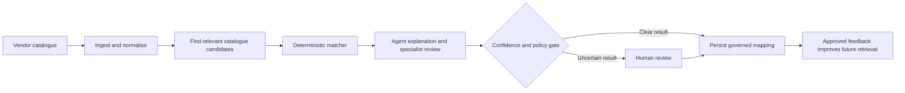

# SCUDO MatchMaker

SCUDO MatchMaker turns inconsistent vendor product catalogues into governed,
reusable mappings against a client-owned CDAO catalogue.

It combines deterministic matching, agent assistance, and human review. The
agents can explain and improve the process, but they do not become the system
of record. The core operating rule is:

> **The matcher proposes a controlled result, agents add context, and people
> decide what is uncertain.**

## Live multi-vendor console

A deployed mirror of this project with a broader vendor catalogue:

[http://data-matching-console-1261515569.us-east-1.elb.amazonaws.com/app/catalogue?vendor=lseg](http://data-matching-console-1261515569.us-east-1.elb.amazonaws.com/app/catalogue?vendor=lseg)

## Why it matters

Vendor catalogues are difficult to use consistently because product names,
identifiers, descriptions, classifications, and delivery terms vary by source.
SCUDO MatchMaker provides a repeatable way to:

- standardise vendor product metadata;
- map products to a shared business taxonomy;
- identify ambiguous or out-of-scope products;
- give reviewers the evidence behind each recommendation;
- preserve decisions and provenance for audit;
- use approved decisions to improve future retrieval without silently changing
  live behaviour.

The current product is a governed **vendor-to-taxonomy matching system**. It is
not yet a complete market-data procurement, spend, licence, usage, or
entitlement optimisation platform.

## Business flow



The same product can be run through the browser, REST API, MCP tools, or the
orchestrated Lambda path. Those surfaces share the same catalogue contracts and
governance rules, although their runtime wiring is not identical. The current
implementation documents those differences in [Technical architecture](#technical-architecture).

## Decision controls

| Control | Business meaning |
|---|---|
| Deterministic scope gate | An out-of-scope product is rejected before similarity or model judgement can change the result. |
| Candidate anchoring | Agents work from candidates retrieved by the matching engine rather than inventing catalogue nodes. |
| Confidence bands | Clear matches can proceed; borderline and weak matches are made visible for review. |
| Human-in-the-loop | Reviewers can approve, override, or reject a decision. |
| Provenance | Inputs, versions, rationale, confidence, and decisions can be traced together. |
| Durable record | Aurora PostgreSQL is the target system of record for decisions, audit, lineage, and agent memory. |
| Controlled learning | Recorded outcomes remain offline evidence until they pass holdout evaluation and receive named approval. |

## What a reviewer sees

The dashboard is designed around the business decision rather than the
underlying infrastructure:

1. A vendor file or product record enters the workflow.
2. The interface shows normalisation, candidate retrieval, scoring, and the
   confidence gate.
3. The agent explains the candidate and the evidence it used.
4. The reviewer sees the proposed mapping, alternatives, confidence, rationale,
   and any policy or validation issue.
5. The reviewer approves, overrides, or rejects the result.
6. The decision becomes a reusable precedent for similar future products.

The review controls are intentionally visible even when a run has not yet
produced a decision. A reviewer cannot approve a missing candidate or override
without an available alternative.

## Controlled self-improvement

SCUDO now has a governed foundation for improving both agent behaviour and
matching-engine quality.

### How it works

1. **Capture evidence.** Agent and deterministic-engine outcomes are stored as
   structured trajectories with input, decision, provenance, and version data.
2. **Curate a golden set.** Human-labelled examples are divided into training,
   holdout, and adversarial cases. A holdout *evaluation* requires at least one
   positive mapping example; abstention-only scenarios still load and remain
   valuable adversarial evidence. Duplicate vendor/product identities across
   splits are rejected.
3. **Evaluate offline.** Candidate changes are measured for exact matching,
   abstention recall, false auto-pass, calibration, Brier score, vendor
   coverage, and taxonomy coverage. A product identity cannot appear in both the mined
   training trajectories and the held-out evaluation partition.
4. **Require approval.** A candidate must pass the holdout policy and receive
   named approval before it can influence live prompts or skills.
5. **Promote immutably.** The approved artifact is stored under a versioned
   key, and a live pointer is updated only after the artifact is written.
6. **Rollback by version.** Earlier approved artifacts remain identifiable and
   can be restored by changing the live pointer.
7. **Monitor promoted behavior offline.** A separate monitoring authority joins
   predictions to authoritative outcomes and signs an immutable
   `SignedMonitoringEnvelope` with its Ed25519 private key. The runtime monitor
   receives only that envelope and configured audience, deployment, key ID, and
   public key. It verifies the active UTC validity period and resolves every
   signed observation against an immutable trajectory/audit source record before
   evaluating fixed `monitor-v1` thresholds (20 total and 20 auto-pass
   observations). Only complete windows atomically claim source events and
   persist retain/rollback decisions. Insufficient samples, including zero
   traffic, return `persisted=false` and claim nothing; the external scheduler
   must retry until its deadline. `monitor-v1` never rolls back merely because
   traffic is absent. Run the offline backend entrypoint with
   `python -m scudo.scripts.monitor_promotion_window ENVELOPE.json --audience
   AUD --deployment-id DEPLOYMENT --key-id KEY --public-key-file PUBLIC.pem`.
   The scheduler and immutable source audit store are deployment prerequisites;
   this repository deploys neither.

Recording a trajectory does not change live matching. The deterministic matcher
remains authoritative at request time, and legacy scalar-only skill records are
quarantined rather than served to agents.

Automatic predictions are valid only at confidence `>= 0.80`. Human teaching
may create an exact-product precedent immediately, but generalized lessons stay
quarantined as `rule_candidate` evidence until incorporated into a protected,
evaluated, promoted artifact.

### Offline evaluation command

From `backend/`, evaluate saved agent or matcher results against a JSONL golden
set:

```bash
PYTHONPATH=. python -m scudo.scripts.evaluate_matching_golden \
  --golden-set cases.jsonl \
  --golden-version golden-2026-07-16 \
  --predictions results.jsonl \
  --candidate-version matcher-v2
```

The evaluator is report-only. It does not write Aurora, change thresholds, or
promote an artifact.

The offline promotion entry points require a structured holdout report and
named approval; scalar scores fail closed. The scheduler's dry-run invokes the
same promotion preflight as an apply run, but never writes an artifact or live
pointer. A holdout *evaluation* with no positive mapping examples is rejected:
correctly abstaining is important, but it does not demonstrate matching
capability. A curated business golden set and a scheduled evaluation job are
still deployment inputs.

## Current experience

### Upload and Test

The primary dashboard flow supports:

- CSV and JSON vendor uploads;
- live ETL stage events;
- candidate retrieval and matching;
- agent activity and rationale;
- confidence-band review;
- approve, override, and reject actions;
- repeat runs with reviewer-selected thresholds.

### Matching Test

The narrower `/matching-test` experience supports:

- selecting an available agent provider;
- uploading a vendor file;
- ingesting a website URL through the guarded ingestion path;
- watching the agent run;
- inspecting the final authoritative matcher result.

### Demonstration endpoints

Known demonstration endpoints are documented here for stakeholder review. Use
synthetic data only, and treat these as closed demonstrations until the
authentication and deployment controls in [Open work and limits](#open-work-and-limits)
are completed.

- [Stakeholder dashboard](https://dp4ji14se0pct.cloudfront.net/cogJPMdemo/)
- [Dashboard deployment](https://d2im563be0sl1r.cloudfront.net/demo/)
- [Matching Test](https://d2im563be0sl1r.cloudfront.net/matching-test)
- [Multi-vendor catalogue console (LSEG entry)](http://data-matching-console-1261515569.us-east-1.elb.amazonaws.com/app/catalogue?vendor=lseg) — mirror of this project with a broader vendor set

## How matching works

The matcher uses a first-match-wins cost ladder:

1. **Scope:** check whether the product is eligible for the requested
   catalogue context.
2. **Precedent:** reuse a confirmed human decision when one exists.
3. **Retrieval:** find and rank a bounded set of catalogue candidates.
4. **Validation:** run deterministic checks against the leading candidate.
5. **Confidence gate:** classify the result as PASS, BORDERLINE, or FAIL.
6. **Specialist, when appropriate:** use an agent only in the borderline
   window and keep it anchored to the retrieved candidates.
7. **Review or persistence:** clear results proceed through the applicable
   publish controls; uncertain results go to human review.

The default business bands are:

| Band | Default score | Meaning |
|---|---:|---|
| PASS | `>= 0.80` | Strong candidate, subject to validation and publish controls. |
| BORDERLINE | `0.70 - <0.80` | Evidence is useful but not decisive; specialist or human review may be required. |
| FAIL | `<0.70` | Insufficient confidence for unattended mapping. |

The public REST path requires specialist confirmation for borderline cases. Some
library and agent paths use the configured floor as a fallback when no
specialist is available. This is an implementation distinction, not a change to
the business policy that uncertain work must remain reviewable.

## Human review and feedback

Human review is a control point, not an exception path.

- **Approve** confirms the proposed mapping.
- **Override** records a different catalogue node.
- **Reject** records that the candidate is not suitable.

Decisions are bound to the authenticated reviewer, retain the source and
decision provenance, and can influence future candidate ranking through a
precedent overlay. The graph store is a retrieval index; it is not the
authoritative record of what the business decided.

## Data and catalogue scope

The catalogue model supports both:

- business catalogue concepts such as products, datasets, distributions,
  services, delivery channels, fields, and taxonomies;
- rights and contract concepts such as parties, contracts, policies, duties,
  permissions, obligations, and documents.

Rights and scope checks are deterministic and fail closed. Similarity alone
does not grant entitlement. The rights graph is available as context, but the
current matching product should not be described as a complete automated
licence or entitlement decision system.

Vendor ingestion currently supports the normalised frame contract used by the
matching engine, with adapters for CSV, JSON, XML, XLSX, and guarded URL
ingestion paths. Source hashes and audit identifiers are preserved when the
upstream source provides them.

## Current status

### Implemented and verified

- Deterministic matching cost ladder with scope, precedent, retrieval,
  validation, confidence, and specialist seams.
- Scripted, Bedrock, and Azure agent runtime options behind a common event
  contract.
- Browser-facing upload, matching, agent, and human-review workflows.
- Aurora-backed agent memory with fail-open reads and fail-loud writes.
- Structured agent and matching-engine trajectories.
- Versioned golden-set evaluator with holdout leakage protection.
- Named-approval and immutable-artifact promotion boundary.
- Rollback-compatible versioned live skill records.

### Required before broader external use

- Curated, representative business golden sets, including adversarial cases.
- A scheduled evaluation and approval workflow for self-improvement.
- Replacement or calibration of the current string-similarity stand-in with
  production semantic retrieval.
- A complete Neptune retrieval implementation if Neptune is selected as a
  deployment backend.
- Production identity enforcement at the gateway and removal of dev-open auth.
  The persistence MCP's write tools now fail closed behind
  `SCUDO_PERSIST_WRITE_TOKEN`, but that authenticates a *service*, not a person:
  a token holder can still record a decision under any `decided_by` it chooses.
- Durable reviewer-queue persistence for the separated MCP deployment shape.
- Deployment of the latest SSE heartbeat and dashboard assets where required.
- Temporal matching is built but not yet reachable on real data. The comparator
  and its `SCUDO_TEMPORAL_VALIDATION` flag exist and are tested, but the DCAT
  loader drops `temporal_coverage` before it reaches a `TaxonomyNode`, so the
  check passes by default in a live run. Two products identical in name but
  covering different periods are still indistinguishable to the engine.
- The Lambda HITL approve path writes `mapping_result` from the request body
  straight to the catalogue without running the deterministic publish gate, so a
  malformed IRI can reach the projection table by a route the auto-publish path
  rejects.

These are explicit boundaries, not hidden assumptions. The repository is
designed so they can be addressed without allowing unvalidated learning to
change live mappings.

## Quick start

**No database, no container, no AWS credentials.** One command:

```bash
pip install -r backend/requirements.txt
python start_local.py
```

Then open **<http://localhost:3000>** — that is the UI. The backend on :5000 is
not the app; opening it directly is the most common false alarm.

Port 5000 is occupied on macOS by AirPlay Receiver, and by some corporate
agents. If the server starts but nothing loads:

```bash
PORT=5055 VITE_API_PROXY=http://localhost:5055 python start_local.py
```

`start_local.py` sets the environment **before** importing `app.py`. That
ordering is load-bearing: launching `python app.py` directly leaves the auth
gate unconfigured, every `/api/*` call returns 401, and the UI renders its shell
with no data — the "only one page opens" symptom. `start_all.sh` now delegates
here for the same reason.

### What runs with nothing installed

Verified end to end from a clean checkout: ingest a vendor file, run the
matcher, get a banded result against a real CDAO node. No FalkorDB, no Neptune,
no MySQL, no PostgreSQL, no Bedrock.

| Page | Works offline? |
|---|---|
| Matching Test, Upload and Test, Catalogue | yes |
| Providers, Datasets, Admin, Ingestion | yes — via the SQLite stand-in below |

Defaults chosen for you by `start_local.py`:

| Variable | Value | Effect |
|---|---|---|
| `STORE_BACKEND` | `scipy_sqlite` | full matching ladder and HITL state in `backend/.local/scudo_matching.sqlite3` |
| `SCUDO_SCIPY_SQLITE_PATH` | `backend/.local/scudo_matching.sqlite3` | matching database; separate from the console database |
| `CONSOLE_DB_BACKEND` | `sqlite` | console pages run with no PostgreSQL — [`backend/db_sqlite_fallback.py`](backend/db_sqlite_fallback.py), standard library only |
| `FRAME_SOURCE` | `mock` | bundled sample vendor data instead of S3 |
| `SCUDO_AUTH_ALLOW_DEV` | `1` | local dev principal, so `/api/*` does not 401 |

Unset `CONSOLE_DB_BACKEND` and the console reverts to real PostgreSQL/Aurora
via `CONSOLE_DB_*`; `docker compose up postgres` provides that locally. The
SQLite path is read at call time, so deployed behaviour is unchanged.

`scipy_sqlite` is a single-host backend. Do not put its database on a shared
network filesystem or use it as a multi-container replacement for the deployed
FalkorDB/Neptune topology. It is not activated in Lambda merely by setting
`STORE_BACKEND`; Lambda use requires the explicit `SCUDO_USE_RETRIEVAL_STORE`
flag and a healthy, pre-seeded taxonomy.

The matching-store factory accepts five backends: `scipy_sqlite`, `local_file`,
`memory`, `falkordb`, and `neptune`. For local startup, `scipy_sqlite` is the
default complete matching store: taxonomy, retrieval indexes, HITL decisions,
precedents, and audit state persist in one SQLite database. `local_file`
remains the simpler precedent-only fallback; it journals reviewer precedents
but does not provide the complete SQLite matching-store contract.

### Health endpoints

`/healthz` — liveness. `/readyz` — readiness; it returns **503 until the CDAO
taxonomy has been seeded**, which happens lazily on the first `/api/*` request,
then 200. A cold 503 is the probe working, not a failure. There is no `/health`.

### Beyond the laptop

The full trust-gradient deployment — FalkorDB plus the three MCP services — is
described in [`backend/scudo/DEPLOY.md`](backend/scudo/DEPLOY.md). Neptune is
reachable only from an appropriate AWS network. Neither is needed for anything
above.

To use Bedrock instead of the offline narrator, set `SCUDO_AGENT_BACKEND` and
`SCUDO_AGENT_PROVIDER_DEFAULT` to `bedrock` with your `AWS_REGION` and
`SCUDO_BEDROCK_MODEL_ID`. Note what this does and does not change: the language
model **narrates** the match; the score itself is deterministic
Jaro-Winkler either way.

## API entry points

The main browser and integration surfaces are:

| Endpoint | Purpose |
|---|---|
| `POST /api/mapping/ingest/stream` | Upload and observe normalisation stages. |
| `POST /api/mapping/map` | Run the deterministic matcher for one product. |
| `POST /api/mapping/agent/run` | Stream an agent-assisted matching run over SSE. |
| `POST /api/mapping/decision` | Approve, override, or reject a decision. |
| `GET /api/mapping/graph` | Read the dashboard's matching architecture payload. |
| `GET /api/mapping/agent/describe` | Inspect configured agent providers. |

The matcher package and MCP services expose the same typed contracts to
automation clients. Raw Cypher, SPARQL, and unrestricted graph queries are not
agent-facing tools.

## Where the code lives

Two folders sit under `backend/`. Telling them apart answers most "where is
the agent?" questions:

| Folder | What it holds | When it runs |
|---|---|---|
| `backend/scudo_mapping_mcp/` | **The product** — the agent, the matching engine, the catalogue and review logic | Always |
| `backend/scudo/` | **The AWS wiring** — Lambda, cloud memory, deployment | Only in AWS |

Running it on a laptop or on Streamlit uses the first folder. You can ignore
the second.

### The four things people look for

Everything below is in `backend/scudo_mapping_mcp/`.

| Looking for | File | In one line |
|---|---|---|
| **The agent** | `agent.py` | Explains the match. Two versions: an offline narrator, and Claude via Bedrock |
| **The agent's tools** | `agent.py` (also `mcp_server.py`) | Six tools it may call — search the catalogue, read a taxonomy node, compare candidates, run the match |
| **The matching engine** | `matching.py` | Produces the score, the band, and the mapped node |
| **The memory** | `store/` and `feedback.py` | Reviewer decisions become precedents the next match reuses |

**The agent does not decide the score.** The matching engine does, and it is
deterministic — the same product scores the same every time. The agent
explains the result in readable language and can be switched off entirely
without changing a single number. That is deliberate: the score is auditable,
the narration is helpful.

The agent also answers one question at a time about one product. It is not a
chatbot you can ask anything.

### If you need more detail

| Concern | File |
|---|---|
| Which retrieval store is in use (`memory`, `local_file`, FalkorDB, Neptune) | `store/factory.py` |
| Durable local memory that survives a restart | `store/local_file_store.py` |
| Reviewer approve / override / reject | `feedback.py` |
| Reading and normalising vendor files | `ingest.py`, `frames.py`, `url_ingest.py` |
| Business rules applied to a candidate | `validations.py` |
| Confidence thresholds | `config.py` |
| Signed verdicts and the write boundary | `verdict.py`, `persistence_mcp.py` |

In `backend/scudo/` (AWS only): `lambda_handler.py` for cloud entry points,
`orchestrator.py` for the publish gate, `aurora_memory.py` and
`aurora_store.py` for cloud memory. Note that cloud memory is **not** used by
the local or Streamlit run — that uses `store/local_file_store.py` instead.

## Technical architecture

The approved target architecture has five business-relevant zones:

| Zone | Responsibility | Representative code |
|---|---|---|
| 1. Sources and ingestion | Receive vendor metadata and create normalised records. | `backend/scudo_mapping_mcp/ingest.py`, `backend/scudo_mapping_mcp/frames.py`, `backend/scudo_mapping_mcp/url_ingest.py` |
| 2. Processing | Validate, clean, quarantine, land, and audit source data. | `backend/scudo_mapping_mcp/validations.py`, `backend/scudo/etl_handler.py` |
| 3. Matching engine | Retrieve candidates, apply policy, score, validate, and gate. | `backend/scudo_mapping_mcp/matching.py`, `backend/scudo_mapping_mcp/store/` (`matcher_bridge.py` is the Lambda-side adapter — not on the Flask/Streamlit path) |
| 4. Agentic layer | Provide contextual reasoning, specialist assistance, and verification. | `backend/scudo_mapping_mcp/agent.py` (the agent you run), `backend/scudo/orchestrator.py` (AWS publish gate) |
| 5. Persistence and review | Store decisions, audit, lineage, memory, and review outcomes. | `backend/scudo/aurora_store.py`, `backend/scudo/aurora_memory.py`, `backend/scudo_mapping_mcp/feedback.py` |

Aurora PostgreSQL is the target system of record. FalkorDB, Neptune, or the
in-memory backend provides retrieval according to `STORE_BACKEND`; these stores
are not authoritative for business decisions.

The three MCP services are:

- **Ingestion:** normalises vendor input and provides bounded frame context.
- **Match-Verify:** provides bounded catalogue evidence and signed deterministic
  verdicts.
- **Persistence:** verifies verdicts and owns the write boundary for the
  separated MCP deployment shape.

The current Flask deployment often calls these package functions in-process.
The networked MCP topology remains available for the trust-gradient deployment
shape. Both shapes preserve the same bounded operation contracts.

## Repository guide

```text
backend/scudo_mapping_mcp/   Matching engine, agent and its tools, MCPs,
                              catalogue models, stores, reviewer feedback
backend/scudo/                Orchestrator, Lambda substrate, Aurora memory,
                              self-improvement, deployment scripts
                              (AWS only — not used by the local run)
backend/routes/               Flask REST facade
frontend/                     React console and matching-test experience
dashboard-dist/               Vendored dashboard build
infra/                        AWS infrastructure and deployment runbooks
docs/architecture/            Approved architecture diagrams and UML sources
docs/okf/scudo/               Navigable project knowledge base
ZONES.md                      Module-to-zone map
start_local.py                One-command local run (sets env before import)
backend/db_sqlite_fallback.py Console DB stand-in — no PostgreSQL, no Docker
```

### Handover documents

| Document | For |
|---|---|
| [`JPMC_LOCAL_RUN_HANDOVER.md`](JPMC_LOCAL_RUN_HANDOVER.md) | Running locally without infrastructure: what is already resolved, what changed and why, per-item evidence. |
| [`JPMC_PORT_TYPE_IN.md`](JPMC_PORT_TYPE_IN.md) | Carrying those changes into `jpmc-port/` by hand. Tiered FIND/TYPE instructions, dry-run verified against the port's own files. |
| [`CITRIX_FOLLOWUP.md`](CITRIX_FOLLOWUP.md) | Corrections after a Citrix-side apply: health-endpoint names, the `falkordb` spelling, switching on the SQLite stand-in. |

## Self-improvement implementation map

| Capability | Location |
|---|---|
| Golden cases, metrics, and promotion contracts | `backend/scudo/matching_self_improvement.py` |
| Report-only evaluator | `backend/scudo/scripts/evaluate_matching_golden.py` |
| Agent memory and trajectory persistence | `backend/scudo/aurora_memory.py` |
| Deterministic-engine trajectory adapter | `backend/scudo/aurora_memory.py` |
| Strict offline sleep cycle | `backend/scudo/skillopt_sleep_runner.py` |
| Live prompt skill pinning | `backend/scudo/schemas.py`, `orchestrator.py`, `lambda_handler.py` |

## Testing and verification

Run from `backend/`:

```bash
# Focused self-improvement and memory coverage
PYTHONPATH=. pytest \
  scudo/tests/test_matching_self_improvement.py \
  scudo/tests/test_aurora_memory.py \
  scudo/tests/test_lambda_handler_memory_wiring.py \
  scudo/tests/test_skillopt_sleep_runner.py -q

# Full SCUDO and matching-engine coverage
PYTHONPATH=. pytest scudo/tests scudo_mapping_mcp/tests -q \
  --disable-warnings --maxfail=10
```

On July 16, 2026, the focused suite passed 76 tests. The broader SCUDO and
matching-engine run passed 494 tests and had two known failures in
`scudo/tests/test_provenance.py` caused by pre-existing forbidden Marketing
content in the generated conceptual graph. Those failures are unrelated to the
self-improvement implementation.

Additional standalone smoke suites are available:

```bash
PYTHONPATH=. python -m scudo_mapping_mcp.tests.smoke
PYTHONPATH=. python -m tests.test_auth
```

The root `backend/tests/test_ingest_*.py` files currently have a pytest
collection-path issue involving `_ingest_helpers`; use the relevant standalone
test command or exclude those files while that test-infrastructure issue is
resolved.

## Deployment and operating references

Use the detailed runbooks for deployment rather than copying commands from this
overview:

- [`backend/scudo/DEPLOY.md`](backend/scudo/DEPLOY.md) - SAM/Lambda deployment
  and required Aurora inputs.
- [`infra/DEPLOY_RUNBOOK_scudo-poc.md`](infra/DEPLOY_RUNBOOK_scudo-poc.md) -
  CloudShell deployment, smoke checks, and rollback.
- [`infra/HANDOVER_5zone_alignment.md`](infra/HANDOVER_5zone_alignment.md) -
  why Aurora is the target system of record.
- [`ZONES.md`](ZONES.md) - module-to-zone ownership.
- [`docs/architecture/README.md`](docs/architecture/README.md) - approved
  architecture diagrams and UML sources.
- [`docs/okf/scudo/index.md`](docs/okf/scudo/index.md) - navigable knowledge
  base covering architecture, operations, specifications, and plans.

## Open work and limits

The following items should be treated as explicit delivery gates:

1. **Retrieval quality:** the default dense arm is currently Jaro-Winkler
   string similarity, not a calibrated production embedding model. Thresholds
   must be recalibrated when the scoring backend changes.
2. **Golden data:** the evaluator is implemented, but a representative,
   approved business golden set and scheduled evaluation process are not
   included in this repository.
3. **Self-improvement operations:** the offline evaluator and promotion boundary
   are implemented; the default optimizer/evaluator integration and scheduled
   AWS job remain operator-owned.
4. **Neptune:** the Neptune retrieval implementation is not complete enough to
   treat it as a production matching backend.
5. **Identity:** the current demo posture can allow dev-open authentication.
   External exposure requires a trusted gateway identity boundary and removal
   of the dev bypass.
6. **Reviewer queue:** the separated Persistence MCP currently has an
   in-memory reviewer queue; durable queue wiring remains open.
7. **Test debt:** the two provenance failures and the ingest test collection
   issue described above remain visible and should not be hidden.

## Glossary

| Term | Meaning |
|---|---|
| CDAO catalogue | The client-owned taxonomy and related catalogue/rights model that products are mapped into. |
| HITL | Human-in-the-loop review for uncertain or policy-sensitive decisions. |
| Precedent | A confirmed human decision reused as evidence for a later similar product. |
| Golden set | Versioned, human-labelled examples used to evaluate matching changes. |
| Holdout set | Examples kept out of training or candidate generation and used for promotion evaluation. |
| Confidence band | The policy classification of a match as PASS, BORDERLINE, or FAIL. |
| MCP | Model Context Protocol service exposing bounded, typed operations to agents. |
| Trajectory | A structured record of an input, decision, evidence, and versions used for offline analysis. |

## Source of truth

This README is the business and engineering index. Detailed implementation
decisions belong in the linked architecture diagrams, specifications, plans,
and deployment runbooks. When those documents disagree, use the current code
and the approved architecture sources, then record the decision in the relevant
specification.

---

# Appendix A — Why the local run needs no infrastructure

Three sessions independently set out to "remove MySQL, FalkorDB and Neptune"
before anyone ran the system to see whether they were load-bearing. They were
not. What follows is the measured position, so the fourth session does not
repeat it.

| Component | Actual state |
|---|---|
| MySQL | Already gone. Zero `mysql`/`pymysql` imports. `db.py` targets Aurora PostgreSQL — the MySQL→Aurora migration already happened. |
| FalkorDB | Lazy-imported in two production files (`store/falkordb_store.py`, `store/factory.py`; three more are tests), reachable only through `factory.py`'s branch. Never loaded under `STORE_BACKEND=local_file`. |
| Neptune | Same: lazy, unused locally. |
| Bedrock | Every `boto3` import is lazy. The app imports and runs with no credentials. |

Nothing was commented out, and that was deliberate — `store/factory.py:20-32`
records the reasoning. The branches stay active because the AWS deploys set
`STORE_BACKEND=falkordb` and would break without them; being lazy imports, they
cost a local run nothing.

**`falkordb_store.py` must stay on disk even though the database is unused:**
the default scoring path imports `_jaro_winkler` from that file. The *pip
package* is not required — its import lives inside a method.

### The real cause of "FalkorDB keeps being asked for"

Not the branches — the **default**. `STORE_BACKEND` defaulted to `"falkordb"`,
so any entry point that set no environment tried to open a connection on :6379.
`start_all.sh` set no environment at all, which is why the obvious script kept
demanding a database nobody wanted.

Two fixes: the default is now `local_file`, and `start_all.sh` delegates to
`start_local.py` rather than keeping a second env block that silently diverged.
Changing the default is safe because **every deployed path sets the variable
explicitly** — verified across `backend/Dockerfile`, `infra/scudo-dev-deploy.yaml`
(four containers), `infra/scudo-poc-app.yaml`, and `backend/scudo/template.yaml`.

### And "only one page opens"

Also an environment problem, not a database one. `start_all.sh` used to run
`python3 app.py` directly, leaving the auth gate unconfigured, so every
`/api/*` call returned 401 while the UI shell rendered normally. Port 5000 is
separately occupied on macOS by AirPlay Receiver.

### The console database

Providers, Datasets, Admin and Ingestion are the only pages needing a
relational store — 74 `execute()` calls over 9 tables — and they returned 500
without PostgreSQL. [`backend/db_sqlite_fallback.py`](backend/db_sqlite_fallback.py)
is a file-backed stand-in using only the standard library.

It was cheap because the route SQL is nearly dialect-free: `%s`→`?`,
`SERIAL`→`INTEGER`, `TIMESTAMPTZ`/`JSONB`→`TEXT`. `RETURNING` and
`ON CONFLICT` are native in SQLite 3.35+ and pass through untouched. The hook
lives in `db.py`'s two connection functions and is read at **call** time, so
**no route code changed** and the deployed Aurora path is byte-for-byte
unaffected.

Limits, stated rather than hidden: no schemas (`console.`/`ingestion.` collapse
into one namespace); the PL/pgSQL `updated_at` trigger is skipped, so that
column does not self-update; single writer. Sized for one person running a
demo, which is the stated need.

---

# Appendix B — Why gates are deterministic, not advisory

A check that is computed but never acted on is not a gate. Two were found here,
both by adversarial review rather than by testing.

`Orchestrator._pre_verify_defects` returns a list of defect strings. That list
was only ever **concatenated into the verifier model's prompt**. Nothing
enforced it. A verifier that scored well and ignored the injected text
published anyway. Measured, before the fix:

```
specialist proposes a node never offered in bundle.candidates
  -> OUTCOME: PUBLISHED | published: 1
```

The consequence is not cosmetic: the model could map a vendor product to **any
CDAO node it invented**, and no confidence score catches that — an invented
node scores however the model says it does.

Two checks were therefore promoted into `_gate_and_decide`, where no model
opinion can override them:

- `vendor_product_iri` must equal the deterministically minted value. It is the
  primary key of the published record, and the publish gate's IRI-shape check
  only inspected *triple subjects*, never this field.
- `proposed_target_iri` must be one of the offered candidates.

The candidate check was initially written `if target and candidates and target
not in candidates` — **fail-open**: an empty candidate list published anything.
That is precisely the case with the least grounding, so it now fails closed on
both degenerate shapes.

**The generalisable rule: adding a check to `_pre_verify_defects` does not
enforce it.** Enforcement belongs in `_gate_and_decide`. Three other checks
there (evidence, source IRIs, band consistency) remain advisory by design and
are commented as such.

### Related: frames are authoritative

Frame resolution exists in **three files** that must agree —
`routes/mapping.py:242`, `match_verify_mcp.py:255` (`_resolve_frame`, with a
thin `_frame` wrapper at `:308`), and `mcp_server.py:127`. All three now
ignore caller-supplied `name`/`description` unless
`SCUDO_MV_ALLOW_INLINE_FRAME` is set, and refuse rather than fabricating
`name=product_id` when no frame exists. Two of the three copies were found only
after the first was fixed; a per-file fix leaves the other ingresses open.

---

# Appendix C — Why the agents are told what they are judged on

`VerifierDimension` defined ten scoring dimensions as bare enum names —
`semantic_fit`, `candidate_coverage`, `conflict_handling` — with **no
definition anywhere in the repository**. Two consequences:

1. The **verifier** invented what each name meant on every call, and its
   `total_score` drives a hard publish / retry / human-review gate. Scores were
   not comparable between runs.
2. The **specialist** was never shown the dimensions at all, and was graded on
   a rubric it could not see. Separately, `vendor_product_iri` appeared **zero
   times** in its prompt while the gate hard-rejects a mismatch on that field —
   the model could not comply with a rule it was never given.

The tell was already in the code: a hand-written line in the verifier prompt
explaining how to score `taxonomy_freshness`. One dimension patched by hand
because the list was not shared.

The rubric is now defined once in `prompts._RUBRIC` and rendered for both
audiences from that single source. `rubric_text()` **raises** if a dimension has
no definition, so a new one cannot ship undefined the way these ten did.

### On the risk of naming the rubric

Telling a model how it is graded invites writing to the scorer. This was
accepted deliberately, because the alternative is worse: a specialist
optimising blind produces work the verifier rejects for reasons nobody stated,
costing a model call and a review ticket per miss.

Three things bound the risk. The verifier is a **separate model**; the
deterministic gates in Appendix B cannot be talked out of; and every definition
rewards a **verifiable property** of the output rather than a rhetorical one —
"cite the evidence you used" is not gameable in a way that hurts, because it is
the actual goal. The specialist is also told explicitly not to write to the
scorer, and that instruction is pinned by a test.

---

# Appendix D — Why refusals are answers

Tools may now return a typed refusal instead of data — `frame_not_found` when
no ingested frame exists for a product. This is deliberate: the system declines
to score a product whose real details it does not have, rather than inventing a
name from the identifier and matching on that.

Two consequences were handled explicitly.

**The agent is told refusals are answers, not errors to work around.** Without
that instruction the natural behaviour is to retry, or to substitute a
plausible name — exactly the fabrication the refusal exists to prevent. The
agent prompt now says to report it and recommend human review.

**The UI must keep the actionable half.** The backend returns
`{error, detail}`, and all sixteen frontend call sites read only `error`, so a
user saw a bare `frame_not_found` while *"ingest it first"* was discarded. A
single response interceptor now folds `detail` into `error`, fixing every call
site without touching any of them.

The same reasoning applies to the reasoning trace. The backend streams a full
agent trace over SSE — a real run emits fourteen events including four tool
calls and their results. The frontend received all of them and rendered each as
raw JSON truncated at 120 characters, cutting the agent's sentences off
mid-word. The information was arriving; it was not legible. It is now rendered
as a followable sequence of thinking, calls, and returns.

---

# Appendix E — Verification posture

Four practices, each stated with the case that produced it so a reader can
judge the practice rather than take it on trust.

**Check that a new test fails when its fix is reverted.** Otherwise it may be
asserting something trivially true. This proves sensitivity to that specific
regression — not correctness in general. Applied to the confidence-band parity
check
(`backend/scudo_mapping_mcp/tests/test_band_config_parity.py`), this exposed a
real evasion: the original scanner paired `Name:`/`Value:` keys in source
order, so the equally-legal `Value:`-before-`Name:` form parsed as zero
records and drift passed silently. The fix is a structural YAML parse, pinned
by `test_key_order_cannot_hide_a_band_declaration`, plus an anti-vacuity test
proving the parser finds the real declarations rather than nothing.

**Distinguish "the code exists" from "the code runs."** Two absence claims were
checked by execution rather than grep, and both answers were more nuanced than
the original wording:

- *"Dates cannot be matched."* A temporal comparator and its
  `SCUDO_TEMPORAL_VALIDATION` flag now exist and are tested. But
  `matching.py` contains **zero** references to `node_temporal_coverage`, and
  the DCAT loader drops the field before it reaches a `TaxonomyNode` — so on a
  live run the check passes by default and the original limitation still
  holds. Built is not the same as reachable; this is listed in "Open work and
  limits" for that reason.
- *"No embedding retrieval path exists."* Wrong as stated. A LlamaIndex
  retriever with real Bedrock embeddings exists at
  `backend/scudo/sidecar/retrieval.py`, is exposed as a tool in
  `tools.py:41`, and **is** attached to the generic mapping specialist via
  `MAPPING_SPECIALIST_TOOLS`. It is unreachable on two axes only: the deployed
  Lambda builds tool-less agents, and `SCUDO_SIDECAR_GRAPH_ENDPOINT` is unset
  in `infra/`, so the sidecar falls back to an in-memory mock. Wired in the
  specialist path, unwired in the Lambda path — which is a different and more
  useful statement than either "exists" or "does not exist."

**Expect two different defect shapes, not one.** The defects found in this
work fell into two kinds, and a review that anticipates only the first will
miss the second.

*Incomplete scope* — the fix was correct inside the file it was scoped to
while the same defect sat untouched elsewhere. Frame resolution was fixed in
`match_verify_mcp.py` while byte-equivalent copies remained in
`routes/mapping.py:242` and `mcp_server.py:127`, the latter backing four live
endpoints.

*A bug inside the fix* — the first hard candidate check was written
`if target and candidates and target not in candidates`, which published
anything when the candidate list was empty: precisely the case with the least
grounding. Recorded at `orchestrator.py:425`, pinned at
`backend/scudo/tests/smoke.py:552`.

Neither is visible from the changed file alone: the first needs a search for
other copies of the function, the second needs the empty-list case to be tried.

**Do not let a red baseline become background noise.** Two tests fail on an
unmodified checkout:

- `test_provenance.py::test_matching_graph_is_knowledge_graph_schema`
- `test_provenance.py::test_every_node_is_labelled_and_expositional`

Both reject the `marketing_dataset` kind supplied by
`fixtures/conceptual_layer.json` and propagated through
`build_matching_graph.py`. Verified by running the file on a clean worktree at
HEAD with none of this work applied: 1 passed, 2 failed.

They are named here rather than counted because a count is a weak signal — it
stays green if one failure is fixed while another appears. The better end state
is an explicit `xfail` with a tracking issue, so the suite is green and the
exception is documented in code rather than in prose.
