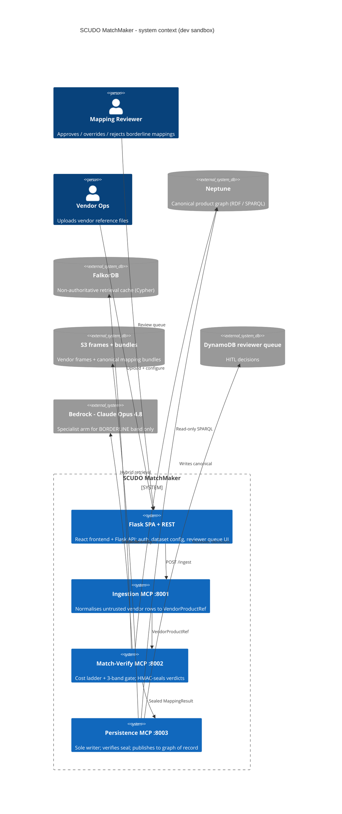
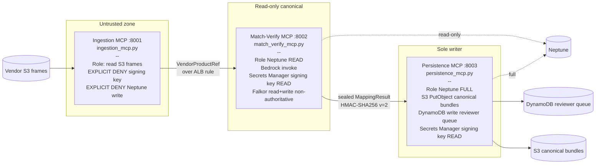
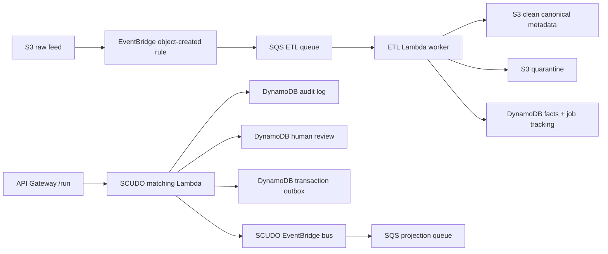
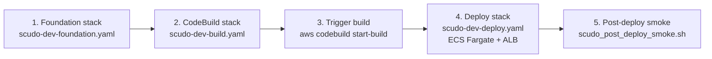

# SCUDO MatchMaker

Deterministic vendor-to-canonical product mapping with a three-MCP trust gradient, a five-rung cost ladder, and a verifier gate.

> **Status:** 86 mapping + 8 auth smoke tests passing. The current AWS target is the Cognizant cloudboost account `954976331678` in `us-east-1`, with stack `scudo-poc` providing the Lambda/API and the event-driven ETL substrate. The older ECS/Fargate dev templates remain under `infra/` for the `eu-west-2` sandbox. **This is a dev sandbox**, **not** the JPMC SCUDO production account. Treat all thresholds, dense-arm similarity, and Neptune retrieval as uncalibrated stand-ins until the production cutover.

## SCUDO as the visibility platform

SCUDO is positioned as the **visibility platform** for the matching backend: the three-MCP trust gradient, the cost ladder, the HMAC seal contract, and the reviewer queue are not just plumbing — they are the audit surface that makes every mapping decision inspectable end-to-end. The Flask SPA + REST tier exposes the trust gradient to the operator: dataset configuration, the reviewer queue, the per-decision trajectory, and the sealed verdict are all visible artefacts of the matching pipeline. Read the backend through this lens — every component exists to make the matching decision visible, attributable, and reversible, not merely to compute it.

---

## What is this

SCUDO MatchMaker proposes mappings between **untrusted vendor product references** (rows from S&P Global, Bloomberg, etc.) and the **canonical SCUDO product graph**. It is a sandbox prototype of the matcher that would sit behind the JPMC SCUDO canonical product service: same shape, same invariants, same trust gradient, but with FalkorDB as a non-authoritative local stand-in for Neptune and with the dense-similarity arm wired to Jaro-Winkler rather than a real embedding model.

The codebase is built around two non-negotiable ideas. First, a **first-match-wins cost ladder** — scope gate, precedent reuse, FalkorDB hybrid retrieval, Opus 4.8 specialist, then a deterministic 3-band gate — so the expensive arms only run when the cheap ones cannot decide. Second, a **three-MCP trust gradient** enforced by separate ECS task roles: Ingestion (port 8001) sees vendor data but is explicitly denied the signing key; Match-Verify (port 8002) reads Neptune and calls Bedrock but writes nothing canonical; Persistence (port 8003) is the only writer and holds the publish gate.

What this repo is **not**: a complete SCUDO. There is no production Neptune retrieval (the `find_similar_products` SPARQL implementation is a placeholder returning `similarity=0.0`), the dense-arm similarity is a string metric pretending to be a vector, and the 0.80 floor + ±0.05 borderline bands are unvalidated against any golden set. See [What is NOT done](#what-is-not-done).

---

## Architecture at a glance



---

## The matching cost ladder

Five rungs. First match wins. Anything reaching the gate must clear the 0.80 floor.


Implementation lives in `backend/scudo_mapping_mcp/matching.py`. Validations and field normalisation in `validations.py`. The HMAC verdict seal contract is in `verdict.py` — `v=2` carries the band, Persistence refuses any agent-passed verdict dict.

---

## Trust gradient (three MCPs)

IAM, not application code, enforces the isolation. Each MCP runs as a separate ECS Fargate service with its own task role.



The seal is the contract. Ingestion cannot mint one (no key). Match-Verify mints; Persistence verifies before letting anything past invariant I5 (the publish gate).

---

## Repo layout

```
backend/scudo_mapping_mcp/
  ingestion_mcp.py         # MCP server :8001 - untrusted vendor in, normalise to VendorProductRef
  match_verify_mcp.py      # MCP server :8002 - cost ladder + 3-band gate; emits sealed MappingResult
  persistence_mcp.py       # MCP server :8003 - sole writer; verifies HMAC seal; publish gate
  matching.py              # Cost ladder implementation (rungs 1-5, first-match-wins)
  frames.py                # _read_vendor_frame (mock -> S3 cutover) + check_scope (rights/entitlement)
  feedback.py              # M4 HITL write-back; approve/override/reject feeds precedent rank signal
  validations.py           # M5 deterministic checks: scope_compatible, identifier_resolves, data_class_match
  bundle.py                # M6 portable mapping bundle - versioned, diffable, cutover artifact
  hydrate.py               # M6 hydration - replays canonical bundle from S3 into FalkorDB at boot
  verdict.py               # HMAC-SHA256 verdict seal v=2; trust-gradient integrity contract
  agent.py                 # M9 agent runner behind POST /api/mapping/agent/run; Opus-driven MCP tool use
  models.py                # Pydantic contracts: MappingStatus, Candidate, MappingResult, etc
  config.py                # Three-seam env-var contract; STORE_BACKEND selects falkordb | neptune
  store/
    base.py                # The seam - retrieval operations interface; never query strings
    factory.py             # Single decision point: which backend, from config
    falkordb_store.py      # FalkorDB backend - Cypher; Jaro-Winkler dense stub; pure-Python BM25
    neptune_store.py       # Neptune backend - SigV4 SPARQL; find_similar_products is M9 PLACEHOLDER
  tests/
    smoke.py               # 86 mapping smoke gates - no pytest dependency
    fake_store.py          # In-memory store for unit-level tests

backend/
  app.py                   # Flask entrypoint; auth, route registration, before_request hook
  auth.py                  # Gateway-header principal resolver; AuthError -> 401
  routes/mapping.py        # Flask REST surface that proxies the matcher (Match-Verify in-process today)
  tests/test_auth.py       # 8 auth smoke tests
  Dockerfile               # Single image, four entrypoints (Flask + 3 MCPs)
  requirements.txt

backend/scudo/
  template.yaml             # us-east-1 SAM stack: API + ETL/EventBridge/SQS/S3/DynamoDB substrate
  lambda_handler.py         # API Gateway /run + /health; writes audit/outbox/review records when wired
  etl_handler.py            # SQS-backed raw S3 object processor: clean canonical or quarantine
  aws_resources.py          # Lazy boto3 adapter for audit/events/table writes

infra/
  scudo-dev-foundation.yaml  # VPC, IAM roles, Neptune, S3, ECR, Secrets, DynamoDB queue
  scudo-dev-deploy.yaml      # ECS cluster, 5 services, ALB w/ 4 listener rules, Cloud Map
  scudo-dev-build.yaml       # CodeBuild project + scoped service role
  scudo-dev-frontend.yaml    # S3 + CloudFront with ALB passthrough (written, not deployed)
  buildspec.yml              # Single-quoted-everywhere CodeBuild buildspec
  scudo_post_deploy_smoke.sh # Hits /api/* + /mcp/*; dumps target-group health

frontend/                    # React SPA (Vite); reviewer queue UI + provider/dataset admin
```

---

## Tests

```
86 mapping smoke tests   # cost ladder, scope gate, seal verify, store seam, bundle round-trip, fusion, hydrate
 8 auth smoke tests      # gateway header + principal + 401 cases
```

The smoke runner is standalone — no pytest dependency. Run from `backend/`:

```bash
python -m scudo_mapping_mcp.tests.smoke     # 86 mapping gates
python -m tests.test_auth                   # 8 auth gates
```

No golden-set evaluation harness is wired up yet. The smoke suite verifies wiring and invariants, not retrieval quality.

---

## Run locally

The integrated backend doesn't ship a root `docker-compose.yml` yet (#14 follow-up). For now, start FalkorDB by hand and run each service from a Python venv.

```bash
# 1. FalkorDB sidecar (Docker Desktop or `falkordb/falkordb` directly in WSL)
docker run -d --name falkordb -p 6379:6379 falkordb/falkordb:v4.10.4

# 2. Backend (Flask + 3 MCPs share one image, four entrypoints)
cd backend
python -m venv .venv && source .venv/bin/activate   # Windows: .venv\Scripts\activate
pip install -r requirements.txt

export STORE_BACKEND=falkordb
export FALKORDB_URL=falkordb://localhost:6379
export VERDICT_SIGNING_KEY=dev-only-not-a-real-secret
export SCUDO_AUTH_ALLOW_DEV=1
export SCUDO_AUTH_DEV_PRINCIPAL=local@dev

# Each MCP is its own entrypoint; run in separate terminals (or backgrounded):
python -m scudo_mapping_mcp.ingestion_mcp        # :8001
python -m scudo_mapping_mcp.match_verify_mcp     # :8002
python -m scudo_mapping_mcp.persistence_mcp      # :8003

# Flask SPA + REST (in another terminal):
gunicorn -b 0.0.0.0:5000 -k gthread --threads 4 --timeout 300 app:app

# 3. Frontend (in another terminal)
cd ../frontend
npm install && npm run dev
```

Switching to Neptune locally is not supported — Neptune is reachable only from inside the VPC.

---

## Deploy to AWS cloudboost account

Current connected account: `954976331678` (`cb4115669a-genaipocs-aw`) in `us-east-1`.

The deployable AIA stack is [`backend/scudo/template.yaml`](backend/scudo/template.yaml). It matches the target diagram's first AWS slice: raw/clean/quarantine/catalog S3 buckets, EventBridge + SQS routing, ETL Lambda, DynamoDB audit/facts/HITL/outbox tables, and the Bedrock-backed matching Lambda/API. See [`backend/scudo/DEPLOY.md`](backend/scudo/DEPLOY.md) for exact CloudShell commands.



Cost-bearing always-on stores from the full target architecture are exposed as parameters, not created by default: `NeptuneSparqlEndpoint`, `OpenSearchEndpoint`, and `AuroraClusterArn`. Pass existing endpoints during deploy when those managed stores are ready.

### Legacy ECS dev sandbox

Target: `954976331678` / `eu-west-2` (Cognizant cloudboost). **Not JPMC.**



1. **Foundation** — `infra/scudo-dev-foundation.yaml` creates the VPC (2 public + 2 private subnets), three IAM task roles enforcing the trust gradient, Bedrock + ECR + CloudWatch Logs interface endpoints, Neptune cluster, S3 frames bucket, ECR repo, KMS-encrypted Secrets Manager signing key (M-V + Persistence read, Ingestion explicit-Deny), DynamoDB reviewer queue.
2. **CodeBuild stack** — `infra/scudo-dev-build.yaml` provisions the CodeBuild project. One-time GitHub credential setup is required for private repos (`aws codebuild import-source-credentials --auth-type PERSONAL_ACCESS_TOKEN --server-type GITHUB --token <ghp_xxx>`) OR temporarily flip the repo public.
3. **Trigger build** — `aws codebuild start-build --project-name scudo-dev-build`. Cold build is ~70s; pushes both `:SHORT_SHA` and `:latest` to ECR.
4. **Deploy** — `infra/scudo-dev-deploy.yaml` creates the Fargate cluster, five services (Flask + 3 MCPs + FalkorDB), ALB with four listener rules, and Cloud Map private DNS for `falkor.scudo.local`.
5. **Smoke** — `infra/scudo_post_deploy_smoke.sh` hits the four ALB-backed paths and dumps target-group health. Exits 0 only when every probe is non-5xx AND every target group has ≥1 healthy target.

Frontend stack (`infra/scudo-dev-frontend.yaml`) covers S3 + CloudFront with ALB passthrough. Written, not yet deployed.

---

## Matching dashboard: Upload & Test (interactive pipeline)

The shipping UI is the **understand-anything matching dashboard** (React 19 +
`@xyflow/react`), built via `pnpm build:matching`. It is no longer a static
diagram — a user can upload a vendor file and watch it flow through the real
pipeline, driven entirely by backend telemetry (no simulation):

1. **Upload** — the "Upload & Test" panel (matching mode) posts a CSV/JSON +
   vendor to `POST /api/mapping/ingest/stream`, which streams **real ETL stage
   events** (`received → parse → validate → sink`) with actual counts as
   `ingest_bytes` runs. Each event carries the ETL graph node ids it lights up
   (EventBridge → SQS → Lambda → Validate → S3/DynamoDB).
2. **Match** — the panel then calls `POST /api/mapping/agent/run` and consumes
   the matcher SSE stream (`find_similar_products → get_taxonomy_node →
   map_vendor_product → final_result`), lighting Parse → Semantic → Rank → Gate.
3. **Contextualise** — selecting a node shows its static role plus, during a run,
   the live data that passed through it (counts at ETL, candidates/band at the
   gate) via a run-state overlay in the store (the loaded graph is never mutated).

Client wiring: `packages/dashboard/src/api/mapping.ts` (fetch + ReadableStream SSE
— `EventSource` can't POST), `src/store.ts` run-state slice,
`src/components/UploadTestPanel.tsx`. `VITE_API_BASE` defaults to `""`
(**same-origin**: CloudFront routes `/api/*` → the Flask ALB in prod, so there is
no prod CORS). Set `VITE_API_BASE` + `VITE_DEV_PRINCIPAL` in
`packages/dashboard/.env.local` only for local dev against the Flask dev server.

### Deploy the dashboard (vendored dist + CloudShell)

The dashboard is a separate pnpm-workspace repo, and `build:matching` emits
assets under `base:"/demo/"`. For the PoC it is built locally and **vendored**:

```bash
# 1. On a machine with node + pnpm + the understand-anything repo:
bash infra/build_dashboard_dist.sh      # → MatchMaker/dashboard-dist/

# 2. From AWS CloudShell (us-east-1, 954976331678 — no local AWS creds):
bash infra/deploy_dashboard_cloudshell.sh
# → syncs dashboard-dist/ to s3://<bucket>/demo/ + invalidates CloudFront
# → served at https://<cloudfront-domain>/demo/
```

`infra/scudo-poc-build.yaml` is also revised to publish the vendored
`dashboard-dist/` under the `demo/` prefix (it no longer builds `frontend/`).
Auto-building the dashboard inside CodeBuild (git-submodule + pnpm workspace) is
a hardening follow-up — see TODO(aws) below.

---

## Key invariants

| # | Invariant | Where enforced |
|---|-----------|----------------|
| I1 | Deterministic routing — same input, same rung, same band | `matching.py` |
| I2 | No raw-query passthrough — MCP tools take operations, not Cypher / SPARQL strings | `store/base.py` |
| I3 | Scope gate is fail-closed — exception ⇒ deny, never allow | `frames.check_scope` |
| I4 | 0.80 floor in code from `settings.confidence_floor` — single source | `matching.py`, `config.py` |
| I5 | Publish gate — Persistence MCP verifies HMAC seal before any write | `persistence_mcp.py`, `verdict.py` |
| I6 | Invariants live outside the model — never in the prompt | `validations.py` |
| I7 | Store seam is retrieval operations, not query strings (Cypher in `falkordb_store`, SPARQL in `neptune_store`) | `store/base.py` |
| I8 | Deterministic UUID5 IRIs — same `(vendor, product_id)` → same mds.<slug>:<uuid5> | `models.mds_iri` |
| I9 | FalkorDB is non-authoritative — hydrated from canonical M6 bundle at boot | `hydrate.py` |
| I10 | Single swap points — `STORE_BACKEND`, `FRAME_SOURCE`, scorer each change in one place | `config.py`, `store/factory.py`, `matching.py` |

---

## What is NOT done

Be honest. Engineering, not marketing.

- **`NeptuneStore.find_similar_products` is a placeholder.** It returns every taxonomy node with `similarity=0.0`. The production cutover requires Neptune Analytics or a Bedrock-backed vector search; both are M9 work. Until then, do not run rung 3 against Neptune in any meaningful test.
- **The dense arm is not dense.** `falkordb_store.py` uses Jaro-Winkler as a stand-in for vector similarity. The 0.80 floor and the ±0.05 borderline bands were chosen for the Jaro-Winkler distribution. When real embeddings arrive, the floor and bands must be **re-derived against a golden set** as a coupled swap — do not assume the numbers carry over.
- **No golden-set evaluation harness.** Smoke tests cover wiring; they do not measure precision / recall.
- **CloudFront frontend stack pending deploy.** `scudo-dev-frontend.yaml` (S3 + CloudFront + ALB passthrough) is written and being shipped under WS-A; once applied to the dev sandbox the CloudFront URL will replace this bullet. Until then the SPA is reachable directly via the ALB.
- **Aurora, Neptune, and OpenSearch are not created by the SAM stack default.** The stack exposes endpoint/ARN seams and provisions the event backbone. Create or import the managed stores explicitly before switching those parameters away from empty strings.
- **No production secret rotation.** `VERDICT_SIGNING_KEY` is dev-only; KMS-backed rotation hooks are stubbed.
- **Q1 (validations as candidate-set filter) is the next matching-ladder code task** — validations currently gate the single best candidate, not the full surviving set.

### Upload & Test / AWS deploy — what's stubbed `TODO(aws)`

- **SECURITY — `X-Authenticated-User` must be gateway-injected.** The PoC dashboard sends `VITE_DEV_PRINCIPAL` as this header so the local flow works (`src/api/mapping.ts`). `auth.py` warns that a forged header lets a caller write precedents as anyone. Before any real use the gateway/ALB must **strip inbound** `X-Authenticated-User` and inject the authenticated identity, and the SPA must stop sending it. This is the loudest TODO.
- **Live embeddings are illustrative locally.** Similarity comes from the Jaro-Winkler stand-in unless `SCUDO_AGENT_BACKEND=bedrock` + Titan (`amazon.titan-embed-text-v2:0`) are wired (provisioned in `scudo-poc-data`). The dashboard labels synthetic/illustrative data via the existing banner.
- **ETL telemetry is real for the local ingest path, not the full AWS event backbone.** `/ingest/stream` emits genuine counts from `ingest_bytes` (decode/parse/validate/sink). The deployed EventBridge → SQS → Lambda → S3/DynamoDB backbone is separate; surfacing *its* live telemetry to the dashboard is not wired.
- **SSE through ALB/CloudFront.** `/api/*` already has `Compress:false`; the route sets `X-Accel-Buffering:no`. A long live Bedrock run could exceed the ALB 60s idle timeout — a heartbeat event is a TODO for live (not scripted) runs.
- **Dashboard CI build.** The deploy uses a locally-built, vendored `dashboard-dist/`. Building it inside CodeBuild (git-submodule the understand-anything repo + pnpm workspace + prebuild `core`) is unspiked and deferred.
- **NodeInfo live-context per-node detail** renders for run nodes, but selecting a leaf node mid-drill-down doesn't always set the selection that surfaces it; node-ring animation is reliable, the per-node live panel is best-effort.

---

## Architecture source of truth

The Mermaid diagrams in [`backend/scudo_mapping_mcp/docs/architecture/`](backend/scudo_mapping_mcp/docs/architecture/) are the **approved source of truth** for the SCUDO architecture (ratified 2026-06-10):

- [`scudo-overview.mmd`](backend/scudo_mapping_mcp/docs/architecture/scudo-overview.mmd) — system-level: Gateway → Agent → MCP host → three MCPs → stores + observability, trust-gradient classification preserved.
- [`scudo-match-verify.mmd`](backend/scudo_mapping_mcp/docs/architecture/scudo-match-verify.mmd) — internals of the matching engine: scope → precedent → match → validations → three-band gate → specialist → seal → Persistence.
- [`scudo-retrieval.mmd`](backend/scudo_mapping_mcp/docs/architecture/scudo-retrieval.mmd) — internals of the retrieval surface: GraphRAG-SDK multi-path (vector / fulltext / cypher / rel-expansion) → cosine rerank → precedent boost → negative-precedent drop → distance check (deferred) → survivors.

The ARB review pack at [`backend/scudo_mapping_mcp/docs/architecture/arb-review-pack.md`](backend/scudo_mapping_mcp/docs/architecture/arb-review-pack.md) carries the decision log, consistency findings, and open questions. `docs/diagram-1-main-flow.md`, `docs/diagram-2-falkor-internals.md`, and `docs/dense-arm-swap.md` are **SUPERSEDED** by the three diagrams above.

---

## Tech stack

- **Backend:** Python 3.12, Flask + gunicorn (gthread workers for SSE), Pydantic v2, FastMCP servers (Ingestion / Match-Verify / Persistence)
- **Frontend:** React SPA (Vite)
- **Stores:** FalkorDB (local / prototype, Cypher), Amazon Neptune (production target, SPARQL via SigV4)
- **LLM:** Bedrock — Claude Opus 4.8 (specialist arm, BORDERLINE band only); Titan v2 embeddings (planned for the dense arm swap)
- **Persistence:** S3 (vendor frames + canonical bundles), DynamoDB (reviewer queue), MySQL via PyMySQL (Flask app-side relational store for auth / dataset / session metadata)
- **Auth / integrity:** Gateway-header principal resolution (`auth.py`); HMAC-SHA256 verdict seals (`verdict.py`, v=2); Secrets Manager + KMS
- **Infra:** AWS SAM/CloudFormation for the `us-east-1` AIA Lambda stack; legacy CloudFormation for ECS Fargate, ALB, VPC endpoints (Bedrock, ECR, Logs), Cloud Map private DNS, and CodeBuild
