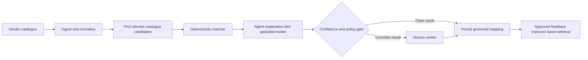

# SCUDO MatchMaker

SCUDO MatchMaker turns inconsistent vendor product catalogues into governed,
reusable mappings against a client-owned CDAO catalogue.

It combines deterministic matching, agent assistance, and human review. The
agents can explain and improve the process, but they do not become the system
of record. The core operating rule is:

> **The matcher proposes a controlled result, agents add context, and people
> decide what is uncertain.**

## Why it matters

Vendor catalogues are difficult to use consistently because product names,
identifiers, descriptions, classifications, and delivery terms vary by source.
SCUDO MatchMaker provides a repeatable way to:

- standardise vendor product metadata;
- map products to a shared business taxonomy;
- identify ambiguous or out-of-scope products;
- give reviewers the evidence behind each recommendation;
- preserve decisions and provenance for audit;
- use approved decisions to improve future retrieval without silently changing
  live behaviour.

The current product is a governed **vendor-to-taxonomy matching system**. It is
not yet a complete market-data procurement, spend, licence, usage, or
entitlement optimisation platform.

## Business flow



The same product can be run through the browser, REST API, MCP tools, or the
orchestrated Lambda path. Those surfaces share the same catalogue contracts and
governance rules, although their runtime wiring is not identical. The current
implementation documents those differences in [Technical architecture](#technical-architecture).

## Decision controls

| Control | Business meaning |
|---|---|
| Deterministic scope gate | An out-of-scope product is rejected before similarity or model judgement can change the result. |
| Candidate anchoring | Agents work from candidates retrieved by the matching engine rather than inventing catalogue nodes. |
| Confidence bands | Clear matches can proceed; borderline and weak matches are made visible for review. |
| Human-in-the-loop | Reviewers can approve, override, or reject a decision. |
| Provenance | Inputs, versions, rationale, confidence, and decisions can be traced together. |
| Durable record | Aurora PostgreSQL is the target system of record for decisions, audit, lineage, and agent memory. |
| Controlled learning | Recorded outcomes remain offline evidence until they pass holdout evaluation and receive named approval. |

## What a reviewer sees

The dashboard is designed around the business decision rather than the
underlying infrastructure:

1. A vendor file or product record enters the workflow.
2. The interface shows normalisation, candidate retrieval, scoring, and the
   confidence gate.
3. The agent explains the candidate and the evidence it used.
4. The reviewer sees the proposed mapping, alternatives, confidence, rationale,
   and any policy or validation issue.
5. The reviewer approves, overrides, or rejects the result.
6. The decision becomes a reusable precedent for similar future products.

The review controls are intentionally visible even when a run has not yet
produced a decision. A reviewer cannot approve a missing candidate or override
without an available alternative.

## Controlled self-improvement

SCUDO now has a governed foundation for improving both agent behaviour and
matching-engine quality.

### How it works

1. **Capture evidence.** Agent and deterministic-engine outcomes are stored as
   structured trajectories with input, decision, provenance, and version data.
2. **Curate a golden set.** Human-labelled examples are divided into training,
   holdout, and adversarial cases. Duplicate vendor/product identities across
   splits are rejected.
3. **Evaluate offline.** Candidate changes are measured for exact matching,
   abstention, false auto-pass, calibration, Brier score, vendor coverage, and
   taxonomy coverage.
4. **Require approval.** A candidate must pass the holdout policy and receive
   named approval before it can influence live prompts or skills.
5. **Promote immutably.** The approved artifact is stored under a versioned
   key, and a live pointer is updated only after the artifact is written.
6. **Rollback by version.** Earlier approved artifacts remain identifiable and
   can be restored by changing the live pointer.

Recording a trajectory does not change live matching. The deterministic matcher
remains authoritative at request time, and legacy scalar-only skill records are
quarantined rather than served to agents.

### Offline evaluation command

From `backend/`, evaluate saved agent or matcher results against a JSONL golden
set:

```bash
PYTHONPATH=. python -m scudo.scripts.evaluate_matching_golden \
  --golden-set cases.jsonl \
  --golden-version golden-2026-07-16 \
  --predictions results.jsonl \
  --candidate-version matcher-v2
```

The evaluator is report-only. It does not write Aurora, change thresholds, or
promote an artifact.

The strict offline promotion entry point is
`scudo.skillopt_sleep_runner.run_evaluated_sleep_cycle`. It requires a
structured holdout report and named approval. A curated business golden set
and a scheduled evaluation job are still deployment inputs.

## Current experience

### Upload and Test

The primary dashboard flow supports:

- CSV and JSON vendor uploads;
- live ETL stage events;
- candidate retrieval and matching;
- agent activity and rationale;
- confidence-band review;
- approve, override, and reject actions;
- repeat runs with reviewer-selected thresholds.

### Matching Test

The narrower `/matching-test` experience supports:

- selecting an available agent provider;
- uploading a vendor file;
- ingesting a website URL through the guarded ingestion path;
- watching the agent run;
- inspecting the final authoritative matcher result.

### Demonstration endpoints

Known demonstration endpoints are documented here for stakeholder review. Use
synthetic data only, and treat these as closed demonstrations until the
authentication and deployment controls in [Open work and limits](#open-work-and-limits)
are completed.

- [Stakeholder dashboard](https://dp4ji14se0pct.cloudfront.net/cogJPMdemo/)
- [Dashboard deployment](https://d2im563be0sl1r.cloudfront.net/demo/)
- [Matching Test](https://d2im563be0sl1r.cloudfront.net/matching-test)

## How matching works

The matcher uses a first-match-wins cost ladder:

1. **Scope:** check whether the product is eligible for the requested
   catalogue context.
2. **Precedent:** reuse a confirmed human decision when one exists.
3. **Retrieval:** find and rank a bounded set of catalogue candidates.
4. **Validation:** run deterministic checks against the leading candidate.
5. **Confidence gate:** classify the result as PASS, BORDERLINE, or FAIL.
6. **Specialist, when appropriate:** use an agent only in the borderline
   window and keep it anchored to the retrieved candidates.
7. **Review or persistence:** clear results proceed through the applicable
   publish controls; uncertain results go to human review.

The default business bands are:

| Band | Default score | Meaning |
|---|---:|---|
| PASS | `>= 0.80` | Strong candidate, subject to validation and publish controls. |
| BORDERLINE | `0.70 - <0.80` | Evidence is useful but not decisive; specialist or human review may be required. |
| FAIL | `<0.70` | Insufficient confidence for unattended mapping. |

The public REST path requires specialist confirmation for borderline cases. Some
library and agent paths use the configured floor as a fallback when no
specialist is available. This is an implementation distinction, not a change to
the business policy that uncertain work must remain reviewable.

## Human review and feedback

Human review is a control point, not an exception path.

- **Approve** confirms the proposed mapping.
- **Override** records a different catalogue node.
- **Reject** records that the candidate is not suitable.

Decisions are bound to the authenticated reviewer, retain the source and
decision provenance, and can influence future candidate ranking through a
precedent overlay. The graph store is a retrieval index; it is not the
authoritative record of what the business decided.

## Data and catalogue scope

The catalogue model supports both:

- business catalogue concepts such as products, datasets, distributions,
  services, delivery channels, fields, and taxonomies;
- rights and contract concepts such as parties, contracts, policies, duties,
  permissions, obligations, and documents.

Rights and scope checks are deterministic and fail closed. Similarity alone
does not grant entitlement. The rights graph is available as context, but the
current matching product should not be described as a complete automated
licence or entitlement decision system.

Vendor ingestion currently supports the normalised frame contract used by the
matching engine, with adapters for CSV, JSON, XML, XLSX, and guarded URL
ingestion paths. Source hashes and audit identifiers are preserved when the
upstream source provides them.

## Current status

### Implemented and verified

- Deterministic matching cost ladder with scope, precedent, retrieval,
  validation, confidence, and specialist seams.
- Scripted, Bedrock, and Azure agent runtime options behind a common event
  contract.
- Browser-facing upload, matching, agent, and human-review workflows.
- Aurora-backed agent memory with fail-open reads and fail-loud writes.
- Structured agent and matching-engine trajectories.
- Versioned golden-set evaluator with holdout leakage protection.
- Named-approval and immutable-artifact promotion boundary.
- Rollback-compatible versioned live skill records.

### Required before broader external use

- Curated, representative business golden sets, including adversarial cases.
- A scheduled evaluation and approval workflow for self-improvement.
- Replacement or calibration of the current string-similarity stand-in with
  production semantic retrieval.
- A complete Neptune retrieval implementation if Neptune is selected as a
  deployment backend.
- Production identity enforcement at the gateway and removal of dev-open auth.
- Durable reviewer-queue persistence for the separated MCP deployment shape.
- Deployment of the latest SSE heartbeat and dashboard assets where required.

These are explicit boundaries, not hidden assumptions. The repository is
designed so they can be addressed without allowing unvalidated learning to
change live mappings.

## Quick start

The fastest local path uses the in-memory retrieval backend and synthetic data.
It does not require AWS credentials or a graph database.

```bash
cd backend
python -m venv .venv
source .venv/bin/activate
pip install -r requirements.txt

export STORE_BACKEND=memory
export SCUDO_AUTH_ALLOW_DEV=1
export SCUDO_AUTH_DEV_PRINCIPAL=local@dev
export SCUDO_VERDICT_ALLOW_DEV=1

gunicorn -b 0.0.0.0:5000 -k gthread --threads 4 --timeout 300 app:app
```

In a second terminal:

```bash
cd frontend
npm install
npm run dev
```

For the full local trust-gradient deployment, run FalkorDB and the three MCP
services as described in
[`backend/scudo/DEPLOY.md`](backend/scudo/DEPLOY.md). Neptune is reachable only
from an appropriate AWS network.

## API entry points

The main browser and integration surfaces are:

| Endpoint | Purpose |
|---|---|
| `POST /api/mapping/ingest/stream` | Upload and observe normalisation stages. |
| `POST /api/mapping/map` | Run the deterministic matcher for one product. |
| `POST /api/mapping/agent/run` | Stream an agent-assisted matching run over SSE. |
| `POST /api/mapping/decision` | Approve, override, or reject a decision. |
| `GET /api/mapping/graph` | Read the dashboard's matching architecture payload. |
| `GET /api/mapping/agent/describe` | Inspect configured agent providers. |

The matcher package and MCP services expose the same typed contracts to
automation clients. Raw Cypher, SPARQL, and unrestricted graph queries are not
agent-facing tools.

## Technical architecture

The approved target architecture has five business-relevant zones:

| Zone | Responsibility | Representative code |
|---|---|---|
| 1. Sources and ingestion | Receive vendor metadata and create normalised records. | `backend/scudo_mapping_mcp/ingest.py`, `backend/scudo_mapping_mcp/frames.py`, `backend/scudo_mapping_mcp/url_ingest.py` |
| 2. Processing | Validate, clean, quarantine, land, and audit source data. | `backend/scudo_mapping_mcp/validations.py`, `backend/scudo/etl_handler.py` |
| 3. Matching engine | Retrieve candidates, apply policy, score, validate, and gate. | `backend/scudo_mapping_mcp/matching.py`, `backend/scudo_mapping_mcp/store/`, `backend/scudo/matcher_bridge.py` |
| 4. Agentic layer | Provide contextual reasoning, specialist assistance, and verification. | `backend/scudo/orchestrator.py`, `backend/scudo/agents.py`, `backend/scudo_mapping_mcp/agent.py` |
| 5. Persistence and review | Store decisions, audit, lineage, memory, and review outcomes. | `backend/scudo/aurora_store.py`, `backend/scudo/aurora_memory.py`, `backend/scudo_mapping_mcp/feedback.py` |

Aurora PostgreSQL is the target system of record. FalkorDB, Neptune, or the
in-memory backend provides retrieval according to `STORE_BACKEND`; these stores
are not authoritative for business decisions.

The three MCP services are:

- **Ingestion:** normalises vendor input and provides bounded frame context.
- **Match-Verify:** provides bounded catalogue evidence and signed deterministic
  verdicts.
- **Persistence:** verifies verdicts and owns the write boundary for the
  separated MCP deployment shape.

The current Flask deployment often calls these package functions in-process.
The networked MCP topology remains available for the trust-gradient deployment
shape. Both shapes preserve the same bounded operation contracts.

## Repository guide

```text
backend/scudo_mapping_mcp/   Matching engine, MCPs, catalogue models, agents
backend/scudo/                Orchestrator, Lambda substrate, Aurora memory,
                              self-improvement, deployment scripts
backend/routes/               Flask REST facade
frontend/                     React console and matching-test experience
dashboard-dist/               Vendored dashboard build
infra/                        AWS infrastructure and deployment runbooks
docs/architecture/            Approved architecture diagrams and UML sources
docs/okf/scudo/               Navigable project knowledge base
ZONES.md                      Module-to-zone map
```

## Self-improvement implementation map

| Capability | Location |
|---|---|
| Golden cases, metrics, and promotion contracts | `backend/scudo/matching_self_improvement.py` |
| Report-only evaluator | `backend/scudo/scripts/evaluate_matching_golden.py` |
| Agent memory and trajectory persistence | `backend/scudo/aurora_memory.py` |
| Deterministic-engine trajectory adapter | `backend/scudo/aurora_memory.py` |
| Strict offline sleep cycle | `backend/scudo/skillopt_sleep_runner.py` |
| Live prompt skill pinning | `backend/scudo/schemas.py`, `orchestrator.py`, `lambda_handler.py` |

## Testing and verification

Run from `backend/`:

```bash
# Focused self-improvement and memory coverage
PYTHONPATH=. pytest \
  scudo/tests/test_matching_self_improvement.py \
  scudo/tests/test_aurora_memory.py \
  scudo/tests/test_lambda_handler_memory_wiring.py \
  scudo/tests/test_skillopt_sleep_runner.py -q

# Full SCUDO and matching-engine coverage
PYTHONPATH=. pytest scudo/tests scudo_mapping_mcp/tests -q \
  --disable-warnings --maxfail=10
```

The focused suite currently passes 49 tests. The full SCUDO and matching-engine
run currently passes 463 tests and has two known failures in
`scudo/tests/test_provenance.py` caused by pre-existing forbidden Marketing
content in the generated conceptual graph. Those failures are unrelated to the
self-improvement implementation.

Additional standalone smoke suites are available:

```bash
PYTHONPATH=. python -m scudo_mapping_mcp.tests.smoke
PYTHONPATH=. python -m tests.test_auth
```

The root `backend/tests/test_ingest_*.py` files currently have a pytest
collection-path issue involving `_ingest_helpers`; use the relevant standalone
test command or exclude those files while that test-infrastructure issue is
resolved.

## Deployment and operating references

Use the detailed runbooks for deployment rather than copying commands from this
overview:

- [`backend/scudo/DEPLOY.md`](backend/scudo/DEPLOY.md) - SAM/Lambda deployment
  and required Aurora inputs.
- [`infra/DEPLOY_RUNBOOK_scudo-poc.md`](infra/DEPLOY_RUNBOOK_scudo-poc.md) -
  CloudShell deployment, smoke checks, and rollback.
- [`infra/HANDOVER_5zone_alignment.md`](infra/HANDOVER_5zone_alignment.md) -
  why Aurora is the target system of record.
- [`ZONES.md`](ZONES.md) - module-to-zone ownership.
- [`docs/architecture/README.md`](docs/architecture/README.md) - approved
  architecture diagrams and UML sources.
- [`docs/okf/scudo/index.md`](docs/okf/scudo/index.md) - navigable knowledge
  base covering architecture, operations, specifications, and plans.

## Open work and limits

The following items should be treated as explicit delivery gates:

1. **Retrieval quality:** the default dense arm is currently Jaro-Winkler
   string similarity, not a calibrated production embedding model. Thresholds
   must be recalibrated when the scoring backend changes.
2. **Golden data:** the evaluator is implemented, but a representative,
   approved business golden set and scheduled evaluation process are not
   included in this repository.
3. **Self-improvement operations:** the offline evaluator and promotion boundary
   are implemented; the default optimizer/evaluator integration and scheduled
   AWS job remain operator-owned.
4. **Neptune:** the Neptune retrieval implementation is not complete enough to
   treat it as a production matching backend.
5. **Identity:** the current demo posture can allow dev-open authentication.
   External exposure requires a trusted gateway identity boundary and removal
   of the dev bypass.
6. **Reviewer queue:** the separated Persistence MCP currently has an
   in-memory reviewer queue; durable queue wiring remains open.
7. **Test debt:** the two provenance failures and the ingest test collection
   issue described above remain visible and should not be hidden.

## Glossary

| Term | Meaning |
|---|---|
| CDAO catalogue | The client-owned taxonomy and related catalogue/rights model that products are mapped into. |
| HITL | Human-in-the-loop review for uncertain or policy-sensitive decisions. |
| Precedent | A confirmed human decision reused as evidence for a later similar product. |
| Golden set | Versioned, human-labelled examples used to evaluate matching changes. |
| Holdout set | Examples kept out of training or candidate generation and used for promotion evaluation. |
| Confidence band | The policy classification of a match as PASS, BORDERLINE, or FAIL. |
| MCP | Model Context Protocol service exposing bounded, typed operations to agents. |
| Trajectory | A structured record of an input, decision, evidence, and versions used for offline analysis. |

## Source of truth

This README is the business and engineering index. Detailed implementation
decisions belong in the linked architecture diagrams, specifications, plans,
and deployment runbooks. When those documents disagree, use the current code
and the approved architecture sources, then record the decision in the relevant
specification.
