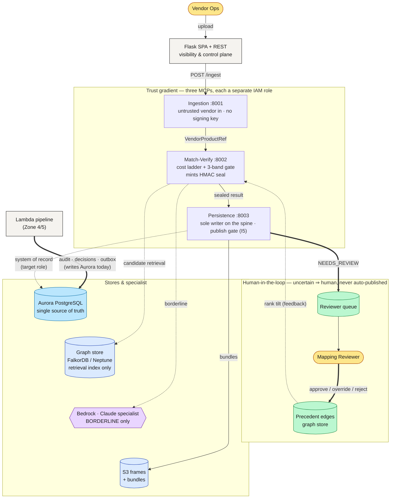
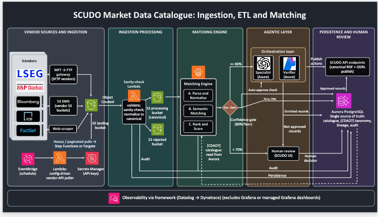
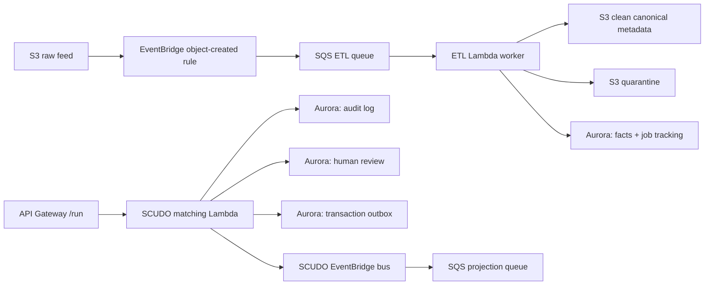
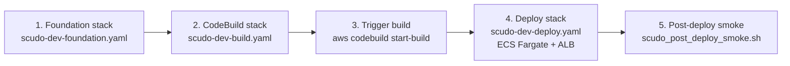

# SCUDO MatchMaker

An **agentic mapping system**: LLM agents, grounded by three MCP servers and bounded
by deterministic gates, map untrusted vendor market-data products onto the client's
CDAO catalogue — and a human owns every decision the agents aren't sure about.

The operating principle throughout: **agents propose, gates dispose, humans decide
the uncertain.** The LLM sits in the judgement path only — routing, thresholds,
entitlement, and publishing all run as plain code the model cannot route around.

> **📐 For client engineers standing this up:** the approved target architecture is
> [`docs/architecture/scudo-5zone-architecture.png`](docs/architecture/scudo-5zone-architecture.png);
> the module→zone map is [`ZONES.md`](ZONES.md); the exact deploy commands are
> [`backend/scudo/DEPLOY.md`](backend/scudo/DEPLOY.md); and the consolidation
> record (why the design moved off DynamoDB/graph-of-record onto Aurora) is
> [`infra/HANDOVER_5zone_alignment.md`](infra/HANDOVER_5zone_alignment.md). The
> section [Where this diverges from the code on git](#where-this-diverges-from-the-code-on-git-and-why)
> explains, deliberately and honestly, where the code retains paths the client
> chose not to take.

> **🟢 Live demos (link-checked 2026-07-15 — every URL below serves end-to-end):**
> - Stakeholder demo: https://dp4ji14se0pct.cloudfront.net/cogJPMdemo/
> - Second deployment — dashboard: https://d2im563be0sl1r.cloudfront.net/demo/
> - Second deployment — Matching Test page: https://d2im563be0sl1r.cloudfront.net/matching-test
>
> The SCUDO Matching Comprehension dashboard: the interactive **Upload & Test**
> flow (upload a vendor CSV/JSON → watch it stream live through ETL → matcher →
> agent), **always-visible HITL** (Approve / Override / Reject), and
> **reviewer-tunable confidence bands** (move the borderline window → re-band
> live + re-run). **Auth is currently dev-open — closed demo only; see the auth
> gate in "What is NOT done" before external exposure.**

> **Status:** 117 mapping + 12 auth standalone smoke gates passing; 422 hermetic
> pytest tests collected (2 pre-existing `test_provenance.py` failures, flagged in
> [What is NOT done](#what-is-not-done)). The primary AWS target is the Cognizant
> cloudboost account `954976331678` in `us-east-1` (stack `scudo-poc`); a second
> independent deployment runs in `426271381846`. **These are dev sandboxes**,
> **not** the client's SCUDO production account. Treat all thresholds, dense-arm
> similarity, and Neptune retrieval as uncalibrated stand-ins until the
> production cutover.

---

## The agent system

SCUDO is agents-first: the unit of work is an agent run that converges one vendor
product onto one CDAO catalogue node, with every step observable and every
uncertain outcome escalated to a human. There are two agent runtimes — the
orchestrated Lambda pipeline and the streaming REST agents — sharing one
candidate-retrieval layer, one catalogue model, and one set of invariants.
(They do not share a matcher *execution*: the Lambda path uses the matcher for
candidate nomination only, while the REST path runs the full cost ladder — the
split is pinned in `matcher_bridge.py` and spelled out honestly below.)

### The agent team (Zone 4 — orchestrated pipeline)

The Lambda pipeline (`backend/scudo/`) is a deterministic Python **Orchestrator**
driving a maker/checker pair of Strands agents, with a third defined for rights:

| Agent | Tools | Role |
|-------|-------|------|
| **Mapping Specialist** | full factory (`agents.py`): catalogue read tools + skills (taxonomy-mapping, rights-odrl, rdf-serialisation, neptune-io) + hooks. The deployed Lambda currently builds a lighter prompt-only variant of this agent. | Selects a target IRI **from the assembled candidate bundle** and drafts the mapping |
| **Rights Specialist** | rights tools only, no graph reads — factory exists (`build_rights_specialist`); **not wired into the Lambda run yet** (`rights_specialist=None`) | Assesses licensing/entitlement questions |
| **Verifier** | **no tools, no skills** | Independent judgement: scores the draft against a fixed 10-dimension 0/1/2 rubric |

The orchestrator's loop is plain code: validate → deterministic route
(`NEW_MAPPING / EXTEND_MAPPING / RECONCILE_CONFLICT / RESEARCH`) → assemble
bundle → specialist → deterministic RDF serialisation fallback → pre-verify
defect checks → verifier → gate-and-decide. The publish gate is hard-coded:
verifier total **≥16** AND confidence **≥0.80** AND deterministic-IRI regex, or
no publish. Scores 12–15 return a `RETRY` outcome whose rejection reasons ride
back to the **maker only, never the verifier**, so verifier independence is
preserved (the batch runner honours exactly one retry; the single-shot Lambda
surfaces `RETRY` to the caller). `RESEARCH` routes can never publish.
(`orchestrator.py`, `batch.py`, `lambda_handler.py`.)

### The streaming mapping agents (REST path)

`POST /api/mapping/agent/run` streams a live agent run over SSE. Three
interchangeable backends sit behind one factory (`scudo_mapping_mcp/agent.py`):
**Scripted** (deterministic walk, the default), **Bedrock** (Strands tool loop),
and **Azure OpenAI** (single-shot shim). All three emit the same seven-event
contract — `start · tool_call · tool_result · agent_message · final_result ·
error · done` — so the front end renders any provider identically.

The pinned contract in code: *the agent explores and recommends; the
deterministic matcher always runs as the authoritative final step. If the
agent's recommendation conflicts with the matcher's status, the matcher wins.*

### How the agents are set up with the matcher

The matcher (`scudo_mapping_mcp/matching.py`) is a five-rung, first-match-wins
**cost ladder** (detailed [below](#the-matching-cost-ladder)). The agents don't
replace it — they are mounted *around* it, at two seams, and the two runtimes
use it differently:

- **Candidate nomination (Lambda path).** The Zone-4 bundle assembler pulls
  scored candidates from the graph store via
  `matcher_bridge.retrieve_candidates` — explicitly a "candidate nominator
  only, NO ladder gating" — and hands them to the specialist as its working
  set. On this path the *orchestrator's own gate* (verifier rubric +
  confidence floor) is the decision authority, not the ladder's 3-band gate.
- **Authoritative ladder run (REST/agent path).** The streaming agents always
  finish by calling `map_vendor_product` — the full ladder — as the
  authoritative final step, whatever the LLM recommended along the way.
- **Rung 4 specialist seam.** Inside the ladder, the borderline arm calls a
  pluggable `SpecialistScorer` callable. `SCUDO_SPECIALIST_BACKEND` selects a
  local Bedrock re-scorer, a remote REST specialist, or none at all; every
  implementation **abstains on error** rather than guessing.

### How the agents shape the target

"Shaping the target" is the discipline that makes agent output land inside the
catalogue instead of beside it:

1. **Candidate anchoring.** Specialists must select from the candidates the
   sparse ranker surfaced. In the cost ladder's Rung-4 arm this is enforced
   deterministically: an off-list pick **fails closed** — the result becomes
   `NEEDS_REVIEW` with `invariant_violation="specialist_off_list"`, confidence
   capped below the borderline threshold, and the off-list IRI discarded. In
   the Lambda orchestrator, an off-list pick is recorded as a pre-verify
   defect that the verifier and publish gate then judge — flagged, not yet a
   hard deterministic block on that path.
2. **Concurrence can reinforce, never inflate.** When the specialist agrees
   with the dense arm, confidence is `min(dense, specialist)` — a hallucinating
   specialist returning 0.99 cannot lift a 0.74 candidate past the gate.
3. **Disagreement escalates.** If the specialist prefers a different candidate,
   the deterministic pick stays primary, the specialist's ride-along becomes
   `alternative_mapped_node_iri`, and confidence is capped into the fail band —
   a human sees both.
4. **The ontology is injected as context, not authority.** A
   `describe_system_context` tool (pre-injected into the prompt for Azure's
   single-shot path) gives the agent the catalogue-vs-rights kind map derived
   live from the model enums, plus the instruction to route rights/licensing
   questions to `NEEDS_REVIEW` rather than force a catalogue node.

### Agent best practices this codebase enforces

These are not aspirations; each is pinned by code and tests:

- **LLM in the judgement path, never the routing or publish path** — routing,
  gates, and thresholds run unconditionally in Python (`orchestrator.py` module
  contract).
- **Context over capability** — the MCP spine feeds agents pre-digested,
  clamped context and withholds writes and keys (next section).
- **Independent verification** — the verifier has no tools and never sees the
  maker's retry feedback; its `total_score` is recomputed in code and
  overridden if the model wrote an inconsistent sum.
- **Escalate, don't guess** — uncertain results become `NEEDS_REVIEW`, never a
  forced pick ([Human-in-the-loop by design](#human-in-the-loop-by-design)).
- **Pay for intelligence only when it changes the outcome** — inside the cost
  ladder, the Rung-4 specialist runs on the borderline band only; a clean PASS
  or FAIL never invokes the specialist. (An explicitly-requested agent run via
  `/agent/run` is the exception by design — the user asked to watch an agent.)
- **Per-tool-call guardrails** — Strands hooks cancel raw SPARQL/Turtle/Cypher
  in tool arguments (`RejectRawQueryHook`), deny agent-loop publishing
  (`PublishGateHook`), cap graph reads at 12 per invocation
  (`NeptuneReadCapHook`), and stamp ontology/rubric/schema versions
  (`VersionPinHook`) (`backend/scudo/hooks.py`).
- **Decisions compound** — the orchestrator CONSULTs Aurora agent memory
  (precedents, promoted rules, the current best matching skill) during bundle
  assembly and DISTILLs verified outcomes back after publishing; HITL verdicts
  write precedent edges that tilt the next retrieval
  (`aurora_memory.py`, `feedback.py`).
- **Integrity is cryptographic, not conventional** — the verdict travels as an
  HMAC-sealed payload the agent carries but cannot forge, cannot re-target to
  another product, and cannot hold past its 300s expiry
  ([trust gradient](#the-mcp-spine-context-for-agents-capability-withheld)).

---

## The MCP spine: context for agents, capability withheld

The three MCP servers are how SCUDO **contextualises everything for the
agents**. The design rule: an agent never authors a raw query and never gets
unclamped access — each MCP turns its zone of the world into typed, bounded,
pre-digested context the agent can reason over, and withholds the capability
that would let the agent (or a compromised input) do damage.

(Deployment honesty up front: in the current sandbox the Flask tier and the
streaming agents call the **same underlying package functions in-process** —
same tool contracts, same store-seam clamps, one process; the REST agents
reach the store through `get_store()` directly rather than over the MCP wire.
The three MCPs run as separately-IAM'd network services in the legacy ECS
deploy stack, and the `McpHost` network transport exists behind a flag — see
[Where this diverges](#where-this-diverges-from-the-code-on-git-and-why). What
holds in *every* shape is the seam: retrieval operations, never query strings,
always clamped.)

**What each MCP contributes to the agent's context:**

- **Ingestion MCP (`:8001`) — normalises vendor chaos.** Any vendor's catalogue
  becomes the canonical `VendorProductRef` shape (vendor, product_id, name,
  description, raw, provenance hashes) via `ingest.list_frames` /
  `ingest.get_frame`. Adding a vendor is a new adapter, not a new server.
  Per-product frame reads go through one swap point
  (`frames._read_vendor_frame` — in-memory locally, S3 in prod, provenance
  hashes computed by the reader itself), and the fail-closed scope gate fires
  at this boundary as defence layer 1 for identifier lookups. It fires again
  inside the matcher for every mapping (short-circuiting to an explicit,
  sealed `OUT_OF_SCOPE` verdict before any store or LLM work) and again at
  Persistence, which refuses to enqueue an out-of-scope commit — so an
  out-of-scope product can be *recorded* as out of scope, but on the MCP/REST
  path it is never mapped and never published, even if it appears in a
  working-set listing. (Honest gap: the Lambda pipeline has **no scope gate
  today** — `IntakeRequest` accepts any vendor string and the orchestrator
  never calls `check_scope`; its protections are the candidate anchor, the
  verifier rubric, and the publish gate. Wiring the ODRL scope gate into the
  Lambda intake is open work.)
- **Match-Verify MCP (`:8002`) — serves judgement-ready evidence.** The agent
  gets typed `Candidate` objects with similarity scores (negative-precedent
  drop, HITL rank-tilt, and dense+lexical fusion already applied inside the
  store), single taxonomy nodes with parent/children, and bounded subgraphs.
  At startup its lifespan hook seeds the CDAO taxonomy and replays the
  canonical precedent bundle when one is available (no bundle or a failed
  hydration is logged, and the server proceeds — hydration is best-effort,
  not a boot gate). `matchverify.verify_mapping` returns the full
  deterministic verdict — **sealed**.
- **Persistence MCP (`:8003`) — makes refusal legible.** The sole writer *on
  the agent path*: within the MCP spine, no other server can write. Every
  refusal is a typed envelope with a reason — *"the agent reasons over
  reason"* — so a refused commit is itself context for the agent's next step.
  Even a validly-sealed `AUTO_MAPPED` verdict arriving via the agent path is
  routed to the reviewer queue, never written to canon (invariant I5).
  Its implemented writes today are the precedent write-back
  (`persist.record_decision` → `feedback.apply_decision`) and canonical S3
  bundles; its reviewer queue is still in-memory, and the Aurora writes shown
  in the target diagrams happen on the Lambda pipeline
  (`aurora_store.py`) — see [What is NOT done](#what-is-not-done).
  (The Flask HITL endpoint and the Lambda pipeline have their own, equally
  gated write paths — `feedback.apply_decision` behind auth, and the
  orchestrator's publish gate — the "sole writer" claim is about the agent
  spine, not every process in the system.)

**What each MCP withholds** is the other half of the design. Retrieval is
clamped in the store seam regardless of what the caller asks for (≤25
candidates, ≤3 hops, ≤100 nodes — *appropriate* context, not maximum context).
No MCP tool accepts a query string (I2); Cypher lives inside the FalkorDB
store, SPARQL inside the Neptune store, and neither leaks above that line.
Smoke gates statically assert (via AST) that Ingestion and Match-Verify import
no writer functions.

```mermaid
flowchart LR
    subgraph untrusted[" Untrusted zone "]
        ing[Ingestion MCP :8001<br/>ingestion_mcp.py<br/>--<br/>CONTEXT GIVEN: normalised VendorProductRef,<br/>provenance hashes, scope pre-check<br/>--<br/>WITHHELD: signing key EXPLICIT DENY,<br/>graph-store write DENY]
    end

    subgraph readonly[" Read-only retrieval "]
        mv[Match-Verify MCP :8002<br/>match_verify_mcp.py<br/>--<br/>CONTEXT GIVEN: scored candidates &#40;≤25&#41;,<br/>taxonomy nodes, bounded subgraphs &#40;≤3 hops&#41;,<br/>sealed deterministic verdicts<br/>--<br/>WITHHELD: all writes; Bedrock + graph READ only]
    end

    subgraph writer[" Sole writer "]
        per[Persistence MCP :8003<br/>persistence_mcp.py<br/>--<br/>CONTEXT GIVEN: typed refusal envelopes,<br/>reviewer-queue state<br/>--<br/>HOLDS: precedent write-back, canonical S3,<br/>seal VERIFY &#40;Aurora write = target role;<br/>today on the Lambda path&#41;]
    end

    vendor[(Vendor S3 frames)] --> ing
    ing -->|VendorProductRef| mv
    mv -->|sealed MappingResult<br/>HMAC-SHA256 v=2| per
    mv -.candidate retrieval.-> graphdb[(Graph store<br/>FalkorDB / Neptune)]
    per -->|"system of record (target;<br/>today written by the Lambda pipeline)"| aur[(Aurora PostgreSQL)]
    per -.precedent edge.-> graphdb
    per --> s3b[(S3 canonical bundles)]
```



**The trust gradient is IAM-enforced, and each step of it is also a context
boundary.** Each MCP runs as a separate ECS Fargate service with its own task
role: Ingestion's role carries an **explicit Deny** on the verdict signing key
and the reviewer queue; Match-Verify can read the graph, invoke Bedrock, and
**sign**; Persistence can write, and **verify**. The HMAC-SHA256 seal (v=2,
binding input-hash, target IRI, status, confidence, band, timestamp) is the
wire contract: Ingestion cannot mint one, the agent can carry but not forge
one, a verdict for product X cannot be replayed against product Y
(identity-bound), and a stale one dies at 300s — within that window and for
the same product, a seal is deliberately re-presentable, which is why even a
sealed AUTO_MAPPED still queues for review. Persistence reads the status
**from the sealed payload** — not from anything the agent passed alongside —
before letting a write near invariant I5.

Today the Flask REST tier calls these tools in-process (same package, two
transports); the three MCPs run as separate networked services in the ECS
deploy stack. The `McpHost` network transport exists behind
`SCUDO_MCP_HOST_ENABLED` but is not yet wired by default — see
[Where this diverges](#where-this-diverges-from-the-code-on-git-and-why).

---

## Architecture at a glance

Read the flow top-to-bottom: a vendor file enters at the top, travels the
three-MCP spine left-to-right, and anything the agents aren't sure about exits
into the **human-in-the-loop** (green), whose decisions loop back to make future
matches better. Solid arrows are the publish path; dotted arrows are reads /
advisory signals.



The thick green loop is the point: a mapping the agents can't confidently decide
is written to the reviewer queue as `NEEDS_REVIEW` — never auto-published — and a
human's verdict is written back as a precedent edge in the graph store that
tilts the next match's retrieval. Aurora is the record of *what was decided* —
written today by the Lambda pipeline (audit, decisions, outbox), with the
Persistence MCP's Aurora role a target-architecture assignment; the graph store
is the *retrieval index* the matcher searches (and the precedent overlay the
loop tilts).

---

## Target architecture (5 zones)

This is the client-approved target architecture (2026-07-03). Everything else in
this README is an implementation detail underneath it. Read it left-to-right:
vendor product metadata enters at Zone 1 and flows through to the system of
record and human loop at Zone 5.



| Zone | Name | What it does | Code |
|------|------|--------------|------|
| **1** | Vendor Sources & Ingestion | Vendor product metadata enters (MFT/FTP, vendor-S3/DMS, or single-URL scrape). Onboarding a vendor is a **config change**, not a new Lambda. | `poller_handler.py`, `ingestion_mcp.py`, `ingest.py`, `url_ingest.py` |
| **2** | Ingestion Processing (ETL) | Validate → normalise → land (clean/canonical or quarantine) + audit. | `etl_handler.py`, `frames.py`, `validations.py`, `csvw_aliases.py` |
| **3** | Matching Engine | The cost ladder: scope → precedent → hybrid retrieval → confidence gate (PASS ≥0.80 / BORDERLINE 0.70–0.80 / FAIL <0.70). | `matching.py`, `retrieval.py`, `matcher_bridge.py`, `store/` |
| **4** | Agentic Layer | Orchestrator → specialist → verifier → gate-and-decide, routing auto-approve / HITL / reject. Bedrock (Claude) default; Azure OpenAI shim optional — exact model defaults per path in [Where this diverges](#where-this-diverges-from-the-code-on-git-and-why). | `orchestrator.py`, `agents.py`, `lambda_handler.py`, `agent.py` |
| **5** | Persistence & Human Review | The system of record and the human loop. | `aurora_store.py`, `projection_handler.py`, `catalogue.py`, `persistence_mcp.py`, `feedback.py` |

> **⚡ Aurora PostgreSQL is the single source of truth.** One cluster, four schemas
> (`public`, `scudo`, `console`, `ingestion`) — audit, decisions, transactional outbox,
> catalogue, lineage, ETL jobs, taxonomy, and agent memory. The DynamoDB tables the
> older design used were consolidated into Aurora and removed. The graph store
> (FalkorDB / Neptune) is a **Zone 3 retrieval index only** — candidate discovery,
> never the record of what was decided.

The full module→zone map is [`ZONES.md`](ZONES.md), and the five zones are made
importable in code (without moving any files) by the re-export façade at
[`backend/scudo/zones/`](backend/scudo/zones/). The canonical record of *why* the
design consolidated onto Aurora is
[`infra/HANDOVER_5zone_alignment.md`](infra/HANDOVER_5zone_alignment.md); the
exact CloudShell deploy commands are [`backend/scudo/DEPLOY.md`](backend/scudo/DEPLOY.md).

---

## The catalogue target the agents shape

The matcher maps vendor products *into* the client-supplied "MDS DataCatalog and
Digital Rights" ontology. In code this is one discriminated model
(`backend/scudo_mapping_mcp/models.py`), and the agents consume it as **context**:

- **20 catalogue + rights kinds.** `ConceptualNodeKind` carries 13 catalogue/DCAT
  kinds (`product_package`, `delivery_product`, `data_service`,
  `delivery_channel`, `distribution`, `distributed_dataset`, `data_taxonomy`,
  `field_group`, `field`, …) — what a matched product becomes a node in — and 7
  rights/contract kinds (`party`, `contract`, `policy`, `duty`, `permission`,
  `obligation`, `document`), transcribed from the client's UML (2026-07-13) with
  per-kind subtype validation and a closed 15-edge vocabulary.
- **Rights are a fail-closed gate, not a suggestion.** The rights half is
  enforced by a deterministic ODRL 2.2 evaluator
  (`rights_odrl.py`) wired in as **rung 1 of the matcher** via
  `frames.check_scope`: any exception, unknown constraint, or unmatched rule is
  DENY. *Similarity is not entitlement* — no model gets a vote on scope.
- **The agents get the map, with honest boundaries.** `describe_system_context`
  hands the agent both halves of the ontology, derived live from the enums, and
  instructs it to route rights/licensing questions to `NEEDS_REVIEW` because the
  deterministic matcher does not yet gate on the rights *graph* (only the ODRL
  scope gate). LLM-inferred enrichment can never be written into the taxonomy
  text the confidence gate reads — a guard test pins that provenance boundary.
- **`ContentDeliveryModel` is complete and citation-guarded.** All 11 delivery
  literals are confirmed identically by both client UML images; a test fails
  loudly if any member is ever added or kept without a documented source
  (`test_rights_contract_model.py`).
- **New matching signals ship dark.** The UML-derived signals
  (`businessConcept` / `assetClass` / `superAssetClass`) are loaded and persisted
  unconditionally, but their effect on matching sits behind two default-off
  flags (`SCUDO_TAXONOMY_UML_TEXT` — BM25 text only, dense scores provably
  unmoved; `SCUDO_ASSET_CLASS_VALIDATION` — deterministic asset-class
  validation), so the 0.80/0.70 band contract cannot drift by accident.

---

## Human-in-the-loop by design

SCUDO never auto-publishes a mapping the agents aren't sure about. Human review is
a first-class stage of the pipeline, not a bolt-on — five mechanisms keep the
human in control of every uncertain decision:

1. **Uncertain mappings escalate; they don't guess.** A mapping auto-publishes only
   when it clears the gate cleanly — a confirmed-precedent reuse, or a PASS band the
   specialist concurs with. A BORDERLINE result the specialist can't confirm
   (verifier dissent), or one a reviewer-tightened window pushes below PASS, is marked
   `NEEDS_REVIEW` and routed to the reviewer queue — *not* the graph of record.
2. **The publish gate is hard (invariant I5).** On the agent spine, Persistence
   is the only writer and refuses any verdict whose HMAC seal it can't verify;
   on the Lambda path the orchestrator's publish gate plays the same role.
   On no path does agent output become canonical around a NEEDS_REVIEW
   decision — releasing one requires a human.
3. **The review surface is always visible.** In the dashboard, Approve / Override /
   Reject and the agent's reasoning render on load (not hidden until a borderline run
   happens), and each action is prerequisite-gated by the backend result — a reviewer
   can't approve a mapping that has no candidate, or override without an alternative.
4. **Reviewers set the risk threshold, live.** The borderline window is reviewer-movable
   *per request*; re-running with a tighter or looser window changes what auto-maps
   versus what escalates. The human owns the threshold — it is not a hard-coded constant.
5. **Decisions compound.** Approve / override / reject feed the precedent graph, which
   tilts future retrieval ranking — so each human decision makes the next similar
   mapping cheaper and more likely to clear without review.

Every decision is attributable and reversible: the per-decision trajectory, the
sealed verdict, and the human action are all recorded artefacts, and `decided_by`
is bound to the authenticated principal — a `decided_by` in the request body is
ignored. Implementation: `feedback.py` (write-back → precedent),
`persistence_mcp.py` + `verdict.py` (publish gate), and the dashboard HITL surface
in [How the front end supports the agents](#how-the-front-end-supports-the-agents).

---

## The matching cost ladder

Five rungs. First match wins. A **PASS** (≥0.80) auto-maps; a **FAIL** (<0.70) rejects.
What happens to a **BORDERLINE** (0.70–0.80) depends on the caller: the public REST path
(`/api/mapping/map`, `borderline_requires_specialist=True`) demands a specialist decision
or routes to human review, while the default library/agent path
(`matcher_bridge`, MCP, `borderline_requires_specialist=False`) falls back to the
deterministic **floor** — auto-mapping a borderline candidate whose score is ≥ the 0.75
floor centre and escalating the rest. Both paths run the same gate; they differ only in
how strict the borderline arm is.

```mermaid
flowchart TD
    start([VendorProductRef in]) --> r1{{Rung 1: scope gate<br/>frames.check_scope + ODRL<br/>fail-closed}}
    r1 -->|deny| fail_scope([REJECT - out of scope])
    r1 -->|allow| r2{{Rung 2: precedent reuse<br/>CONFIRMED only}}
    r2 -->|hit| seal([Seal verdict - PASS])
    r2 -->|miss| r3[Rung 3: hybrid retrieval<br/>dense + BM25 lexical + RRF<br/>+ negative-precedent drop + rank tilt]
    r3 --> band{{3-band gate<br/>PASS / BORDERLINE / FAIL}}
    band -->|PASS >= 0.80| seal
    band -->|FAIL < 0.70| fail_low([REJECT - below floor])
    band -->|BORDERLINE 0.70-0.80| arm{{specialist arm on?<br/>borderline_requires_specialist}}
    arm -->|"REST /map (True)"| r4[Rung 4: Claude specialist &#40;Bedrock&#41;<br/>anchored to candidates, concur-cap MIN not MAX]
    arm -->|"default library/agent (False)"| floorgate{{>= floor 0.75?}}
    floorgate -->|yes| seal
    floorgate -->|no| queue
    r4 --> r5{{Rung 5: re-gate<br/>specialist concurs?}}
    r5 -->|concur PASS| seal
    r5 -->|dissent / abstain → NEEDS_REVIEW| queue[(HITL reviewer queue)]
    seal --> persist[Persistence MCP verifies HMAC seal<br/>then publishes]
    queue -.human verdict.-> precedent[(Precedent graph)]
    precedent -.rank tilt.-> r3

    classDef hitl fill:#bbf7d0,stroke:#15803d,color:#1a1a1a
    class queue,precedent hitl
```



Implementation lives in `backend/scudo_mapping_mcp/matching.py`. Validations and
field normalisation in `validations.py`. The HMAC verdict seal contract is in
`verdict.py` — `v=2` carries the band, Persistence refuses any agent-passed
verdict dict.

The PASS / BORDERLINE / FAIL cuts above are the **defaults** (`confidence_floor = 0.75`,
`borderline_half_width = 0.05` from `config.py`, yielding PASS ≥0.80 and BORDERLINE
≥0.70). A reviewer can override the window **per request**: the dashboard sends
`confidence_floor` + `borderline_half_width` to `/api/mapping/map` (and
`/agent/run`), which re-band the same dense score live.

---

## How the front end supports the agents

The front end exists to make the agent runs **visible, steerable, and
adjudicable** — every panel is driven by backend telemetry, not simulation.

### The agent run, live (Upload & Test)

The shipping dashboard (React 19 + `@xyflow/react`, vendored at
`dashboard-dist/`) turns an agent run into something a reviewer can watch:

1. **Upload** — a vendor CSV/JSON posts to `POST /api/mapping/ingest/stream`,
   which streams **real ETL stage events** (`received → parse → validate →
   sink`) with actual row counts from this run's in-process `ingest_bytes`
   pipeline — real data, not a scripted shimmer. Each event carries the graph
   node ids of the *architectural stage* it corresponds to, so the ETL layer
   of the diagram animates as the stages complete. (Two honest caveats: the
   deployed EventBridge → SQS → Lambda backbone is a separate substrate whose
   live telemetry is an open TODO — see
   [What is NOT done](#what-is-not-done) — and the graph fixture's sink still
   shows a legacy "DynamoDB" node from the pre-Aurora shape, pending a
   fixture refresh.)
2. **Agent run** — the panel calls `POST /api/mapping/agent/run` and consumes
   the agent's SSE stream. Every `tool_call` lights the graph nodes that tool
   touches (`find_similar_products` → parse/semantic; `get_taxonomy_node` →
   the CDAO catalogue; `map_vendor_product` → rank + confidence gate), so the
   audience literally watches the agent traverse the architecture.
3. **Reasoning transcript** — the `ReasoningPanel` renders the same stream as a
   role-labelled transcript (agent messages, tool calls, tool results, then the
   final status + confidence + rationale). The agent's narrated rationale and
   tool activity are a first-class UI artefact, not a log file (internal
   chain-of-thought is deliberately not streamed).
4. **A "Run sample" button** feeds a known product through the identical live
   path, so the panels populate without hunting for a file.

### The human's controls

- **DecisionPanel (always visible).** Approve / Override / Reject render on
  load with idle empty states. Enablement derives **only from the backend
  result** — approve needs a mapped node + confidence, override needs an
  alternative candidate, out-of-scope disables everything. Decisions POST to
  `/api/mapping/decision`, which writes a confirmed precedent under the
  authenticated principal.
- **Reviewer-tunable bands.** A "Review thresholds" control moves the
  borderline window; graph edges re-colour live (advisory display — it never
  mutates a recorded decision), and **"Re-run with these thresholds"**
  re-invokes the agent with the chosen window (FE derives
  `confidence_floor=(passCut+failCut)/2`, `borderline_half_width=(passCut−failCut)/2`,
  4dp; backend validates the window and threads it into the authoritative gate).
- **Story tour.** A six-step guided tour walks the eight graph layers (ETL →
  matching engine → borderline orchestration → persistence → CDAO catalogue →
  vendor products → conceptual enrichment), drilling into each step's dominant
  layer so every highlighted node is actually on screen.

### The `/matching-test` page (deployed React app)

A second, narrower surface proves the same agent path end-to-end: a provider
dropdown populated live from `GET /api/mapping/agent/describe` (Bedrock always
enabled; Azure shown **disabled** unless all three Azure OpenAI env vars are
set — the UI tells the truth about configuration rather than offering a path
known to fail), file ingest via the same SSE ETL route, **website-URL ingest**
via `POST /api/mapping/ingest/url` (server-side fetch, SSRF-guarded, same
`ingest_bytes` pipeline — no parallel path), then a live agent run with the
selected provider.

Both SSE endpoints stream from a bounded queue with cooperative cancel on
client disconnect and emit `: ping` comment heartbeats (default 15s,
`SCUDO_SSE_HEARTBEAT_SECONDS`) so proxies don't drop quiet streams.

The dashboard's **source lives in a separate repo** (the understand-anything
dashboard package); this repo carries the vendored build at `dashboard-dist/`
(rebuild via `infra/build_dashboard_dist.sh`, never hand-edit). In that repo
the client wiring is `src/api/mapping.ts` (fetch + ReadableStream SSE —
`EventSource` can't POST), the `src/store.ts` run-state slice, and
`src/components/UploadTestPanel.tsx`; `VITE_API_BASE` defaults to same-origin.

---

## Where this diverges from the code on git, and why

The client made architecture choices that moved *away* from what the repository
still carries. None of these are bugs — they are deliberate: the code retains the
road not taken, behind a single swap point, in case the client changes direction.
Read this section before you assume the git tree *is* the target.

- **Graph store retained but dormant as the record.** The client did **not**
  adopt Neptune/FalkorDB as the canonical store. **Aurora is the single source
  of truth** — the durable record of what was decided. The graph store still
  plays two roles the matcher needs: it is the **candidate-retrieval index**
  (Zone 3 discovery, selected by `STORE_BACKEND=falkordb|neptune|memory` behind
  one seam, `store/factory.py`) **and** it carries the **precedent overlay** —
  a HITL approve/override/reject writes a precedent edge back into the graph
  (`feedback.apply_decision` → `store.upsert_precedent`) so the *next*
  retrieval is tilted. Aurora is never on the candidate-retrieval hot path;
  the graph is never the record. Flipping the retrieval backend is one env
  var, not a rewrite.

- **DynamoDB removed.** The 5-zone consolidation retired the DynamoDB tables
  (reviewer queue, facts, audit, outbox) into Aurora schemas. Any doc, diagram,
  or template parameter that still names DynamoDB is describing the
  pre-consolidation shape (the legacy `eu-west-2` ECS sandbox genuinely still
  provisions one — see [Legacy ECS dev sandbox](#legacy-ecs-dev-sandbox)).

- **Confidence bands are 0.80 / 0.70 — and the constant name misleads.** The live
  config is `CONFIDENCE_FLOOR = 0.75` ± `BORDERLINE_HALF_WIDTH = 0.05`
  (`backend/scudo_mapping_mcp/config.py:47,52`), yielding **PASS ≥0.80 /
  BORDERLINE 0.70–0.80 / FAIL <0.70**. The `0.75` is the band *centre*, **not**
  the pass edge — the pass edge is `floor + half = 0.80`, computed via
  `pass_threshold()` which rounds to dodge the `0.75 + 0.05 = 0.800000…1` float
  defect. Do **not** conflate this with the separate, unrelated
  `orchestrator.py` `CONFIDENCE_FLOOR = 0.80` (the Zone 4 auto-approve gate).
  `0.85 / 0.75` appearing in some older docs is **stale**.

- **Model defaults differ per path — say which path you mean.** The approved
  diagram labels the agentic layer **"Specialist (Azure)"** / **"Verifier
  (Azure)"** — that is the demo the client saw. The **code default is Bedrock**
  (`SCUDO_AGENT_PROVIDER_DEFAULT=bedrock`), with the Azure OpenAI
  specialist+verifier shim a deliberate, built path switched on per-deploy or
  per-request (`agent_provider`) — see `backend/scudo/DEPLOY.md` "Intelligent
  demo". Within Bedrock, the defaults are split: the **Zone-4 Lambda stack**
  deploys with `BedrockModelId` defaulting to **Claude Sonnet 5**
  (`template.yaml`), while the **streaming REST agents and the Rung-4
  specialist** default in code to **Claude Opus 4.8**
  (`agent.py DEFAULT_BEDROCK_MODEL_ID`, `opus_dense.py`; override via
  `SCUDO_BEDROCK_MODEL_ID`). The first live deployment (`954976331678`) runs
  Opus 4.8; the second (`426271381846`) runs Sonnet 5. Pick the provider and
  model deliberately — don't assume the diagram ⇒ the running default.

- **The dense arm is not yet embeddings.** `SCUDO_DENSE_BACKEND` defaults to
  `jaro_winkler` (string similarity standing in for vectors), with an `opus`
  re-scoring option. Titan embeddings are **parked** in the matching path
  (they appear only in the projection/OpenSearch pipeline) — any claim that
  AWS similarity "uses Titan" describes the projection path, not candidate
  scoring. When real embeddings arrive, the bands must be re-derived against a
  golden set as a coupled swap.

- **The MCP network transport is built but not switched on.** The Flask REST
  tier calls the mapping package in-process today ("same package, two
  transports"); `McpHost` (round-robin, circuit-breaker, semaphore) exists
  behind `SCUDO_MCP_HOST_ENABLED` but no production caller installs the
  singleton yet, so `/api/visibility/mcp-host` reports `enabled: false`. The
  three MCPs run as separate networked services only in the **legacy
  `scudo-dev` ECS stack** — the live `scudo-poc` deployments run the single
  console service, in-process. The MCP tool contracts, clamps, and the AST
  trust-gradient gates hold in both shapes; the separate-IAM-role isolation
  holds only in the ECS shape.

- **MFT/DMS ingress and APM observability are client-owned black boxes.** Per
  the sign-off, the MFT→FTP gateway and vendor-S3/DMS ingress are client-owned;
  the repo stops at the EventBridge/poller boundary. Observability is the
  CloudWatch-EMF shim (`metrics.py`), not the client's APM stack.

Two honesty callouts that are *not* design choices — they are known, flagged,
unconverged divergences in the code itself (see [`ZONES.md`](ZONES.md) and
[`infra/HANDOVER_5zone_alignment.md`](infra/HANDOVER_5zone_alignment.md)):

- **Two audit-table names coexist:** `scudo.audit_events` (schema-qualified, in
  `aurora_store.py`) vs unqualified `scudo_audit_events` (in `projection_handler.py`) —
  legacy, not yet converged.
- **Two HITL decision contracts** at the `…/decision` path — the Flask console shape vs
  the 5-zone Lambda shape — convergence pending.

Plus the deployed-PoC reality: **auth is dev-open** (closed-demo only) — see the loud gate
in [What is NOT done](#what-is-not-done).

---

## Repo layout

```
backend/scudo_mapping_mcp/     # The mapping package: matcher, MCP spine, streaming agents
  ingestion_mcp.py         # MCP server :8001 - untrusted vendor in, normalise to VendorProductRef
  match_verify_mcp.py      # MCP server :8002 - cost ladder + 3-band gate; emits sealed MappingResult
  persistence_mcp.py       # MCP server :8003 - sole writer; verifies HMAC seal; publish gate
  mcp_server.py            # Legacy combined MCP server :8000 (read-only tools)
  mcp_host.py              # Network transport for the three MCPs (built, not yet default-on)
  agent.py                 # Streaming mapping agents (scripted / Bedrock / Azure) behind /agent/run
  matching.py              # Cost ladder implementation (rungs 1-5, first-match-wins)
  specialist.py            # Rung-4 SpecialistScorer seam (local / rest / strands)
  opus_dense.py            # Bedrock re-scoring specialist backend
  dense_scorer.py          # Dense-arm seam (jaro_winkler default; opus option; Titan parked)
  frames.py                # _read_vendor_frame (mock -> S3 cutover) + check_scope (fail-closed)
  rights_odrl.py           # Deterministic ODRL 2.2 evaluator - the rights half of scope
  feedback.py              # HITL write-back; approve/override/reject feeds precedent rank signal
  validations.py           # Deterministic checks: scope_compatible, identifier_resolves, data_class_match
  bundle.py                # Portable mapping bundle - versioned, diffable, cutover artifact
  hydrate.py               # Hydration - replays canonical bundle from S3 into FalkorDB at boot
  verdict.py               # HMAC-SHA256 verdict seal v=2; trust-gradient integrity contract
  models.py                # Pydantic contracts incl. ConceptualNodeKind (20 kinds) + rights models
  models_dcat.py           # DCAT projection models (Dataset/Distribution/DataService/...)
  taxonomy_text.py         # BM25/dense text composition (UML signals behind default-off flag)
  url_ingest.py            # SSRF-guarded website-URL ingest (same ingest_bytes pipeline)
  ingest.py                # ingest_bytes ETL entry (CSV/JSON/XML/XLSX via csvw_aliases)
  enrichment.py            # Conceptual enrichment (I5 provenance-guarded)
  config.py                # Env-var contract; STORE_BACKEND selects falkordb | neptune | memory
  loaders/dcat_loader.py   # Customer DCAT export loader
  store/
    base.py                # The seam - retrieval operations interface; never query strings
    factory.py             # Single decision point: which backend, from config
    falkordb_store.py      # FalkorDB backend - Cypher; BM25 + dense fusion
    neptune_store.py       # Neptune backend - SigV4 SPARQL; find_similar_products is a PLACEHOLDER
    memory_store.py        # In-memory backend (laptop demo / tests)
  scripts/calibrate_confidence_floor.py  # Offline band-calibration harness (report-only)
  tests/
    smoke.py               # 117 mapping smoke gates - no pytest dependency
    fake_store.py          # In-memory store for unit-level tests

backend/
  app.py                   # Flask entrypoint; auth, route registration, before_request hook
  auth.py                  # Gateway-header principal resolver; AuthError -> 401
  routes/mapping.py        # Flask REST surface (in-process facade over the mapping package)
  tests/test_auth.py       # 12 auth smoke tests
  tests/e2e/               # Playwright E2E (run via infra/e2e_smoke.sh)
  Dockerfile               # Single image, four entrypoints (Flask + 3 MCPs)
  requirements.txt

backend/scudo/               # Zone-4 orchestrated pipeline + AWS substrate
  template.yaml            # us-east-1 SAM stack: API + ETL/EventBridge/SQS/S3 (Aurora = source of truth)
  orchestrator.py          # Deterministic agent pipeline: route -> specialist -> verifier -> gate
  agents.py                # Strands agent factories (mapping/rights specialist, verifier)
  prompts.py               # Agent system prompts
  hooks.py                 # Per-tool-call guardrails (publish gate, raw-query reject, read caps)
  lambda_handler.py        # API Gateway /run + /health; builds Bedrock/Azure agents; CONSULT/DISTILL
  matcher_bridge.py        # The only seam between the two runtimes (run_match / retrieve_candidates)
  batch.py                 # BatchMatcher over the per-product orchestrator (idempotent, resumable)
  etl_handler.py           # SQS-backed raw S3 object processor: clean canonical or quarantine
  aurora_store.py          # Durable persistence via RDS Data API (audit, decisions, outbox, ...)
  aurora_memory.py         # Agent memory: CONSULT (fail-open) / DISTILL (fail-loud)
  skillopt_adapter.py      # Verified skillopt-sleep CLI adapter (+ skillopt_sleep_runner.py, skill_gate.py)
  projection_handler.py    # Async projection Lambda: drains the transactional outbox
  build_matching_graph.py  # Dashboard graph fixture builder
  scripts/                 # aurora_smoke.py, run_sleep_cycle_job.py (offline, never Lambda-imported)
  zones/                   # 5-zone re-export façade (no files move) - see ZONES.md

infra/
  scudo-poc-*.yaml           # us-east-1 PoC stacks (foundation / app / build / frontend)
  scudo-dev-*.yaml           # Legacy eu-west-2 ECS sandbox (foundation / deploy / build / frontend)
  buildspec.yml              # CodeBuild buildspec
  e2e_smoke.sh               # Backend+frontend E2E runner (ports 5050/3010)
  scudo_post_deploy_smoke.sh # Hits /api/* + /mcp/*; dumps target-group health

frontend/                    # React SPA (Vite); reviewer queue UI + /matching-test page
dashboard-dist/              # Vendored dashboard build (rebuild via infra/build_dashboard_dist.sh)
docs/okf/scudo/              # Navigable OKF knowledge bundle (start at index.md)
```

---

## Tests

```
117 mapping smoke gates   # cost ladder, scope gate, seal verify, store seam, bundle round-trip, trust-gradient AST gates
 12 auth smoke gates      # gateway header + principal + 401 + dev-principal write guards
422 hermetic pytest tests # agent memory, rights/contract model, URL ingest, taxonomy signals (no real AWS/network)
```

The smoke runners are standalone — no pytest dependency. Run from `backend/`:

```bash
python -m scudo_mapping_mcp.tests.smoke     # 117 mapping gates
python -m tests.test_auth                   # 12 auth gates
```

The hermetic pytest suites (Aurora calls, the `skillopt-sleep` CLI, and outbound
URL fetches are all injected/faked):

```bash
python -m pytest scudo/tests/ scudo_mapping_mcp/tests/ -v    # 422 tests
```

Two honest caveats a client engineer should expect: (1) two `test_provenance.py`
tests fail at HEAD, unadjudicated — see [What is NOT done](#what-is-not-done);
(2) `backend/tests/test_ingest_*.py` currently fails pytest **collection** (a
`_ingest_helpers` sys.path issue, not a product failure) — append
`tests/ --ignore-glob='tests/test_ingest_*'` to include the rest of that
directory until it's fixed.

No golden-set evaluation harness is wired up yet. The suites verify wiring and
invariants, not retrieval quality.

---

## Run locally

The integrated backend doesn't ship a root `docker-compose.yml` yet. For now,
start FalkorDB by hand and run each service from a Python venv.

```bash
# 1. FalkorDB sidecar (Docker Desktop or `falkordb/falkordb` directly in WSL)
docker run -d --name falkordb -p 6379:6379 falkordb/falkordb:v4.10.4

# 2. Backend (Flask + 3 MCPs share one image, four entrypoints)
cd backend
python -m venv .venv && source .venv/bin/activate   # Windows: .venv\Scripts\activate
pip install -r requirements.txt

export STORE_BACKEND=falkordb            # or `memory` for a zero-dependency laptop demo
export FALKORDB_URL=falkordb://localhost:6379
export SCUDO_VERDICT_SIGNING_KEY=dev-only-not-a-real-secret   # or SCUDO_VERDICT_ALLOW_DEV=1
export SCUDO_AUTH_ALLOW_DEV=1
export SCUDO_AUTH_DEV_PRINCIPAL=local@dev

# Each MCP is its own entrypoint; run in separate terminals (or backgrounded):
python -m scudo_mapping_mcp.ingestion_mcp        # :8001
python -m scudo_mapping_mcp.match_verify_mcp     # :8002
python -m scudo_mapping_mcp.persistence_mcp      # :8003

# Flask SPA + REST (in another terminal):
gunicorn -b 0.0.0.0:5000 -k gthread --threads 4 --timeout 300 app:app

# 3. Frontend (in another terminal)
cd ../frontend
npm install && npm run dev
```

Switching to Neptune locally is not supported — Neptune is reachable only from inside the VPC.

---

## Deploy to AWS cloudboost account

Current connected account: `954976331678` (`cb4115669a-genaipocs-aw`) in `us-east-1`.
There is a **second, separate live deployment** in a different AWS account —
see [Second live deployment](#second-live-deployment-account-426271381846-us-east-1)
below. The two do not share any infrastructure; neither promotes to the other.

> **Operational runbooks** (CloudShell, for an operator with AWS creds — the
> local repo has none):
> - `infra/DEPLOY_RUNBOOK_scudo-poc.md` — full deploy (clone → dashboard sync →
>   backend image → smoke → security gates → rollback).
> - `infra/build_dashboard_dist.sh` / `infra/deploy_dashboard_cloudshell.sh` —
>   build+vendor the dashboard / publish to S3 `/demo/` + invalidate.
> - `infra/REDEPLOY_NOTE_branding.md` — re-publish to both `/demo/` and the
>   base-rewritten `/cogJPMdemo/` path.
> - `infra/SMOKE_upload_flow_live.md` — live Upload & Test smoke (curl SSE +
>   browser); `infra/SMOKE_FIXES_round1.md` — round-1 findings + fixes.

The deployable stack is [`backend/scudo/template.yaml`](backend/scudo/template.yaml):
raw/clean/quarantine/catalog S3 buckets, EventBridge + SQS routing, ETL Lambda,
**Aurora PostgreSQL as the persistence layer** (audit / facts / job-status /
human-review / transaction-outbox — all schema-qualified tables, **not**
DynamoDB), and the Bedrock-backed matching Lambda/API. See
[`backend/scudo/DEPLOY.md`](backend/scudo/DEPLOY.md) for exact CloudShell commands.

> **This is the biggest deploy-time divergence from the git history.** The template
> **requires** `AuroraClusterArn` + `AuroraSecretArn` (no default — the deploy fails
> without them) *precisely because the DynamoDB tables were removed* in the 5-zone
> consolidation. Any older diagram or doc that still shows DynamoDB
> audit/facts/HITL/outbox tables is pre-consolidation.



Aurora is **required** (`AuroraClusterArn` + `AuroraSecretArn`, no default — supply an
existing cluster; the stack does not create one). The other cost-bearing always-on stores
are optional seams, exposed as parameters and empty by default: `NeptuneSparqlEndpoint`
and `OpenSearchEndpoint`. Pass existing endpoints during deploy when those managed stores
are ready.

### Second live deployment (account `426271381846`, us-east-1)

A separate AWS account also runs the full stack — independent infrastructure,
not connected to the `954976331678` deployment above and not a promotion
pipeline between them. Built and deployed from AWS CloudShell, the same
no-local-creds pattern as the primary account.

- **CloudFront:** `https://d2im563be0sl1r.cloudfront.net` (distribution `E3FLKLK9JY9832`)
- **S3 (frontend):** `scudo-poc-frontend-426271381846`
- **ECR:** `scudo-poc-console-backend`
- **Stacks:** `scudo-poc-net`, `scudo-poc-data`, `scudo-poc-foundation`,
  `scudo-poc`, `scudo-poc-frontend`

Live paths (link-checked 2026-07-15): root React app at `/`, Matching Test at
`/matching-test`, dashboard demo at `/demo/`, health at `/healthz`, provider
info at `/api/mapping/agent/describe`. This deployment runs **Claude Sonnet 5**
on Bedrock (the primary account runs Opus 4.8).

See [Second deployment — status](#second-deployment-426271381846--status)
below for smoke results and known gaps.

### Legacy ECS dev sandbox

Target: `954976331678` / `eu-west-2` (Cognizant cloudboost). **Not the client's account.**

> **Pre-5-zone shape — read as historical.** This sandbox predates the Aurora
> consolidation: its `scudo-dev-foundation.yaml` genuinely provisions a **Neptune
> cluster** and a **DynamoDB reviewer queue**, so the DynamoDB/Neptune mentions below are
> real *for this legacy stack* — they are **not** the current target (which is Aurora,
> above). Kept for the `eu-west-2` sandbox and as the "in case the client changes
> direction" graph path; do not deploy this for a 5-zone stand-up.



1. **Foundation** — `infra/scudo-dev-foundation.yaml` creates the VPC, three IAM task
   roles enforcing the trust gradient (including the Ingestion explicit-Deny on the
   signing key), Bedrock + ECR + CloudWatch Logs interface endpoints, Neptune cluster,
   S3 frames bucket, ECR repo, KMS-encrypted Secrets Manager signing key, DynamoDB
   reviewer queue.
2. **CodeBuild stack** — `infra/scudo-dev-build.yaml` provisions the CodeBuild project.
3. **Trigger build** — `aws codebuild start-build --project-name scudo-dev-build`.
4. **Deploy** — `infra/scudo-dev-deploy.yaml` creates the Fargate cluster, five services
   (Flask + 3 MCPs + FalkorDB), ALB with four listener rules, and Cloud Map private DNS.
5. **Smoke** — `infra/scudo_post_deploy_smoke.sh` exits 0 only when every probe is
   non-5xx AND every target group has ≥1 healthy target.

---

## Aurora agent memory + SkillOpt-Sleep (offline, outside the Lambda)

The Orchestrator pipeline's CONSULT/DISTILL memory (precedents, promoted rules,
and a versioned matching **skill document**) is backed by one Aurora PostgreSQL
table, `scudo.agent_memory`, via the RDS Data API
(`backend/scudo/aurora_store.py`/`aurora_memory.py`). Reads are fail-open
(a missing/unreachable Aurora is advisory, never blocks a mapping request);
writes are fail-loud.

**Required env vars** (same three `aurora_store._execute` already requires
for every other Aurora write in this codebase):

```bash
export SCUDO_AURORA_CLUSTER_ARN=arn:aws:rds:...
export SCUDO_AURORA_SECRET_ARN=arn:aws:secretsmanager:...
export SCUDO_AURORA_DATABASE_NAME=scudo
```

**Diagnostics** (`backend/scudo/scripts/aurora_smoke.py`) — read-only by
default:

```bash
python -m scudo.scripts.aurora_smoke                  # SELECT 1 FROM scudo.agent_memory LIMIT 1
python -m scudo.scripts.aurora_smoke --write-smoke-test  # + one throwaway insert/read/delete round-trip
```

Skips clearly (exit `77`, the conventional "test skipped" code) when the env
vars above are absent — the expected state for a local/CI run without Aurora
credentials, not a diagnostic failure.

**Offline SkillOpt-Sleep cycle** (`backend/scudo/scripts/run_sleep_cycle_job.py`)
— harvest → mine → evaluate → gate → promote, against real `aurora_memory`,
**dry-run by default**:

```bash
python -m scudo.scripts.run_sleep_cycle_job            # dry-run: reports the gate decision, writes nothing
python -m scudo.scripts.run_sleep_cycle_job --apply     # actually promotes if the gate accepts
```

Neither script is ever imported by `lambda_handler.py` — verified by a
subprocess-based test per module.

**Be honest about SkillOpt itself**: microsoft/SkillOpt's real CLI
(`skillopt-sleep`, verified directly from source — see
`backend/scudo/skillopt_adapter.py`'s docstring) is wired as far as safely
possible without inventing anything. The default optimizer/evaluator seam and
the CLI adapter both **fail clearly** (a typed error, not a silent no-op) when
the `skillopt-sleep` binary isn't installed. Whether SCUDO's vendor-mapping
outcomes are a meaningfully *scorable* signal for SkillOpt-Sleep's judge/replay
machinery is a domain-fit question that has not been tested against a real run.

---

## Key invariants

| # | Invariant | Where enforced |
|---|-----------|----------------|
| I1 | Deterministic routing — same input, same rung, same band | `matching.py` |
| I2 | No raw-query passthrough — MCP tools take operations, not Cypher / SPARQL strings | `store/base.py` |
| I3 | Scope gate is fail-closed — exception ⇒ deny, never allow | `frames.check_scope`, `rights_odrl.py` |
| I4 | Band edges derive from `settings.confidence_floor` + `settings.borderline_half_width` — single source | `matching.py`, `config.py` |
| I5 | Publish gate — Persistence MCP verifies HMAC seal before any write; agent-driven AUTO_MAPPED still queues for review | `persistence_mcp.py`, `verdict.py` |
| I6 | Invariants live outside the model — never in the prompt | `validations.py` |
| I7 | Store seam is retrieval operations, not query strings (Cypher in `falkordb_store`, SPARQL in `neptune_store`) | `store/base.py` |
| I8 | Deterministic UUID5 IRIs — same `(vendor, product_id)` → same mds.<slug>:<uuid5> | `models.mds_iri` |
| I9 | FalkorDB is non-authoritative — hydrated from canonical bundle at boot | `hydrate.py` |
| I10 | Single swap points — `STORE_BACKEND`, `FRAME_SOURCE`, dense scorer each change in one place | `config.py`, `store/factory.py`, `dense_scorer.py` |

---

## What is NOT done

Be honest. Engineering, not marketing.

- **`NeptuneStore.find_similar_products` is a placeholder.** It returns every taxonomy node with `similarity=0.0`. The production cutover requires Neptune Analytics or a Bedrock-backed vector search. Until then, do not run rung 3 against Neptune in any meaningful test.
- **The dense arm is not dense.** The default is Jaro-Winkler string similarity standing in for vector similarity (Titan embeddings are parked in the matching path). The PASS ≥0.80 / BORDERLINE ≥0.70 defaults were chosen for the Jaro-Winkler distribution. When real embeddings arrive, the floor and bands must be **re-derived against a golden set** as a coupled swap — do not assume the numbers carry over.
- **No golden-set evaluation harness.** Smoke tests cover wiring; they do not measure precision / recall.
- **Aurora, Neptune, and OpenSearch are not created by the SAM stack default.** The stack exposes endpoint/ARN seams and provisions the event backbone. Create or import the managed stores explicitly before switching those parameters away from empty strings.
- **No production secret rotation.** `SCUDO_VERDICT_SIGNING_KEY` is dev-only; KMS-backed rotation hooks are stubbed.
- **The reviewer queue behind the Persistence MCP is in-memory.** The infra provisions a queue table and injects its name, but the MCP still uses a module-level list — production wiring is open.
- **Q1 (validations as candidate-set filter) is the next matching-ladder code task** — validations currently gate the single best candidate, not the full surviving set.
- **SkillOpt-Sleep domain-fit is unverified, not assumed.** The CLI wiring is real and tested; whether mapping trajectories are a scorable training signal has not been tested against a real run.
- **No EventBridge/cron infra for the nightly sleep cycle.** `run_sleep_cycle_job.py` exists and is tested; scheduling it in AWS is documented but not deployed.
- **Two `test_provenance.py` tests fail at HEAD, unadjudicated.** `conceptual_layer.json` carries a node of kind `marketing_dataset` (labelled "Equity Prices Historical Series") and the test greps the JSON blob for "marketing"; the failures are pre-existing — flagged here so a client engineer running `pytest` isn't surprised by a red suite.
- **`backend/tests/test_ingest_*.py` fails pytest collection** (`_ingest_helpers` sys.path issue) — a test-infrastructure defect, not a product one; see [Tests](#tests) for the workaround.
- **Outbox head-of-line starvation is a known, unadjudicated risk.** `projection_handler.py` `sweep_outbox` drains the transactional outbox in order; a poison/slow entry at the head can stall projections behind it.

### Upload & Test / AWS deploy — status

**✅ Live & verified end-to-end on `scudo-poc` (us-east-1):**
`/healthz` → `{"status":"ok"}`; `/api/mapping/ingest/stream` streams real ETL
stage events with real counts; `/api/mapping/agent/run` streams the live agent
with Bedrock Claude Opus 4.8; the deployed SPA calls same-origin `/api/*`.
Deploy is the vendored `dashboard-dist/` synced to S3 on the dev CloudFront
distribution (`dp4ji14se0pct.cloudfront.net`).

**Still open / `TODO(aws)`:**

- **🔴 SECURITY — auth gate is dev-open (ACCEPTED RISK for the closed demo).**
  `SCUDO_AUTH_ALLOW_DEV` is enabled on the deployed backend, so `/api/*` answers
  without a header (fine for a **closed demo only**). Because the API is
  internet-facing with no edge gate and `AgentBackend=bedrock`, anyone with
  the URL can trigger **paid Bedrock inference** and write decisions to the
  precedent store — the data is synthetic, so the exposures are **cost-abuse +
  demo integrity**, not a data breach. This is a recorded, deliberate owner
  decision (URL-obscurity only, 2026-06-27) — see
  `infra/HANDOVER_hitl_bands_2026-06-26.md` §5. Before external exposure this is a
  **coupled** change: unset `SCUDO_AUTH_ALLOW_DEV` (→ 401 unauth) **and** have
  CloudFront/ALB **strip inbound** `X-Authenticated-User` + inject the trusted
  identity. Doing only one half breaks the demo or leaves a spoofing path. This is
  the loudest remaining gate.
- **The formal `scudo-poc-frontend` CloudFront distribution
  (`d1n9fcdyynpn9j.cloudfront.net`) currently serves a broken dashboard** — the
  HTML shell loads but its main JS bundle returns 403 from S3, so the page never
  boots (verified 2026-07-15). Its link has been removed from this README until
  the bundle is re-synced; use the stakeholder distribution above.
- **ETL telemetry is real for the ingest endpoint, not the full event backbone.**
  `/ingest/stream` emits genuine counts from `ingest_bytes`. The deployed
  EventBridge → SQS → Lambda → S3/Aurora backbone is separate; surfacing *its*
  live telemetry is not wired.
- **SSE heartbeats are in the tree, not yet in the deployed images.** Both
  streaming generators now emit `: ping` comment heartbeats (default 15s) so
  ALB/CloudFront idle timeouts don't drop quiet streams — but the deployed
  backends predate this fix, so a long silent Bedrock run can still close the
  viewer stream there until redeployed.
- **Dashboard CI build deferred.** Deploy uses a locally-built, vendored
  `dashboard-dist/`; building it inside CodeBuild (submodule + pnpm workspace)
  is unspiked.

### Second deployment (`426271381846`) — status

**✅ Smoke-tested** at `https://d2im563be0sl1r.cloudfront.net`: `/healthz` →
`{"status":"ok"}`; `/api/mapping/agent/describe` responds; `POST
/api/mapping/ingest/url` ingests a URL; `POST /api/mapping/agent/run` reaches
the matching path and returns a final CDAO mapping result. Runs **Claude
Sonnet 5** on Bedrock (verified live 2026-07-09) — a different model than the
primary deployment (Opus 4.8).

**Known gaps on this deployment, `TODO(aws)`:**

- **⚠️ SSE streams can close client-side mid-run.** The frontend stack's ALB
  origin sets no `OriginReadTimeout`, so CloudFront defaults to 30s of allowed
  origin *silence*, and the deployed image predates the SSE heartbeat fix now
  in the tree. Redeploying the backend (heartbeats) and/or raising
  `OriginReadTimeout` on the `/api/*` origin resolves it.
- **Azure is visible but disabled.** It appears in the provider dropdown but
  has no Azure OpenAI env vars/secrets configured on this account's ECS task —
  the UI honestly reports it as "(not configured)".
- **Matching Test vendor field is free-text, not a dropdown**, on this
  deployment.
- **Providers admin page is broken here** — the default `/providers` page
  loads but shows "Failed to load providers"; use `/matching-test` for the
  validated demo workflow instead.

---

## Architecture source of truth

The Mermaid diagrams in [`backend/scudo_mapping_mcp/docs/architecture/`](backend/scudo_mapping_mcp/docs/architecture/) are the **approved source of truth** for the SCUDO architecture (ratified 2026-06-10):

- [`scudo-overview.mmd`](backend/scudo_mapping_mcp/docs/architecture/scudo-overview.mmd) — system-level: Gateway → Agent → MCP host → three MCPs → stores + observability, trust-gradient classification preserved.
- [`scudo-match-verify.mmd`](backend/scudo_mapping_mcp/docs/architecture/scudo-match-verify.mmd) — internals of the matching engine: scope → precedent → match → validations → three-band gate → specialist → seal → Persistence.
- [`scudo-retrieval.mmd`](backend/scudo_mapping_mcp/docs/architecture/scudo-retrieval.mmd) — internals of the retrieval surface: multi-path retrieval → rerank → precedent boost → negative-precedent drop → survivors.

The ARB review pack at [`backend/scudo_mapping_mcp/docs/architecture/arb-review-pack.md`](backend/scudo_mapping_mcp/docs/architecture/arb-review-pack.md) carries the decision log, consistency findings, and open questions. `backend/scudo_mapping_mcp/docs/diagram-1-main-flow.md`, `…/diagram-2-falkor-internals.md`, and `…/dense-arm-swap.md` are **SUPERSEDED** by the three diagrams above.

These `.mmd` diagrams — and the rest of the project's scattered docs — are also consolidated into a single navigable knowledge base. See [Knowledge base (OKF bundle)](#knowledge-base-okf-bundle).

---

## Knowledge base (OKF bundle)

This project's knowledge — architecture, specs, plans, runbooks, handovers, agent
skills — had accreted across five places. Worse, ~14 of those files were
commit-pinned, point-in-time snapshots that still *read* as current truth.

**What it is.** [`docs/okf/scudo/`](docs/okf/scudo/index.md) is a navigable
[Open Knowledge Format](https://github.com/GoogleCloudPlatform/knowledge-catalog/tree/main/okf)
bundle: **37 concepts** (one markdown file each) organised into 7 topic folders —
`architecture/`, `reference/`, `skills/`, `specs/`, `plans/`, `deployment/`,
`handovers/`.

**What it does** — makes the knowledge *clearer and trustworthy*:

- **Index-first navigation** — start at `index.md` and follow links; you don't grep
  the tree (every folder has its own `index.md` + `claude.md` agent guide).
- **Typed, summarised concepts** — each file carries a `type`, a one-line
  description, and cross-links, so you can decide what to open without reading it.
- **Honest staleness** — every concept is tagged `current` / `historical` /
  `superseded`, and replaced docs carry a visible "superseded by →" banner.
- **Link graph** — `docs/okf/scudo/viz.html` visualises how the concepts relate.

**Use / rebuild.** Read it from `docs/okf/scudo/index.md`. It is *generated*, not
hand-maintained: sources are **copied**, never moved, so edit
`docs/okf/build/manifest.yaml` and rebuild — don't hand-edit `docs/okf/scudo/`.

```bash
# OKF toolkit lives in a separate repo/venv (one-time: pip install -e . there)
OKF_BIN=/path/to/OpenKnowledgeFormat/.venv/bin/okf ./docs/okf/build_bundle.sh
```

Status + rebuild details: [`docs/okf/README.md`](docs/okf/README.md),
[`docs/okf/SUMMARY.md`](docs/okf/SUMMARY.md).

---

## Tech stack

- **Backend:** Python 3.12, Flask + gunicorn (gthread workers for SSE), Pydantic v2, FastMCP servers (Ingestion / Match-Verify / Persistence), Strands agents
- **Frontend:** React SPA (Vite) + vendored React 19 dashboard (`@xyflow/react`)
- **System of record:** **Aurora PostgreSQL** (single source of truth — one cluster, four schemas `public`/`scudo`/`console`/`ingestion`) via the RDS Data API (`aurora_store.py`) and psycopg v3 for the console (`backend/db.py`)
- **Retrieval index (Zone 3 only, non-authoritative):** FalkorDB (local / prototype, Cypher), Amazon Neptune (SPARQL via SigV4), or in-memory — selected by `STORE_BACKEND`; candidate discovery, never the record
- **LLM:** Bedrock Claude (specialist + verifier; Zone-4 stack defaults to Sonnet 5, streaming/REST agents default to Opus 4.8 — see [Where this diverges](#where-this-diverges-from-the-code-on-git-and-why)); optional Azure OpenAI shim (`agent_provider`)
- **Object storage:** S3 (vendor frames + canonical bundles)
- **Auth / integrity:** Gateway-header principal resolution (`auth.py`); HMAC-SHA256 verdict seals (`verdict.py`, v=2); Secrets Manager + KMS
- **Infra:** AWS SAM/CloudFormation for the `us-east-1` Lambda stack; CloudFormation for ECS Fargate, ALB, VPC endpoints, Cloud Map, and CodeBuild

---

## Contributors

Honest attribution — this codebase is human-directed and multi-AI built. (This
section describes the *build process* — how the contributors' model inference
was provisioned — not the product's own runtime, which is documented above.)
All AI-contributor inference ran through **enterprise-grade hyperscaler
endpoints (AWS Bedrock, Azure OpenAI, GCP Vertex), not direct-to-vendor
Anthropic/OpenAI APIs**, routed by internal inference routers built by
Cognizant (Anthony Lui):

- **Anthony Lui (Cognizant)** — architecture, product direction, review
  rulings, every deploy decision, and the internal inference-routing layer the
  AI contributors run on.
- **Claude Code (Anthropic)** — primary AI pair-programmer: implementation,
  tests, docs, and orchestration of the multi-agent build workflow. Inference:
  AWS Bedrock / GCP Vertex enterprise Anthropic endpoints.
- **Codex (OpenAI)** — independent AI review gate: substantive changes go
  through Codex review, and its REWORK verdicts have caught real regressions
  before they landed. Inference: Azure OpenAI / AWS enterprise endpoints.
- **Cursor agents (Cognizant Enterprise)** — contributed the catalogue/rights
  model phases A–B under the same review gates.
