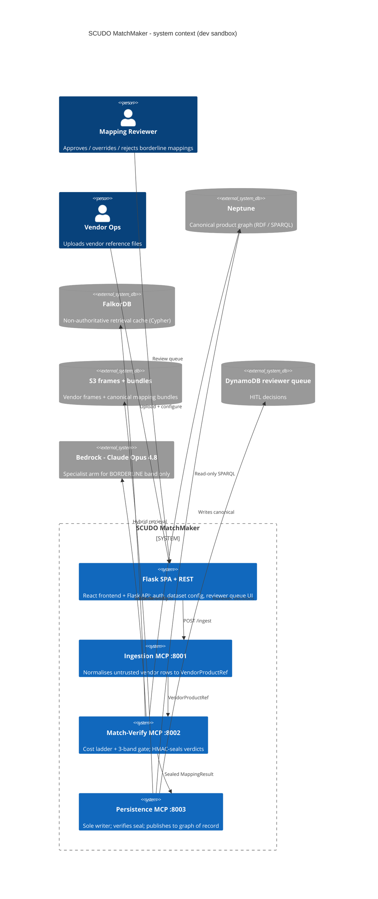
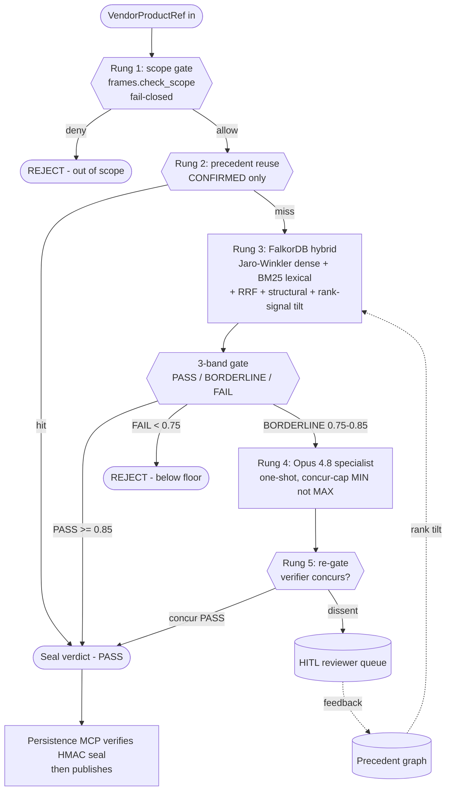
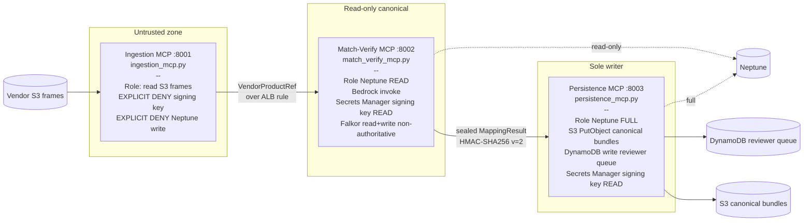
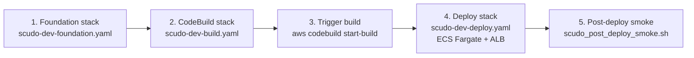

# SCUDO MatchMaker

Deterministic vendor-to-canonical product mapping with a three-MCP trust gradient, a five-rung cost ladder, and a verifier gate.

> **Status:** 120 mapping + 8 auth smoke tests passing. Deploy is **GREEN** in the Cognizant cloudboost sandbox (`954976331678`, `eu-west-2`). ALB: `scudo-dev-alb-2025833982.eu-west-2.elb.amazonaws.com`. **This is a dev sandbox**, **not** the JPMC SCUDO production account. Treat all thresholds, dense-arm similarity, and Neptune retrieval as uncalibrated stand-ins until the production cutover.

## SCUDO as the visibility platform

SCUDO is positioned as the **visibility platform** for the matching backend: the three-MCP trust gradient, the cost ladder, the HMAC seal contract, and the reviewer queue are not just plumbing — they are the audit surface that makes every mapping decision inspectable end-to-end. The Flask SPA + REST tier exposes the trust gradient to the operator: dataset configuration, the reviewer queue, the per-decision trajectory, and the sealed verdict are all visible artefacts of the matching pipeline. Read the backend through this lens — every component exists to make the matching decision visible, attributable, and reversible, not merely to compute it.

---

## What is this

SCUDO MatchMaker proposes mappings between **untrusted vendor product references** (rows from S&P Global, Bloomberg, etc.) and the **canonical SCUDO product graph**. It is a sandbox prototype of the matcher that would sit behind the JPMC SCUDO canonical product service: same shape, same invariants, same trust gradient, but with FalkorDB as a non-authoritative local stand-in for Neptune and with the dense-similarity arm wired to Jaro-Winkler rather than a real embedding model.

The codebase is built around two non-negotiable ideas. First, a **first-match-wins cost ladder** — scope gate, precedent reuse, FalkorDB hybrid retrieval, Opus 4.8 specialist, then a deterministic 3-band gate — so the expensive arms only run when the cheap ones cannot decide. Second, a **three-MCP trust gradient** enforced by separate ECS task roles: Ingestion (port 8001) sees vendor data but is explicitly denied the signing key; Match-Verify (port 8002) reads Neptune and calls Bedrock but writes nothing canonical; Persistence (port 8003) is the only writer and holds the publish gate.

What this repo is **not**: a complete SCUDO. There is no production Neptune retrieval (the `find_similar_products` SPARQL implementation is a placeholder returning `similarity=0.0`), the dense-arm similarity is a string metric pretending to be a vector, and the 0.80 floor + ±0.05 borderline bands are unvalidated against any golden set. See [What is NOT done](#what-is-not-done).

---

## Architecture at a glance



---

## The matching cost ladder

Five rungs. First match wins. Anything reaching the gate must clear the 0.80 floor.



Implementation lives in `backend/scudo_mapping_mcp/matching.py`. Validations and field normalisation in `validations.py`. The HMAC verdict seal contract is in `verdict.py` — `v=2` carries the band, Persistence refuses any agent-passed verdict dict.

---

## Trust gradient (three MCPs)

IAM, not application code, enforces the isolation. Each MCP runs as a separate ECS Fargate service with its own task role.



The seal is the contract. Ingestion cannot mint one (no key). Match-Verify mints; Persistence verifies before letting anything past invariant I5 (the publish gate).

---

## Normalise & Calibrate MCP (:8004) — why a fourth server

`normalise_mcp.py` is a **read-only utility tier** alongside the trust gradient — it holds no signing key, imports no write surface (smoke gate `TRUST_normalise_mcp_imports_no_writers` pins this via the AST), and registers as the `normalise` tier on the `McpHost`. It exists because of a precise gap analysis of the matching engine (the full review lives in [`backend/scudo_mapping_mcp/docs/mcp-matching-engine-review.md`](backend/scudo_mapping_mcp/docs/mcp-matching-engine-review.md)):

**The matcher scores `name + description` similarity and nothing else.** A dense/RAG retriever over CDAO improves *recall* on those two fields only. Precision comes from structure, and the structured fields were either buried in the untyped `raw` dict or absent from the engine entirely. Each one needs a *deterministic* treatment, not a retrieval one:

| Gap | Why retrieval can't fix it | Tool that closes it |
|---|---|---|
| **Identifiers** (ISIN, CUSIP, SEDOL, RIC, FIGI, ticker) | Embeddings are weak on exact codes; an exact identifier is a **join key, not a similarity input**. An exact ISIN hit is identity. | `normalise.validate_identifier` (real check-digit validation where the scheme defines one; honest `pattern` checks otherwise) + `normalise.resolve_identifiers` (exact join over the working set — use it *before* asking Match-Verify to score) |
| **Dates** | No temporal field exists on `VendorProductRef`; no validation touches time. Dates were matched **nowhere**. | `normalise.normalise_date` — canonicalises to ISO-8601 and **fails closed on ambiguity** (`03/04/2024` → `ambiguous`, never a guess); the precondition for any future effective-dating validation |
| **Data class** | `validations.data_class_match` is pass-by-default until *both* sides declare a class — so a cross-asset-class string match can auto-map cleanly. | `normalise.classify_data_class` — controlled vocabulary onto the CDAO roots; unknown values return `null` with a reason rather than a fabricated class |
| **Vendor normalisation** | `SCUDO_VENDOR_ADAPTERS` was parsed and smoke-tested but consumed by nothing; the generic column heuristic synthesised `row-N` ids that re-fork IRIs on re-upload (breaks I8). | `normalise.normalise_record` — the adapter registry that actually consumes the setting; rows with no primary key are **rejected to quarantine, never synthesised** (M8 contract) |
| **Identity fork** | `models.mds_iri` and `vendor_catalogue_mcp.product_iri` mint *different* IRIs for the same product — golden data minted under either scheme silently misses precedent reuse. | `normalise.translate_iri` — returns both mints so the join is explicit |
| **Uncalibrated thresholds** | The 0.80 floor / ±0.05 band were set against the Jaro-Winkler stand-in; swapping the dense arm without recalibrating fails silently in one of two directions (everything auto-maps, or nothing does). | `calibrate.replay_golden` — retrieval-only replay of a golden set: precision@1, recall into the top-N specialist anchor window, MRR, band distribution, and a floor sweep with auto-map precision per threshold |

The same discipline as the rest of the engine applies throughout: deterministic, replay-safe, **fail-closed — refuse with a reason rather than guess**. The scope gate fires on every vendor-taking tool (layer-1 posture, same as Ingestion), and the calibration harness deliberately excludes precedent reuse and the specialist so the measurement is of the retriever, not contaminated by the things the calibration protects.

---

## Repo layout

```
backend/scudo_mapping_mcp/
  ingestion_mcp.py         # MCP server :8001 - untrusted vendor in, normalise to VendorProductRef
  match_verify_mcp.py      # MCP server :8002 - cost ladder + 3-band gate; emits sealed MappingResult
  persistence_mcp.py       # MCP server :8003 - sole writer; verifies HMAC seal; publish gate
  normalise_mcp.py         # MCP server :8004 - read-only normalise & calibrate tier (see section above)
  normalisation.py         # Adapter registry, identifier checksums, date + data-class canonicalisation
  calibration.py           # Golden-set retrieval replay: precision@1, recall@N, floor sweep
  matching.py              # Cost ladder implementation (rungs 1-5, first-match-wins)
  frames.py                # _read_vendor_frame (mock -> S3 cutover) + check_scope (rights/entitlement)
  feedback.py              # M4 HITL write-back; approve/override/reject feeds precedent rank signal
  validations.py           # M5 deterministic checks: scope_compatible, identifier_resolves, data_class_match
  bundle.py                # M6 portable mapping bundle - versioned, diffable, cutover artifact
  hydrate.py               # M6 hydration - replays canonical bundle from S3 into FalkorDB at boot
  verdict.py               # HMAC-SHA256 verdict seal v=2; trust-gradient integrity contract
  agent.py                 # M9 agent runner behind POST /api/mapping/agent/run; Opus-driven MCP tool use
  models.py                # Pydantic contracts: MappingStatus, Candidate, MappingResult, etc
  config.py                # Three-seam env-var contract; STORE_BACKEND selects falkordb | neptune
  store/
    base.py                # The seam - retrieval operations interface; never query strings
    factory.py             # Single decision point: which backend, from config
    falkordb_store.py      # FalkorDB backend - Cypher; Jaro-Winkler dense stub; pure-Python BM25
    neptune_store.py       # Neptune backend - SigV4 SPARQL; find_similar_products is M9 PLACEHOLDER
  tests/
    smoke.py               # 120 mapping smoke gates - no pytest dependency
    fake_store.py          # In-memory store for unit-level tests

backend/
  app.py                   # Flask entrypoint; auth, route registration, before_request hook
  auth.py                  # Gateway-header principal resolver; AuthError -> 401
  routes/mapping.py        # Flask REST surface that proxies the matcher (Match-Verify in-process today)
  tests/test_auth.py       # 8 auth smoke tests
  Dockerfile               # Single image, four entrypoints (Flask + 3 MCPs)
  requirements.txt

infra/
  scudo-dev-foundation.yaml  # VPC, IAM roles, Neptune, S3, ECR, Secrets, DynamoDB queue
  scudo-dev-deploy.yaml      # ECS cluster, 5 services, ALB w/ 4 listener rules, Cloud Map
  scudo-dev-build.yaml       # CodeBuild project + scoped service role
  scudo-dev-frontend.yaml    # S3 + CloudFront with ALB passthrough (written, not deployed)
  buildspec.yml              # Single-quoted-everywhere CodeBuild buildspec
  scudo_post_deploy_smoke.sh # Hits /api/* + /mcp/*; dumps target-group health

frontend/                    # React SPA (Vite); reviewer queue UI + provider/dataset admin
```

---

## Tests

```
120 mapping smoke tests  # cost ladder, scope gate, seal verify, store seam, bundle round-trip, fusion, hydrate,
                         # normalisation (adapters, checksums, dates, data class) + calibration replay
  8 auth smoke tests     # gateway header + principal + 401 cases
```

The smoke runner is standalone — no pytest dependency. Run from `backend/`:

```bash
python -m scudo_mapping_mcp.tests.smoke     # 120 mapping gates
python -m tests.test_auth                   # 8 auth gates
```

The golden-set evaluation harness is `calibrate.replay_golden` on the Normalise & Calibrate MCP — the smoke suite verifies wiring and invariants; the calibration harness measures retrieval quality against a golden set you supply.

---

## Run locally

The integrated backend doesn't ship a root `docker-compose.yml` yet (#14 follow-up). For now, start FalkorDB by hand and run each service from a Python venv.

```bash
# 1. FalkorDB sidecar (Docker Desktop or `falkordb/falkordb` directly in WSL)
docker run -d --name falkordb -p 6379:6379 falkordb/falkordb:v4.10.4

# 2. Backend (Flask + 3 MCPs share one image, four entrypoints)
cd backend
python -m venv .venv && source .venv/bin/activate   # Windows: .venv\Scripts\activate
pip install -r requirements.txt

export STORE_BACKEND=falkordb
export FALKORDB_URL=falkordb://localhost:6379
export VERDICT_SIGNING_KEY=dev-only-not-a-real-secret
export SCUDO_AUTH_ALLOW_DEV=1
export SCUDO_AUTH_DEV_PRINCIPAL=local@dev

# Each MCP is its own entrypoint; run in separate terminals (or backgrounded):
python -m scudo_mapping_mcp.ingestion_mcp        # :8001
python -m scudo_mapping_mcp.match_verify_mcp     # :8002
python -m scudo_mapping_mcp.persistence_mcp      # :8003
python -m scudo_mapping_mcp.normalise_mcp        # :8004 (read-only normalise & calibrate)

# Flask SPA + REST (in another terminal):
gunicorn -b 0.0.0.0:5000 -k gthread --threads 4 --timeout 300 app:app

# 3. Frontend (in another terminal)
cd ../frontend
npm install && npm run dev
```

Switching to Neptune locally is not supported — Neptune is reachable only from inside the VPC.

---

## Deploy to AWS dev sandbox

Target: `954976331678` / `eu-west-2` (Cognizant cloudboost). **Not JPMC.**



1. **Foundation** — `infra/scudo-dev-foundation.yaml` creates the VPC (2 public + 2 private subnets), three IAM task roles enforcing the trust gradient, Bedrock + ECR + CloudWatch Logs interface endpoints, Neptune cluster, S3 frames bucket, ECR repo, KMS-encrypted Secrets Manager signing key (M-V + Persistence read, Ingestion explicit-Deny), DynamoDB reviewer queue.
2. **CodeBuild stack** — `infra/scudo-dev-build.yaml` provisions the CodeBuild project. One-time GitHub credential setup is required for private repos (`aws codebuild import-source-credentials --auth-type PERSONAL_ACCESS_TOKEN --server-type GITHUB --token <ghp_xxx>`) OR temporarily flip the repo public.
3. **Trigger build** — `aws codebuild start-build --project-name scudo-dev-build`. Cold build is ~70s; pushes both `:SHORT_SHA` and `:latest` to ECR.
4. **Deploy** — `infra/scudo-dev-deploy.yaml` creates the Fargate cluster, five services (Flask + 3 MCPs + FalkorDB), ALB with four listener rules, and Cloud Map private DNS for `falkor.scudo.local`.
5. **Smoke** — `infra/scudo_post_deploy_smoke.sh` hits the four ALB-backed paths and dumps target-group health. Exits 0 only when every probe is non-5xx AND every target group has ≥1 healthy target.

Frontend stack (`infra/scudo-dev-frontend.yaml`) covers S3 + CloudFront with ALB passthrough. Written, not yet deployed.

---

## Key invariants

| # | Invariant | Where enforced |
|---|-----------|----------------|
| I1 | Deterministic routing — same input, same rung, same band | `matching.py` |
| I2 | No raw-query passthrough — MCP tools take operations, not Cypher / SPARQL strings | `store/base.py` |
| I3 | Scope gate is fail-closed — exception ⇒ deny, never allow | `frames.check_scope` |
| I4 | 0.80 floor in code from `settings.confidence_floor` — single source | `matching.py`, `config.py` |
| I5 | Publish gate — Persistence MCP verifies HMAC seal before any write | `persistence_mcp.py`, `verdict.py` |
| I6 | Invariants live outside the model — never in the prompt | `validations.py` |
| I7 | Store seam is retrieval operations, not query strings (Cypher in `falkordb_store`, SPARQL in `neptune_store`) | `store/base.py` |
| I8 | Deterministic UUID5 IRIs — same `(vendor, product_id)` → same mds.<slug>:<uuid5> | `models.mds_iri` |
| I9 | FalkorDB is non-authoritative — hydrated from canonical M6 bundle at boot | `hydrate.py` |
| I10 | Single swap points — `STORE_BACKEND`, `FRAME_SOURCE`, scorer each change in one place | `config.py`, `store/factory.py`, `matching.py` |

---

## What is NOT done

Be honest. Engineering, not marketing.

- **`NeptuneStore.find_similar_products` is a placeholder.** It returns every taxonomy node with `similarity=0.0`. The production cutover requires Neptune Analytics or a Bedrock-backed vector search; both are M9 work. Until then, do not run rung 3 against Neptune in any meaningful test.
- **The dense arm is not dense.** `falkordb_store.py` uses Jaro-Winkler as a stand-in for vector similarity. The 0.80 floor and the ±0.05 borderline bands were chosen for the Jaro-Winkler distribution. When real embeddings arrive, the floor and bands must be **re-derived against a golden set** as a coupled swap — do not assume the numbers carry over.
- **No golden-set evaluation harness.** Smoke tests cover wiring; they do not measure precision / recall.
- **CloudFront frontend stack pending deploy.** `scudo-dev-frontend.yaml` (S3 + CloudFront + ALB passthrough) is written and being shipped under WS-A; once applied to the dev sandbox the CloudFront URL will replace this bullet. Until then the SPA is reachable directly via the ALB.
- **No production secret rotation.** `VERDICT_SIGNING_KEY` is dev-only; KMS-backed rotation hooks are stubbed.
- **Q1 (validations as candidate-set filter) is the next matching-ladder code task** — validations currently gate the single best candidate, not the full surviving set.

---

## Architecture source of truth

The Mermaid diagrams in [`backend/scudo_mapping_mcp/docs/architecture/`](backend/scudo_mapping_mcp/docs/architecture/) are the **approved source of truth** for the SCUDO architecture (ratified 2026-06-10):

- [`scudo-overview.mmd`](backend/scudo_mapping_mcp/docs/architecture/scudo-overview.mmd) — system-level: Gateway → Agent → MCP host → three MCPs → stores + observability, trust-gradient classification preserved.
- [`scudo-match-verify.mmd`](backend/scudo_mapping_mcp/docs/architecture/scudo-match-verify.mmd) — internals of the matching engine: scope → precedent → match → validations → three-band gate → specialist → seal → Persistence.
- [`scudo-retrieval.mmd`](backend/scudo_mapping_mcp/docs/architecture/scudo-retrieval.mmd) — internals of the retrieval surface: GraphRAG-SDK multi-path (vector / fulltext / cypher / rel-expansion) → cosine rerank → precedent boost → negative-precedent drop → distance check (deferred) → survivors.

The ARB review pack at [`backend/scudo_mapping_mcp/docs/architecture/arb-review-pack.md`](backend/scudo_mapping_mcp/docs/architecture/arb-review-pack.md) carries the decision log, consistency findings, and open questions. `docs/diagram-1-main-flow.md`, `docs/diagram-2-falkor-internals.md`, and `docs/dense-arm-swap.md` are **SUPERSEDED** by the three diagrams above.

---

## Tech stack

- **Backend:** Python 3.12, Flask + gunicorn (gthread workers for SSE), Pydantic v2, FastMCP servers (Ingestion / Match-Verify / Persistence)
- **Frontend:** React SPA (Vite)
- **Stores:** FalkorDB (local / prototype, Cypher), Amazon Neptune (production target, SPARQL via SigV4)
- **LLM:** Bedrock — Claude Opus 4.8 (specialist arm, BORDERLINE band only); Titan v2 embeddings (planned for the dense arm swap)
- **Persistence:** S3 (vendor frames + canonical bundles), DynamoDB (reviewer queue), MySQL via PyMySQL (Flask app-side relational store for auth / dataset / session metadata)
- **Auth / integrity:** Gateway-header principal resolution (`auth.py`); HMAC-SHA256 verdict seals (`verdict.py`, v=2); Secrets Manager + KMS
- **Infra:** AWS CloudFormation, ECS Fargate, ALB, VPC endpoints (Bedrock, ECR, Logs), Cloud Map private DNS, CodeBuild for cloud-side image builds
