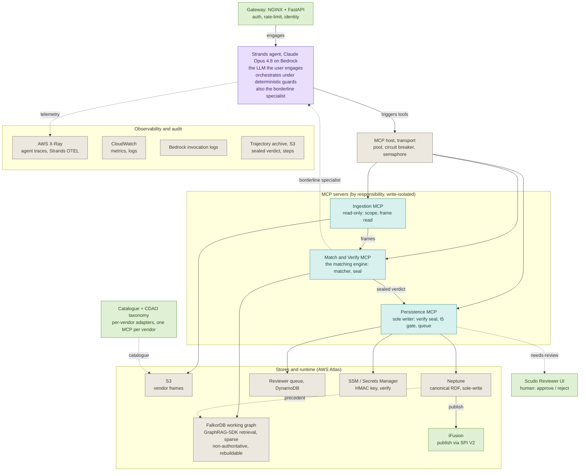
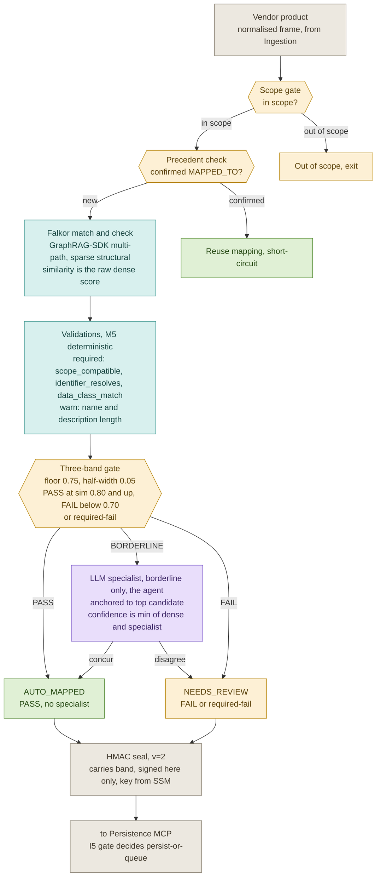
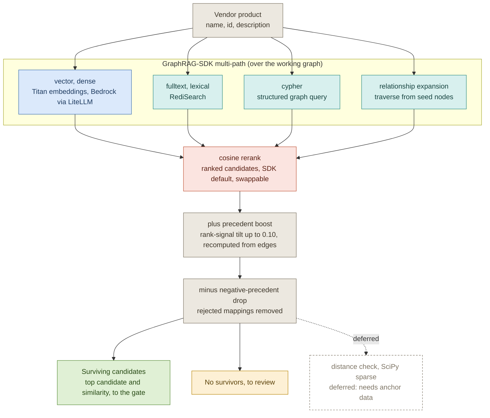

# SCUDO Architecture — ARB Review Pack

## 1. Decision being tabled

The programme is adopting **FalkorDB GraphRAG-SDK** as the dense + lexical + cypher + relationship-expansion retrieval surface for the Match&Verify MCP, replacing the in-house Jaro-Winkler / pure-Python BM25 / RRF stand-in shipped today. The three-MCP trust gradient (Ingestion read-only, Match&Verify matcher + signer, Persistence sole-writer + I5 gate) and the I5 invariant (no autonomous canonical write without human) are **unchanged** by this decision. The architecture is captured in three Mermaid diagrams (`scudo-overview`, `scudo-match-verify`, `scudo-retrieval`) now sitting at `scudo_mapping_mcp/docs/architecture/` and tabled here as the source-of-truth, superseding the prior `diagram-1-main-flow.md` / `diagram-2-falkor-internals.md` and the `dense-arm-swap.md` v0.2 build-it-ourselves plan.

## 2. What was landed in this workflow

Files written / edited in this session:

- `scudo_mapping_mcp/docs/architecture/scudo-overview.mmd` (+ `.txt`) — system-level diagram: Gateway → Agent → MCP host → three MCPs → stores + observability, trust gradient classification preserved.
- `scudo_mapping_mcp/docs/architecture/scudo-match-verify.mmd` (+ `.txt`) — internals of the matching engine: scope → precedent → match → validations → three-band gate → specialist → seal → Persistence.
- `scudo_mapping_mcp/docs/architecture/scudo-retrieval.mmd` (+ `.txt`) — internals of the retrieval surface: GraphRAG-SDK multi-path (vector / fulltext / cypher / rel-expansion) → cosine rerank → precedent boost → negative-precedent drop → distance check (deferred) → survivors.
- `scudo_mapping_mcp/docs/architecture/README.md` — index, intended audience, supersession notice.
- `scudo_mapping_mcp/docs/diagram-1-main-flow.md` — banner: **SUPERSEDED**, forward pointer to `architecture/scudo-overview.mmd`.
- `scudo_mapping_mcp/docs/diagram-2-falkor-internals.md` — banner: **SUPERSEDED**, forward pointer to `architecture/scudo-match-verify.mmd` and `architecture/scudo-retrieval.mmd`.
- `scudo_mapping_mcp/docs/dense-arm-swap.md` — banner: **SUPERSEDED-PENDING-REPLAN**, forward pointer to forthcoming `dense-arm-sdk-adoption.md`; the v0.2 critical-review findings are carried forward in §8 below.

## 3. The three diagrams

### 3.1 Overview (`scudo-overview.mmd`)

Load-bearing: the **MCPS** subgraph classification (write-isolated) encodes the trust gradient; the **AGENT → HOST → {ING, MV, PER}** fan-out shows the agent orchestrating through a single MCP host (pool, breaker, semaphore); the dotted **MV -.->|borderline specialist| AGENT** edge is the only LLM-into-matcher hop.



### 3.2 Match & Verify (`scudo-match-verify.mmd`)

Load-bearing: the **three-band gate** (floor 0.75 ± 0.05 — PASS at sim 0.80 and up, FAIL below 0.70) decides PASS / BORDERLINE / FAIL; the **specialist** runs **only** on BORDERLINE and produces `confidence = min(dense, specialist)`; the **HMAC seal v=2** carries `band` and is signed in M&V only — Persistence is the sole verifier.



### 3.3 Retrieval (`scudo-retrieval.mmd`)

Load-bearing: the **PATHS** subgraph is the SDK multi-path surface (vector / fulltext / cypher / rel-expansion); the **BOOST → DROP** pair is the SCUDO-specific structural pass (precedent boost ≤ +0.10 on rank only, never on similarity; negative-precedent drop) implemented as swappable SDK strategies; distance check is **deferred**.



## 4. What changed from the prior architecture

Concrete deltas against `diagram-1-main-flow.md` / `diagram-2-falkor-internals.md`:

- **Agent moved to the top of the orchestration.** Previously the agent was only invoked by Match&Verify on the BORDERLINE path. Now the agent is the entry point the user engages via the Gateway, and orchestrates all three MCPs through deterministic guards. The agent retains its second role as the borderline specialist.
- **MCP host added as a NEW component.** A transport / pool / circuit-breaker / semaphore layer sits between the agent and the three MCPs. This did not exist on the prior diagrams and does not exist in code today — it is target-state for the I5-lift / Strands-on-Bedrock production deployment.
- **Retrieval consolidated under GraphRAG-SDK multi-path.** Prior diagrams showed an in-house "dense + lexical → RRF" composition. The new retrieval diagram shows four SDK-native arms (vector, fulltext, cypher, relationship-expansion) feeding a single rerank stage. The in-house RRF is replaced by SDK cosine rerank.
- **Structural pass becomes swappable SDK strategies.** Precedent boost (≤ +0.10 on rank-signal only, never on similarity) and negative-precedent drop (rejected mappings removed pre-scoring) are repositioned as strategies that plug into the SDK rather than custom logic in `find_similar_products`. Distance check remains deferred (no anchor data).
- **Trust gradient, three-band gate, seal v=2-with-band, I5 gate — all UNCHANGED.** This is the point: the retrieval surface is being swapped underneath an unchanged control envelope.

## 5. Consistency findings — diagram vs shipped code

Fifteen findings from the validation pass, grouped by severity. **Blocking + high findings must be resolved before the diagrams are called authoritative.**

### 5.1 Blocking

**[scudo-retrieval / BLOCKING] VEC arm "Titan via LiteLLM" — IAM, Bedrock model access, and SDK preprocessing risk to the raw-dense floor anchor.**
- *Inconsistency:* the diagram shows Titan embeddings live via Bedrock/LiteLLM; in reality (a) the M&V task role has `bedrock:InvokeModel` for Opus 4.8 only, not for `amazon.titan-embed-text-v2:0`; (b) the eu-west-2 Bedrock "Model access" toggle for Titan-Embed in sandbox 954976331678 is region- and account-scoped and is a separate enablement; (c) GraphRAG-SDK typically runs its own preprocessing / normalisation pipeline, which collides with the load-bearing discipline at `falkordb_store.py:4-16` that "`Candidate.similarity` is the raw dense score and the 0.80 floor is calibrated against the dense distribution".
- *Which changes:* **both — code and diagram**. Code: IAM policy add for the Titan model ARN; account-level model-access enablement; an interceptor or SDK config that preserves the raw dense score on `Candidate.similarity`. Diagram: annotate that VEC is gated by §4.1 / §4.2 of `i5-lift-preconditions.md` and that "raw dense as similarity" is an invariant the SDK adoption must satisfy.
- *Recommended resolution:* do not ship the diagram as authoritative until (i) the model-ARN IAM add is merged and applied, (ii) Bedrock model access is enabled for Titan-Embed in eu-west-2 / 954976331678, and (iii) a probe test demonstrates the SDK returning raw dense scores (or that an intercept preserves them) — and the golden-set recalibration is in the same change as the SDK adoption per §4.2.

### 5.2 High

**[scudo-overview / high] HOST (MCP host with pool, circuit breaker, semaphore) does not exist in shipped code.**
- *Inconsistency:* the diagram shows `AGENT -->|triggers tools| HOST` and `HOST --> {ING, MV, PER}`. In code (`scudo_mapping_mcp/agent.py:343-367, 421-477`) `BedrockMappingAgent._build_agent()` constructs a Strands Agent whose tools are local Python `@tool` functions calling straight into the package; there is no MCP client, no pool, no breaker, no semaphore. The only `urllib3.PoolManager` use (`neptune_store.py`) is unrelated; "circuit breaker" appears only as target-state in `i5-lift-preconditions.md`.
- *Which changes:* **diagram** (and code follows later). HOST is target-state for the I5-lift / production Strands-on-Bedrock deployment.
- *Recommended resolution:* style HOST node and its edges as aspirational (dashed border / dotted edges) consistent with the convention `diagram-1-main-flow.md` already used for autonomous-Neptune persistence. Pin a separate workstream owner for HOST as a NEW deliverable (see §6).

**[scudo-overview / high] `NEP -.->|precedent| FALKOR` write-back path is not implemented.**
- *Inconsistency:* `feedback.apply_decision` (`feedback.py:138-142`) calls `store.upsert_precedent` on the **single** active store selected by `STORE_BACKEND` via `store/factory.py:7-24`; the stores are alternatives, not synchronised. There is no Neptune→Falkor hydrator. In `STORE_BACKEND=neptune` deployments Falkor is bypassed; in `STORE_BACKEND=falkor` deployments Neptune is bypassed. The edge as drawn is misleading.
- *Which changes:* **either diagram or code, by ARB choice**. If the architectural intent is "Neptune is canonical, Falkor is the rebuildable working graph hydrated from Neptune", a hydrator is missing in code. If the intent is "two backend modes, only one active at a time", the diagram must say so.
- *Recommended resolution:* clarify the intent (Open Question §6) and either (a) drop the edge and annotate the two store modes, or (b) keep the edge and open a workstream for the Neptune→Falkor hydrator with an explicit owner.

**[scudo-retrieval / high] Diagram describes a TARGET state; today there is no GraphRAG-SDK integration at all.**
- *Inconsistency:* `find_similar_products` (`falkordb_store.py:180-285`) is a single-host scan (`MATCH (t:TaxonomyNode) RETURN ...`), then pure-Python Jaro-Winkler over the label (`_jaro_winkler`, lines 52-90), then pure-Python BM25 over the same label corpus (`base.py:281-362`), fused via RRF (not cosine). No `db.idx.vector.queryNodes`, no `db.idx.fulltext.*`, no cypher-as-retrieval, no rel-expansion, no SDK import. The module banner (`falkordb_store.py:4-37`) and the seam docstring (`base.py:18-23`) still name "AWS GraphRAG Toolkit" as the production target and call the toolkit graph-store "vector-only, no traversal" — stale under SDK adoption.
- *Which changes:* **code must catch up to diagram** (the diagram is the adopted target). Concurrently, the in-file production-swap commentary must be updated to point at GraphRAG-SDK, not the AWS toolkit.
- *Recommended resolution:* the diagram is approved as TARGET STATE; the dense-arm-sdk-adoption.md plan is the implementation route; in the same change as the SDK lands, rewrite the `falkordb_store.py:4-37` and `base.py:18-23` banners. Until that lands, annotate the retrieval diagram as TARGET.

**[scudo-retrieval / high] RR "cosine rerank, SDK default, swappable" — today's fuser is RRF and "swappable" must be load-bearing.**
- *Inconsistency:* the fuser today is RRF (`base.py:344-362`); the code is built around the discipline `Candidate.similarity = raw dense, RRF + boost drive sort key only` (`falkordb_store.py:194-209, 265-282`). If the SDK rerank replaces similarity with cosine-of-cosines, the 0.80 floor stops measuring the quantity it was calibrated against, and `matching.py:323-356`'s disagreement-cap loses its reference quantity.
- *Which changes:* **diagram caption must elevate "swappable" from a default to an invariant; code must enforce it.**
- *Recommended resolution:* either (a) run the SDK rerank but pass the raw dense score through on `Candidate.similarity` (rerank affects ORDER only, as RRF does today), or (b) configure the SDK with a custom reranker that preserves the raw-dense contract. If the SDK forces cosine and cannot be intercepted, move the floor + disagreement-cap **outside** the SDK boundary. Annotate "swappable" on the diagram as a hard invariant.

**[scudo-match-verify / high] Persistence I5 gate routes on `sealed_status` only, NOT on `sealed_band`.**
- *Inconsistency:* `commit_mapping` (`persistence_mcp.py:225, 246-265`) reads `sealed_status` from the payload and routes solely on status — `AUTO_MAPPED → _enqueue(reason='auto_mapped_agent_path')`, `NEEDS_REVIEW → _enqueue(reason='needs_review')`, `OUT_OF_SCOPE → refuse`. The seal carries `band` (`verdict.py:160`), and `verdict.py:36-37` explicitly anticipates band-gating ("Persistence MCP can gate on `sealed_band` … refuse to write APPROVED if `band=fail` without explicit override"), but `commit_mapping` never reads `payload['band']`. The reviewer queue is also still in-memory (`persistence_mcp.py:91` comment: "placeholder in-memory implementation").
- *Which changes:* **code**. The diagram's "I5 gate decides persist-or-queue" is correct for status routing, but if the band is intended to be load-bearing at the gate, the code must honour it.
- *Recommended resolution:* extend `commit_mapping` to read `sealed_band` and refuse / down-route `AUTO_MAPPED` seals where `band == 'fail'`. Track the DynamoDB reviewer-queue wiring as a separate workstream and annotate PERS in the diagram as "in-memory queue today, DynamoDB target" if ARB confirms that as the framing.

### 5.3 Medium

**[scudo-overview / medium] `NEP -->|publish| IFU` iFusion edge is target-state, no SPI V2 wiring exists.** No `ifusion|iFusion|SPI|spi_v2` matches in the codebase except the diagram files. Persistence writes to Neptune via `upsert_precedent` and stops. Drawing this as a solid edge alongside genuinely-shipped edges overstates readiness — style it aspirational (dashed) like the prior diagram-1 convention.

**[scudo-overview / medium] `PER → SSM` edge mis-describes how the signing key is loaded.** `verdict._load_signing_key` (`verdict.py:85-96`) reads `SCUDO_VERDICT_SIGNING_KEY` from env, with a dev fallback gated by `SCUDO_VERDICT_ALLOW_DEV=1`. No `boto3` Secrets Manager / SSM call. The contract docstring (`verdict.py:41-44`) says prod MUST inject via Secrets Manager — i.e. an infra / task-definition responsibility. Either re-label the edge as "env var injected by Secrets Manager at task start" or extend `verdict.py` to fetch directly.

**[scudo-match-verify / medium] Specialist "anchored to top candidate" is not enforced in code.** `SpecialistScorer` (`matching.py:121-124`) signature matches the diagram. Concur branch identifies agreement by `specialist_pick.node.iri == best.node.iri` (line 310). But there is **no check** that `specialist_pick.node.iri` is in `{c.node.iri for c in candidates}`. A misbehaving specialist returning an off-list IRI falls through to the disagree branch (line 335) and the off-list IRI surfaces as `alternative_iri` / `alternative_label` (lines 347-348). Either add `assert specialist_pick.node.iri in candidate_iris` (abstain otherwise) or soften the diagram caption.

**[scudo-match-verify / medium] SEAL "key from SSM" is aspirational — env var in code.** v=2 + band are correctly implemented (`verdict.py:155, 160`); `verify()` accepts v ∈ {1,2} (lines 215-219). But `_load_signing_key` is env-var only. Soften the diagram caption to "key from env (Secrets Manager-injected)" **or** extend `verdict.py` to fetch from Secrets Manager directly with a cached client.

**[scudo-retrieval / medium] BOOST node positioning contradicts code; `*rrf_top` scaling is invisible.** Values match: per-approval 0.02, cap 0.10, derived from confirmed-only `MAPPED_TO` edges (`base.py:232-253`; `falkordb_store.py:462-473`). The I5 discipline holds: `sort_key = rank_score + scaled_boost`, `similarity = round(dense_scores[iri], 4)` — boost never touches similarity. **However** the diagram positions BOOST AFTER RR (rerank), implying boost operates on rerank output; in code today, boost is co-applied with RRF inside `find_similar_products` as a single sort-key composition. Also `scaled_boost = raw_boost * rrf_top` (`falkordb_store.py:281`): if SDK cosine outputs sit in [0, 1] (vs RRF's ~0.016 top contribution), the `*rrf_top` scaling becomes wrong. Re-derive scaling under cosine rerank; annotate "recomputed from edges, no stored counter" on the BOOST node.

### 5.4 Low

**[scudo-overview / low] Trust-gradient import boundaries match the diagram.** `ingestion_mcp.py:41-51` has zero verdict / feedback / bundle imports and no Bedrock; `match_verify_mcp.py:54-65` imports `verdict_seal` (sign side) + `matching` only; `persistence_mcp.py:64-78` is the only module importing `feedback.apply_decision`, `bundle.import_bundle/export_bundle`, and the verify side of `verdict_seal`. On `MV -.-> AGENT`: `matching.py:131` takes `specialist: Optional[SpecialistScorer] = None` as a kwarg; `agent.py:260, 410` invokes `map_vendor_product` with the agent supplying the specialist callback **in-process** — not a cross-MCP hop. Edge is directionally fine for visualisation; add a legend note that this is an in-process callback today (will become a host-mediated call under HOST).

> **Stale as of 2026-08-17 — historical record.** The next two findings state the bands as of
> this review pack's date. The floor moved to `0.75` (PASS `0.80` / FAIL `0.70`) under
> `docs/superpowers/plans/2026-07-04-scudo-5zone-alignment.md` Task 1. Retained unedited as
> the record of what was true then. Live values:
> `docs/superpowers/matching-data-provenance.md`. Verified 2026-08-17:
> `PYTHONPATH=backend python3 -c "from scudo_mapping_mcp import config as c; print(c.CONFIDENCE_FLOOR, c.pass_threshold(), c.borderline_threshold())"`
> → `0.75 0.8 0.7`.
>
> **Two things changed under these findings, so the verdicts "Diagram accurate" / "Accurate"
> no longer describe either artifact:**
>
> 1. **The floor.** `floor 0.80, half-width 0.05` is now `floor 0.75, half-width 0.05`.
>    Consequently the disagreement cap `borderline_threshold - 0.01` is now
>    **`min(best, 0.69)`**, not `min(best, 0.74)` — measured, not inferred. The cap's
>    *purpose* is unchanged and still holds: it is still guaranteed below the PASS edge and
>    still forces NEEDS_REVIEW.
> 2. **The diagram.** `scudo-match-verify.mmd` has itself been updated to the live values —
>    its GATE node (line 9) now reads
>    `Three-band gate | floor 0.75, half-width 0.05 | PASS at sim 0.80 and up, FAIL below 0.70`.
>    So the diagram is accurate *today*, but not against the numbers these findings quote;
>    the finding's evidence chain (code ↔ diagram agreement at 0.80/0.05) has been replaced
>    on both sides, not merely on one. Note this makes the pack disagree with **itself**:
>    §3.2's embedded copy of the diagram carries the new `0.75 / 0.80 / 0.70` values, while
>    the findings here still assert the old ones. That is expected — §3.2 mirrors the live
>    `.mmd`, these findings are a dated verdict.
>
> **Line anchors below have rotted — do not trust them.** Re-measured 2026-08-17:
>
> | Cited anchor | What it claims | What is actually there now | Real current location |
> |---|---|---|---|
> | `config.py:44` | band constant | `# IRI namespace convention: mds.<vendor>:<uuid5>` | — |
> | `config.py:49` | band constant | `CONFIDENCE_FLOOR: float = 0.75` — **still a band constant, but the value moved** | `config.py:49` (floor), `config.py:54` (`BORDERLINE_HALF_WIDTH = 0.05`) |
> | `config.py:123-124` | Settings fields | a blank line and a vendor-slug docstring example (`"LSEG"  -> "lseg"`) | Settings fields are now `config.py:185-186` |
> | `config.py:179-182` | Settings fields | the tail of the `vendor_adapters` tuple plus `neptune_endpoint` / `graph_name` / `frame_source` Settings fields | as above |
> | `matching.py:243-246` | gate reads the constants | inside a `precedent_human_confirmed` `Validation(...)` literal | `matching.py:340-342` (gate reads `settings.confidence_floor` / `borderline_half_width`, then `_gate_thresholds`); cap at `matching.py:417` (and `:523`) |
> | `matching.py:318` ("Concur") | `confidence = min(dense, specialist)` | a comment: `# Both sides absent → pass-by-default (validations.py truth table).` | `matching.py:490` |
> | `matching.py:351` ("Disagree") | the disagreement cap | blank line | `matching.py:417` and `matching.py:523` — the cap now has **two** call sites, not one |
>
> > **Corrected 2026-08-17.** Three cells in the two `config.py` Settings-field rows of the
> > table above were themselves wrong when written, so the "re-measured" table needed
> > re-measuring. The originals read:
> >
> > > `config.py:123-124` … "tail of `_priority_vendor_slugs()` (`out.append(s)` /
> > > `return tuple(out)`)" … "Settings fields are now `config.py:168-169`"
> > >
> > > `config.py:179-182` … "a `taxonomy_uml_text` comment block"
> >
> > Measured:
> >
> > ```
> > $ python3 -c "
> > ls=open('backend/scudo_mapping_mcp/config.py').read().split('\n')
> > for n in (123,124,168,169,179,180,181,182,185,186): print(n, repr(ls[n-1]))"
> > 123 ''
> > 124 '      "LSEG"        -> "lseg"'
> > 168 '            SCUDO_TAXONOMY_LOADER. Defaults to "cdao". Allowed values:'
> > 169 '            "cdao" | "dcat".'
> > 179 '    )'
> > 180 '    neptune_endpoint: str  # e.g. https://<cluster>.neptune.amazonaws.com:8182'
> > 181 '    graph_name: str  # logical graph / dataset name'
> > 182 '    frame_source: str  # "mock" | "s3"'
> > 185 '    confidence_floor: float'
> > 186 '    borderline_half_width: float  # cost-ladder band width around the floor'
> > ```
> >
> > So: `out.append(s)` is at `config.py:140`, not `123-124`; `taxonomy_uml_text` is a
> > Settings **field** at `config.py:200`, not a comment block at `179-182`; and
> > `config.py:168-169` is docstring prose about `SCUDO_TAXONOMY_LOADER`, **not** the band
> > Settings fields. The band fields are `confidence_floor` / `borderline_half_width` at
> > `config.py:185-186` — the table's cells have been corrected to those values in place.
> > This is the failure mode the table exists to warn about, reproduced one level up:
> > re-anchor by **searching the field names**, not by trusting any line number in this
> > table, including these.
> Also stale in mechanism, not just in line number: the finding says `matching.py` *computes*
> `pass_threshold = floor + half`. It no longer does — `_gate_thresholds` (search the symbol;
> `matching.py:154` as-of-today) delegates to `config.pass_threshold()` /
> `config.borderline_threshold()` (search those two symbols in `config.py`), which 2dp-round
> the edge.
>
> > **Corrected 2026-08-17.** The paragraph above originally ended with a false
> > justification for that rounding, namely:
> >
> > > "which 2dp-round the edge precisely because a naive `floor + half` yields
> > > `0.8000000000000001` and would push a score of exactly `0.80` into BORDERLINE."
> >
> > That is **wrong for the canonical window**, and it was wrong *inside a correction
> > block* — text already carrying a "this has been verified" signal, which is why it
> > survived re-reading. The canonical 0.75/0.05 window is EXACT and never needs the
> > rounding. Measured:
> >
> > ```
> > $ python3 -c "print(repr(0.75+0.05), (0.75+0.05)==0.80, repr(0.75-0.05), repr(0.80+0.05), repr(0.85-0.05))"
> > 0.8 True 0.7 0.8500000000000001 0.7999999999999999
> > ```
> >
> > `0.75 + 0.05` is exactly the float `0.8` and `0.75 - 0.05` is exactly `0.7`; there is
> > no `0.8000000000000001` anywhere on the default path. Both config helpers additionally
> > short-circuit to the `PASS_CUT` / `FAIL_CUT` constants when `floor`/`half` are the
> > module defaults, so the canonical window does not even reach the `round()`.
> >
> > **The real reason the rounding exists** is that `floor` and `half` are *overridable* —
> > per call (`map_vendor_product(..., floor=, half=)`, threaded into `_gate_thresholds`)
> > and via the `CONFIDENCE_FLOOR` / `BORDERLINE_HALF_WIDTH` env vars read in
> > `Settings.from_env` — and **neighbouring** windows are NOT exact:
> >
> > | Overridden window | Naive expression | Naive result | Effect without `round(..., 2)` |
> > |---|---|---|---|
> > | floor 0.80, half 0.05 | `0.80 + 0.05` | `0.8500000000000001` | `0.85 >= edge` is **False** — an exact-`0.85` PASS is demoted to BORDERLINE |
> > | floor 0.85, half 0.05 | `0.85 - 0.05` | `0.7999999999999999` | edge sits one ULP *below* `0.80`, so the largest float under `0.80` is wrongly admitted to BORDERLINE instead of FAIL |
> >
> > Note the two errors run in *opposite* directions — one strict, one lenient — so the
> > rounding is not a one-sided safety margin. Banding is the product's headline
> > behaviour, so the edge must be exact for **every** window, not just the default one.
> > This matches the reasoning already in the `_gate_thresholds` and `pass_threshold` /
> > `borderline_threshold` docstrings.

**[scudo-match-verify / low] Three-band gate values match diagram (floor 0.80, half-width 0.05).** `config.py:44, 49, 123-124, 179-182` defines both as module constants and Settings fields; `matching.py:243-246` reads them and computes `pass_threshold = floor + half`, `borderline_threshold = floor - half`. Diagram accurate.

> **Corrected 2026-08-17.** The finding above is retained verbatim as the dated record, but
> **three** of its claims are now false. It also contradicts its own neighbour: the correction
> block immediately above it already flags the `floor + half` mechanism as stale, yet the
> finding still asserts it.
>
> 1. **"floor 0.80, half-width 0.05"** — the floor is **0.75**. `0.80` is the PASS cut, not
>    the floor; the floor is the band **centre**. Live constants (search the symbols in
>    `config.py`; `:49`, `:54`, `:55`, `:56` as-of-today):
>
>    ```
>    $ python3 -c "
>    ls=open('backend/scudo_mapping_mcp/config.py').read().split('\n')
>    print([ls[n-1] for n in (49,54,55,56)])"
>    ['CONFIDENCE_FLOOR: float = 0.75', 'BORDERLINE_HALF_WIDTH: float = 0.05',
>     'PASS_CUT: float = 0.80', 'FAIL_CUT: float = 0.70']
>    ```
>
>    Resolved edges (`PYTHONPATH=backend python3 -c "from scudo_mapping_mcp import config as c;
>    print(c.CONFIDENCE_FLOOR, c.pass_threshold(), c.borderline_threshold())"`) → `0.75 0.8 0.7`.
>
> 2. **"`matching.py:243-246` reads them and computes `pass_threshold = floor + half`"** —
>    dead anchor *and* dead mechanism. `matching.py:243-246` is now inside a
>    `precedent_human_confirmed` `Validation(...)` literal. Nothing computes the edge inline:
>    `map_vendor_product` calls `_gate_thresholds(floor, half)` (search the symbol), which
>    returns `config.pass_threshold(floor, half), config.borderline_threshold(floor, half)`.
>    Those helpers short-circuit to `PASS_CUT` / `FAIL_CUT` on the default window and
>    `round(..., 2)` otherwise. The Settings fields the finding cites as
>    `config.py:123-124, 179-182` are now `confidence_floor` / `borderline_half_width` at
>    `config.py:185-186` (as-of-today — search the field names).
>
> 3. **"Diagram accurate"** — this no longer describes either artifact cleanly, and the
>    reason is that **both sides of the evidence chain moved**. `scudo-match-verify.mmd` was
>    itself updated (working-tree change, verified by `git diff`): its `GATE` node went from
>    `Three-band gate<br/>sim vs floor 0.80, half-width 0.05<br/>or required-fail` to
>    `Three-band gate<br/>floor 0.75, half-width 0.05<br/>PASS at sim 0.80 and up, FAIL below
>    0.70<br/>or required-fail`. So: the diagram **is** accurate against the live code *today*
>    (`0.75 / 0.05 / 0.80 / 0.70` on both sides — re-verified), but it is **not** the diagram
>    this finding graded, and the numbers this finding quotes match neither the current code
>    nor the current diagram. The verdict was true when written and is now vacuous rather than
>    simply wrong — it certifies agreement between two artifacts that have since been replaced
>    in lockstep.

**[scudo-match-verify / low] `confidence = min(dense, specialist)` on concur; disagreement caps below floor.** Concur (line 318): `confidence = min(best.similarity, specialist_pick.similarity)` — exactly as diagram. Disagree (line 351): `confidence = min(best.similarity, borderline_threshold - 0.01)` = `min(best, 0.74)` — guaranteed below the 0.80 floor and forces NEEDS_REVIEW. Accurate.

> **Corrected 2026-08-17.** The finding above is retained verbatim as the dated record. Its
> *conclusion* still holds — the cap does still force NEEDS_REVIEW — but two of its
> statements are now false and a third is a mislabel that was wrong even when written.
>
> - **"`= min(best, 0.74)`"** — the arithmetic moved with the floor. `borderline_threshold()`
>   is now `0.70`, so the cap expression evaluates to **`min(best, 0.69)`**. Measured:
>
>   ```
>   $ PYTHONPATH=backend python3 -c "
>   from scudo_mapping_mcp import config as c
>   bt = c.borderline_threshold()
>   print(repr(bt), repr(bt - 0.01), (bt-0.01) < c.CONFIDENCE_FLOOR, (bt-0.01) < c.PASS_CUT)"
>   0.7 0.69 True True
>   ```
>
>   (`0.69` here is the exact repr, not a rounded display.)
>
> - **"below the 0.80 floor"** — mislabel, and independent of the value drift: `0.80` is the
>   **PASS cut** (`PASS_CUT`), not the floor. The floor is `CONFIDENCE_FLOOR = 0.75`, the band
>   *centre*. The cap at `0.69` is below both, and also below the `FAIL_CUT` of `0.70` — which
>   is the property that actually matters, since it is what puts the case in the FAIL band
>   rather than merely under the auto-map edge.
>
> - **"Disagree (line 351)"** — dead anchor, and the finding understates the surface. Line 351
>   is now blank, and the cap expression `min(best.similarity, borderline_threshold - 0.01)`
>   has **two** call sites, not one (verified verbatim; `matching.py:417` and `:523`
>   as-of-today — search the expression):
>
>   - `:523` is the original **specialist-disagrees** branch the finding graded.
>   - `:417` is a **newer** branch that did not exist at review time: the specialist-returns-an
>     -off-list-IRI invariant violation, which fails closed to `NEEDS_REVIEW` and applies the
>     same cap. This is the code answer to the §5.3 medium finding "Specialist 'anchored to top
>     candidate' is not enforced in code" — that gap has since been closed, and the §5.3
>     finding should be read as addressed.
>
>   Both sites are `confidence = min(best.similarity, borderline_threshold - 0.01)` — identical
>   text, so any future change to the cap must be made in **both** places. The concur anchor
>   ("line 318") is likewise dead; that expression is now `matching.py:490` and is otherwise
>   unchanged, so the concur half of the finding remains correct in substance.

**[scudo-retrieval / low] Negative-precedent drop is correctly inside the seam, ahead of scoring.** `falkordb_store.py:218-233` fetches negatives up front and skips them before the scoring loop (line 229: `if iri in rejected: continue`). The comment at :219-223 notes this was moved into the seam per Diagram 2. Minor nit: the diagram orders DROP after BOOST in dataflow but in code negative-precedent drop is a pre-filter; the per-candidate scope / data-class drop happens inside the scoring loop. Diagram conflates two structural drops into one node — fine at this altitude; worth a footnote in case relationship-expansion (REL) ever surfaces a negatively-precedented node late.

## 6. Open questions for ARB

**Diagram-vs-code reconciliation:**
- [scudo-overview] Is the HOST / transport / pool / circuit-breaker layer planned for the I5-lift work, or only for a future production Strands-on-Bedrock deployment? If the latter, the diagram should mark HOST as target-state to match the diagram-1 convention.
- [scudo-overview] When `STORE_BACKEND=neptune` in prod, what populates the FalkorDB working graph the diagram shows M&V reading from? Either Falkor is unused in that mode (and the diagram should say so) or there is an unimplemented Neptune→Falkor hydrator the `NEP -.->|precedent| FALKOR` edge is hinting at.
- [scudo-overview] Is the iFusion SPI V2 publisher owned by SCUDO or by a downstream team? The edge should be styled aspirational until a publisher module exists in this repo or a documented out-of-repo consumer is named.
- [scudo-overview] Should the diagram label clarify that Secrets Manager injects `SCUDO_VERDICT_SIGNING_KEY` at task-start (env var), not that Persistence calls SSM at verify time?
- [scudo-match-verify] Should the diagram be tightened to "key from env (Secrets Manager-injected)" for honesty, or should `verdict.py` be extended to fetch directly from Secrets Manager / SSM Parameter Store with a cached client?
- [scudo-match-verify] Is the "anchored to top candidate" invariant intended to be enforced in code (assert `specialist_pick.node.iri ∈ candidate IRI set`, abstain otherwise), or is the current "surface as alternative on disagree" behaviour the actual contract and the diagram caption needs softening?
- [scudo-match-verify] Should `commit_mapping` read `sealed_band` from the seal payload and refuse / down-route `AUTO_MAPPED` seals where `band == 'fail'` (as `verdict.py:36-37` itself anticipates), so the I5 gate framing is band-aware end-to-end?
- [scudo-match-verify] Reviewer queue is still the in-memory placeholder list in `persistence_mcp.py` — is the DynamoDB wiring tracked as a separate workstream, or should the diagram annotate PERS as "in-memory queue today, DynamoDB target"?
- [scudo-retrieval] Does GraphRAG-SDK expose the raw dense (cosine) score per candidate before its rerank, or only reranked-and-normalised scores? This decides whether `Candidate.similarity` can keep its raw-dense, floor-anchored contract or whether the floor + disagreement-cap must move outside the SDK boundary.
- [scudo-retrieval] Does the SDK accept a custom reranker callable (the "swappable" claim on the diagram), or are we forced to either accept its cosine rerank or post-rerank ourselves outside the SDK?
- [scudo-retrieval] Does the SDK do its own text preprocessing (stopwording, chunking, normalisation) before computing embeddings, and if so does it apply that to the QUERY as well as to indexed labels? If asymmetric, the 0.80 floor's calibration distribution shifts and a recalibration is mandatory — not optional.
- [scudo-retrieval] Should the in-file production-swap commentary (`falkordb_store.py:4-37` and `base.py:18-23`) be updated in the same change as the diagram lands, so the next reviewer doesn't trip on the "AWS GraphRAG Toolkit, vector-only" framing? And should `dense-arm-swap.md` be marked SUPERSEDED with a forward pointer? (Yes, the latter is done in this workflow.)
- [scudo-retrieval] Is the `*rrf_top` scaling of the boost (`falkordb_store.py:281`) still correct under cosine rerank? Cosine scores sit in [-1, 1] (or [0, 1] post-normalisation), an entirely different order of magnitude from RRF's ~0.016 top contribution — the scaling factor will need re-derivation.

**Explicit decisions ARB is asked to take:**
- Pin a specific Titan model version (`amazon.titan-embed-text-v2:0`) and dimension (1024) to the Model Inventory under MRGR registration?
- Confirm the MCP host component as a NEW deliverable to be owned by **[TBC]**?
- Confirm that agent-at-top orchestration is the target state regardless of I5 status?
- Re-table `dense-arm-sdk-adoption.md` (yet to be drafted, replacing v0.2) at the next ARB session?

## 7. Preconditions still open (linked to `i5-lift-preconditions.md`)

The architecture being approved here **does not lift I5**; it nominates the retrieval surface and orchestration shape. The following §4 preconditions of `i5-lift-preconditions.md` remain open after this architecture change:

- **§4.1 Dense arm is production-grade** — depends on the SDK adoption landing in code, IAM grant for Titan model ARN, and eu-west-2 Bedrock model-access toggle (the BLOCKING finding above).
- **§4.2 Floor and band widths calibrated against a golden set** — must happen in the same change as the SDK adoption; SDK preprocessing risk (Open Question above) makes recalibration mandatory, not optional.
- **§4.3 Verdict seal hardening cluster** — SSM/SM key custody, IRSA scoping, rotation policy, replay window tightening, image signing — none closed by this architecture change.
- **§4.4 Retrieval path integration-tested against real stores** — current tests are seam-level; FalkorDB + Neptune end-to-end integration tests not yet in CI.
- **§4.5 Per-decision audit-back loop with integrity** — not implemented; sampled-review acting authority **[TBC]**.
- **§4.6 Canonical taxonomy DQ pass** — not evidenced in repo.
- **§4.7 Precedent edge integrity** — precedents created before the dense swap must be re-scored under embeddings (not done; no dense arm yet).
- **§4.8 Controlled rollout** — phased lift plan exists in `i5-lift-preconditions.md` §5 but is not active.
- **§4.9 Commercial / TPRM envelope** — SoW amendment, TPRM reclassification, OpRisk capital impact — not closed.
- **§4.10 LLM-in-the-loop classification** — borderline specialist (Opus 4.8) and any Path A verifier require Model Inventory registration + independent MRGR validation.
- **§4.11 Governance sign-off** — full §10 sign-off matrix unsatisfied.
- **§4.12 Path A verifier seam** — only required if Path A is chosen; not built.

This ARB approves the **architecture**, not the lift.

## 8. Carry-forward findings from the superseded `dense-arm-swap.md` v0.2 critical review

Eight themes from the adversarial review of the build-it-ourselves plan apply equally to the SDK adoption path:

1. **Fail-closed contract must be CODE not prose in `matching.py`.** Any condition that should abstain (specialist off-list, SDK timeout, missing dense score) must raise / route to review, not be documented as a "should".
2. **Match&Verify needs `bedrock:InvokeModel` IAM + eu-west-2 model-access toggle for Titan.** Same blocker as v0.2; restated as the BLOCKING finding in §5.1.
3. **Score normalisation [-1, 1] vs [0, 1] — verify against SDK output range.** The 0.80 floor was calibrated against Jaro-Winkler's character-similarity distribution; whatever range the SDK returns dictates a new floor — re-derived against the golden set, in the same change.
4. **Rollback model must gate the write side too.** Whatever feature flag wraps SDK adoption must be observable in Persistence's I5 gate, so a rollback flips both retrieval and write-side behaviour atomically.
5. **Reindex must use the shadow-property protocol; no whole-graph rebuild on live traffic.** The SDK's index lifecycle must support shadow-build → atomic alias swap; if not, we wrap it.
6. **Observability not wired anywhere — must be specified before flag flip.** Per-arm latency, hit rate, score distribution, rerank-vs-raw-dense gap, boost-scaling diagnostics, precedent-drop counts — all required for the §4.5 audit-back loop. None exist today.
7. **Persistence dependency: reviewer queue still in-memory list, separate workstream.** Restated as a Medium finding in §5.3; the DynamoDB wiring gap blocks any meaningful Phase 2 / 3 evidence per `i5-lift-preconditions.md` §5.
8. **SDK version must be pinned to a hash for the same preprocessing-policy property v0.2 derived.** Any SDK upgrade silently changes embedding model, tokeniser, or normalisation — invalidating calibration. Pin to a commit hash, gate upgrades behind the §4.10 model-change control.

## 9. What ARB is asked to do

Three explicit decisions:

1. **Approve** the three diagrams in `scudo_mapping_mcp/docs/architecture/` (`scudo-overview.mmd`, `scudo-match-verify.mmd`, `scudo-retrieval.mmd`) as the SCUDO architecture **source-of-truth**, superseding `docs/diagram-1-main-flow.md` and `docs/diagram-2-falkor-internals.md` (already marked SUPERSEDED in this workflow).
2. **Acknowledge** the supersession of `docs/dense-arm-swap.md` (the build-it-ourselves plan) and **approve** `docs/dense-arm-sdk-adoption.md` being drafted as the replacement plan, to come back to ARB at a future session.
3. **Confirm** that the §5 consistency findings (one blocking, five high, five medium, four low) must be resolved — by diagram amendment (mark target-state) or code change — before the diagrams ship to wider distribution. In particular, the BLOCKING IAM / model-access / SDK-preprocessing items must be evidenced before the retrieval diagram is presented outside this forum as anything other than TARGET STATE.

## 10. Document control

- **Workflow run ID:** (filled by workflow runtime)
- **Date tabled:** 2026-06-10
- **Files touched in this workflow:**
  - `scudo_mapping_mcp/docs/architecture/scudo-overview.mmd` (+ `.txt`)
  - `scudo_mapping_mcp/docs/architecture/scudo-match-verify.mmd` (+ `.txt`)
  - `scudo_mapping_mcp/docs/architecture/scudo-retrieval.mmd` (+ `.txt`)
  - `scudo_mapping_mcp/docs/architecture/README.md`
  - `scudo_mapping_mcp/docs/diagram-1-main-flow.md` (marked SUPERSEDED)
  - `scudo_mapping_mcp/docs/diagram-2-falkor-internals.md` (marked SUPERSEDED)
  - `scudo_mapping_mcp/docs/dense-arm-swap.md` (marked SUPERSEDED-PENDING-REPLAN)
- **Validation findings preserved at:** §5 of this pack.
- **Forward references:**
  - `scudo_mapping_mcp/docs/i5-lift-preconditions.md` v0.2 — unchanged by this architecture decision; preconditions tracked in §7.
  - `scudo_mapping_mcp/docs/dense-arm-sdk-adoption.md` — to be drafted, replaces `dense-arm-swap.md`.

## 11. Decisions ratified

- **2026-06-10:** Three diagrams (`scudo-overview.mmd`, `scudo-match-verify.mmd`, `scudo-retrieval.mmd`) **APPROVED** as the SCUDO architecture source of truth (user sign-off). `docs/diagram-1-main-flow.md` and `docs/diagram-2-falkor-internals.md` confirmed SUPERSEDED.
- **2026-06-10:** Supersession of `docs/dense-arm-swap.md` **ACKNOWLEDGED**; `docs/dense-arm-sdk-adoption.md` **APPROVED in principle** as the replacement plan (see WS-E for the draft).
- **2026-06-10:** BLOCKING items in §5.1 (IAM grant for Titan model ARN / Bedrock model-access toggle in eu-west-2 / SDK preprocessing risk to the raw-dense floor anchor) **PARKED**. Park rationale and re-entry conditions live in `docs/dense-arm-sdk-adoption.md` §6.
- **2026-06-10:** MCP host **ADOPTED** as a SCUDO-owned visibility platform — NEW deliverable (see WS-C). Closes Open Question §6 "Confirm the MCP host component as a NEW deliverable to be owned by …".
- **2026-06-10:** Specialist-anchored-to-top-candidate invariant **ENFORCED IN CODE** (see WS-D). Closes the §5.3 medium finding "Specialist 'anchored to top candidate' is not enforced in code" and the matching Open Question in §6.

**End of document.**