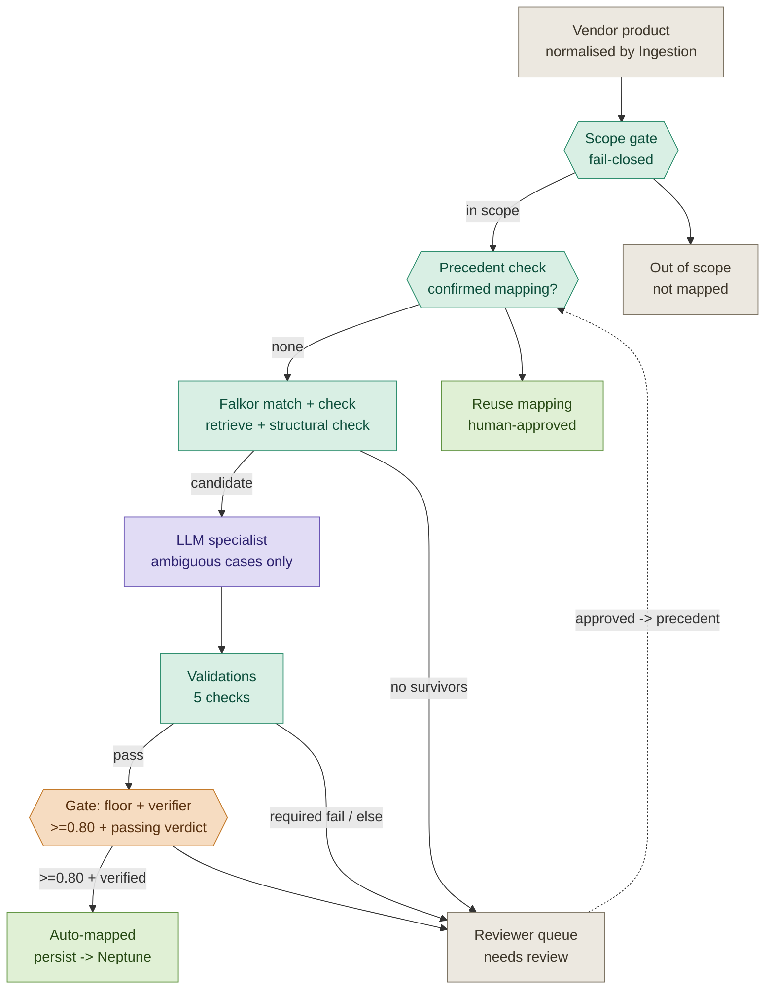

# Diagram 1 — Main mapping flow

> **SUPERSEDED — 2026-06-10**
>
> This diagram has been superseded by the canonical architecture set under `docs/architecture/`:
>
> - **`docs/architecture/scudo-overview.mmd`** — replaces the end-to-end mapping flow shown below
> - **`docs/architecture/scudo-architecture/scudo-match-verify.mmd`** — replaces the Match&Verify-specific portion (Falkor + LLM specialist + gate)
>
> The new diagrams reflect the decision to **adopt the FalkorDB GraphRAG-SDK** (vector + fulltext + cypher + relationship expansion + cosine rerank) rather than building the retrieval primitives ourselves. The trust gradient (Ingestion / Match&Verify / Persistence) and the I5 gate are unchanged.
>
> Content below is retained as historical context only. Do not edit.
>
> ---

Canonical end-to-end shape of a single mapping decision. The cost ladder runs left-to-right; first rung that can settle the case wins, the LLM specialist runs only on the narrow ambiguous window, and the reviewer queue closes the loop back into precedents.

## Reading the diagram against the code

| Diagram element | Code location | Notes |
|---|---|---|
| Scope gate | `frames.check_scope` (rung 1 of `matching.map_vendor_product`) | Deterministic; LLM never gets a vote (I3) |
| Precedent check / reuse | `store.get_precedent_mapping` (rung 2) | Confirmed-only; provisional edges filtered |
| Falkor match + check | `store.find_similar_products` (rung 3) | See Diagram 2 for internals |
| LLM specialist | `specialist` kwarg on `map_vendor_product` (rung 4) | Per-call DI; default `None`. Runs ONLY in the borderline window |
| Validations | `validations.run_validations` + `required_failures` | Required-fail forces NEEDS_REVIEW even at high similarity (I6) |
| Gate | `matching.map_vendor_product` rung 5 | Three bands: PASS / BORDERLINE / FAIL — see `MappingResult.band` |
| Auto-mapped → Neptune | `persistence_mcp.commit_mapping` | **Currently intercepted by I5** — agent-driven AUTO_MAPPED goes to reviewer queue. Lift gated by [i5-lift-preconditions.md](i5-lift-preconditions.md) |
| Reviewer queue | `persistence_mcp._REVIEWER_QUEUE` | Approved → `feedback.apply_decision` writes precedent edge |

## "Auto-mapped → Neptune" is aspirational today

The arrow from Gate to `AutoMapped → persist → Neptune` is what the cost ladder *would* do without I5. Today, `persist.commit_mapping` refuses agent-driven `AUTO_MAPPED` verdicts and routes them to the reviewer queue. The reviewer is the universal verifier of last resort; the diagram's autonomous-persist arrow becomes live only once the preconditions in [i5-lift-preconditions.md](i5-lift-preconditions.md) are met, evidenced, and signed off.
