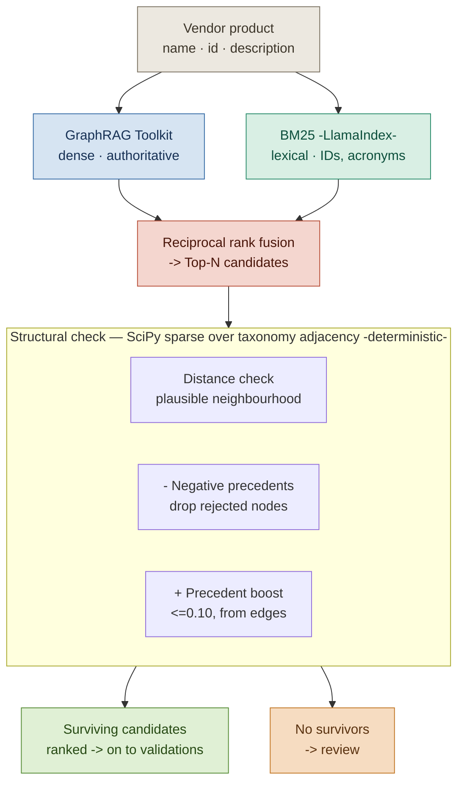

# Diagram 2 — Inside the Falkor match + check

> **SUPERSEDED — 2026-06-10**
>
> This diagram has been superseded by:
>
> - **`docs/architecture/scudo-retrieval.mmd`** — the canonical retrieval-internals diagram
>
> Specifically, the v0.2 "Inside the Falkor match+check" content shown below — the Jaro-Winkler dense-arm stand-in, the pure-Python BM25 sidecar, and the Reciprocal Rank Fusion (RRF) step — is superseded by the **FalkorDB GraphRAG-SDK multi-path adoption** (vector + fulltext + cypher + relationship expansion + cosine rerank). The SCUDO-specific structural pass (precedent boost, negative-precedent drop, distance check) plugs into the SDK as swappable strategies. The trust gradient and the I5 gate are unchanged.
>
> Content below is retained as historical context only. Do not edit.
>
> ---

What rung 3 of the cost ladder does. Dense and lexical retrieval arms fuse via RRF; the structural pass drops rejected nodes, tilts toward precedents, and (when the anchor data exists) bounds candidates by taxonomy distance.

> The structural ranking also cross-checks the LLM output downstream — disagreement caps confidence (see [diagram-1-main-flow.md](diagram-1-main-flow.md) and `matching.map_vendor_product` borderline-disagreement branch).

## What lives where — production targets vs today's stand-ins

| Box | Production target | Today | Where it lives |
|---|---|---|---|
| Dense arm | AWS GraphRAG Toolkit vector index (Titan v2 / equivalent embeddings) via `CALL db.idx.vector.queryNodes` | Pure-Python Jaro-Winkler over taxonomy labels | `store.falkordb_store._jaro_winkler` |
| Lexical arm | LlamaIndex `BM25Retriever` (or FalkorDB-native full-text index) | Pure-Python BM25 | `RetrievalStore.bm25_scores` (`store/base.py`) |
| RRF | Same | RRF k=60 | `RetrievalStore.reciprocal_rank_fusion` (`store/base.py`) |
| Distance check | SciPy sparse adjacency BFS / shortest-path against an anchor | **Not implemented** — deferred until anchor data exists (see warm-up phase) | — |
| Negative precedents | Same | Implemented in seam | `FalkorDBStore.find_similar_products` + `FakeStore.find_similar_products` |
| Precedent boost (≤+0.10) | Same | Implemented in seam — applied to SORT KEY only, never to `Candidate.similarity` | `RetrievalStore.compute_rank_boost` |

## The dense / floor coupling

`Candidate.similarity` is the **dense-arm** score (Jaro-Winkler today, embeddings later). The 0.80 floor and the band half-width are calibrated against this distribution. **The dense-arm swap (Titan) and the recalibration are one operation** — swapping character similarity for semantic embeddings changes the quantity the floor measures, so the 0.80 and the bands must be re-derived against a golden set at the same time. See [i5-lift-preconditions.md §4.2](i5-lift-preconditions.md).

## RRF is sort-only

RRF fuses dense rank with BM25 rank to drive the SORT order, so lexical hits (RICs, tickers, ISINs) surface into the top-N. It does **not** replace dense as similarity. If a lexical-strong, semantic-weak candidate sorts to the top, the floor still sees the low dense score and routes the case to NEEDS_REVIEW (correctly). Recall lift without precision loss.

## Distance check — why deferred

The distance check needs an anchor. The candidates are:

- (a) The parent path of any precedent for the same `(vendor, signature)`.
- (b) The nearest ancestor with any confirmed precedent across all vendors.
- (c) A per-vendor class baseline derived from data_class tags.

In the warm-up phase, (a) and (b) abstain (no precedents yet) and (c) is inert (CDAO seed carries no class tags). The implementation will use the tightest-available fallback `a → b → c`, contribute distance as a soft signal into the confidence cap when an anchor resolves, and never hard-drop until the underlying data is real.
