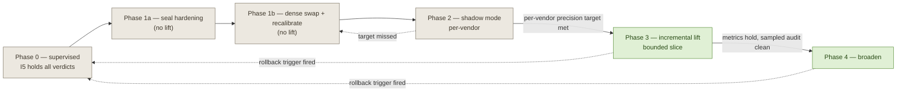

# I5 Lift — Preconditions for Autonomous Canonical Writes

| Field | Value |
|---|---|
| Status | Draft for review — owners must be named before circulation to any governance forum |
| Scope | SCUDO mapping, five priority vendors (LSEG, S&P Global, Bloomberg, ICE, FactSet) |
| Accountable Owner | _[TBC — JPMC MD, SCUDO programme]_ |
| Technology Owner | _[TBC — JPMC ED, Data Platform / Neptune SoR]_ |
| Control Steward | _[TBC — JPMC, aligned to Firmwide Model Risk Governance]_ |
| Delivery partner | Cognizant (does not own this control) |
| Model Inventory Tier | _[TBC — to be assigned by MRGR on registration]_ |
| GRC Control ID | _[TBC]_ |
| Version | 0.2 |

## 1. What this gates

Invariant **I5** stops the system writing to the canonical store (Amazon Neptune — the system-of-record graph for enriched mappings) without a human. Every mapping verdict, including `AUTO_MAPPED`, is intercepted by the Persistence MCP (the only component permitted to write) and routed to the reviewer queue. Nothing reaches Neptune until a reviewer approves it.

This document states what must be true before I5 can be lifted: that is, before a sealed PASS-band verdict (`sealed_band == "pass"`) is allowed to become a direct-write trigger and persist to Neptune without review.

It is a gate, not a plan. Nothing below is scheduled here. **These are preconditions — lift cannot happen until all of them hold, evidenced and signed off.**

### 1.1 What this does NOT gate

The following remain governed by their own controls and are unchanged by I5 lift:

- **M6 bundle imports** (bulk seed of confirmed precedents). Out of scope for I5 lift; remain supervised under a separate signed-manifest + reviewer-approval control _[TBC: name the control]_, persisted via a distinct code path that does **not** consult `sealed_band`.
- **HITL writes via `record_decision`.** The reviewer-queue path is unaffected and remains the route for everything below PASS, or whenever any precondition is unmet.
- **Out-of-scope vendors.** The deterministic scope gate continues to fail-closed; I5 lift does not relax I3.
- **All BORDERLINE and FAIL verdicts** continue to route through the reviewer queue.

## 2. The substitution being closed

The matcher's confidence gate has three bands, decided on the dense similarity score relative to the floor and a half-width:

- **PASS** (`sim >= floor + half`): auto-maps with **no model in the loop**.
- **BORDERLINE** (within `± half` of the floor): the LLM specialist is consulted.
- **FAIL** (below, or a required validation fails): goes to review.

The PASS band has no semantic check today — it is decided on similarity alone. This is safe only because I5 routes every verdict through the reviewer queue. **The reviewer is the safety net, not a "universal verifier".** Reviewers do not refute; they take one of three actions: **approve** the matcher's pick, **override** to a different node, or **reject** with no mapping. The substitution at lift is therefore not "human-verifier → machine-verifier" but "human-with-override-capability → machine-without-override-capability". This re-frames Path A: a refute/concur model is necessary but **not sufficient** if it cannot supply an override candidate when it disagrees.

The moment I5 lifts and a sealed PASS becomes a direct write, the reviewer's safety net is gone. Closing that gap is the central decision of lift, not an afterthought.

## 3. The decision that must be made at lift

The hard preconditions in §4 hold either way. The choice is **what replaces the reviewer** on the PASS band:

### Path A — universal verifier on PASS (recommended)

A cheap LLM refute-check runs on every PASS verdict before it can auto-persist. The verifier produces a **second seal under a separate key**; Persistence requires both seals present, both valid, and cross-bound to the same `input_hash + mapped_node_iri` before any autonomous write. The verifier must be able to supply an alternative candidate on disagreement (the override-capability the reviewer had); a yea/nay refuter alone does not replace the human.

Adds latency to the common case; closes the substitution directly.

### Path B — similarity-only autonomous writes

No semantic check; PASS is trusted on calibrated similarity alone. Defensible only when **every** precondition in §4 is met **and** the per-vendor auto-persist precision target (§7) is met with statistical confidence on a held-out golden set **and** the audit-back loop (§4.5) is operating with documented integrity. Path B is not a shortcut: it trades the verifier for stricter reliance on calibration and audit, both of which become load-bearing under it.

### Path C — hybrid: auto-persist with sliding-cadence sampling

Persist sealed PASS autonomously; route a stratified random sample (rate set by `audit_sample_rate`) back through human review on a sliding cadence. Path C is **not a third route at lift** — it is **how the audit-back loop (§4.5) operates regardless of Path A or B**. If sampled review disagreement breaches a threshold, automatic rollback is triggered (§6).

### Recommendation

**Path A**, unless **all** of the following hold simultaneously:

1. Measured per-PASS verifier p95 latency exceeds the end-to-end SLO budget (§5.4), **and**
2. Per-vendor auto-persist precision on the held-out golden set is ≥ _[TBC: e.g. 99%]_ with a 95% confidence-interval lower bound also ≥ _[TBC: e.g. 98%]_, **and**
3. MRGR independent validation of the dense arm and calibration has signed off without findings.

If any of (1)–(3) fails, the answer is to **remain at I5 and redesign** — not to fall to Path B by default. This choice is itself a precondition of lift and is recorded in the evidence pack.

## 4. Hard preconditions

All must hold before lift; each requires evidence attached to the sign-off pack.

### 4.1 Dense arm is production-grade

The dense retrieval arm is real semantic embeddings (Titan v2 or equivalent), **not** the Jaro-Winkler character-similarity stand-in. Auto-persisting on a string-similarity stand-in is indefensible.

Evidence: model card (provider, version, hosting boundary, data residency); deployment manifest with pinned model version; integration tests against the production endpoint.

### 4.2 Floor and band widths calibrated against a golden set

The floor and `± half` width are derived from a labelled golden set, not guessed, and per-vendor auto-persist precision (§7) meets target. **The dense swap and the recalibration are one operation** — any calibration done against Jaro-Winkler is void the moment embeddings land.

#### 4.2.1 Golden set construction

- **Labelling authority.** Named JPMC role _[TBC]_. ≥2 independent labellers per item; disagreements adjudicated by a third labeller.
- **Taxonomy version pin.** Each label is valid against a specific CDAO snapshot ID. Re-label triggered on bump.
- **Inter-annotator agreement.** Cohen's κ ≥ 0.8 on a ≥20% double-labelled subset. Lower κ blocks lift.
- **Coverage.** ≥ _[TBC: e.g. 200]_ items per vendor, stratified across CDAO branches in proportion to live traffic, with explicit oversampling of the hard tail (low-similarity historical disagreements).
- **Hold-out.** ≥30% strict hold-out, never seen during floor selection or band tuning, used only for the final per-vendor precision report.
- **Provenance.** Golden set lives in a controlled-access store with versioning, labelled by JPMC personnel only; no Cognizant labelling on items that calibrate the autonomous-write decision (conflict of interest).

#### 4.2.2 Floor and band are independent events

The PASS-band threshold (sparse-ranker precision distribution) and the BORDERLINE half-width (LLM-specialist disagreement-cap effectiveness) are statistically independent. They are calibrated separately, against separate slices of the golden set, with separate target metrics.

### 4.3 Verdict seal is hardened (the IAM-and-key cluster)

The entire I5 gate trusts `sealed_status` and `sealed_band`. The signing-key trust model must be:

- **Key custody.** SSM Parameter Store or Secrets Manager (KMS-backed), scoped to the Match&Verify and Persistence task roles **only** — never readable by Ingestion or any operator role.
- **IRSA scoping verified.** No cluster-wide service account; no privileged debug sidecar can assume the M&V pod identity; no shared SA across MCPs. Evidence: IRSA configuration audit + cluster posture report.
- **Key rotation.** Documented rotation policy with maximum age _[TBC: e.g. 90 days]_, dual-control on rotation, and an overlap window during which both old and new keys verify.
- **Key access audit.** CloudTrail on the SSM/SM ARN; every `GetSecretValue` is logged, alerted on out-of-band access, and reviewed monthly.
- **Replay / freshness window.** `SCUDO_VERDICT_MAX_AGE_SECONDS` must be tightened from the current review-mediated default (300s) to a value appropriate for autonomous writes _[TBC: e.g. 60s]_. Pinned in the signed deploy manifest.
- **Supply chain.** Container images for M&V and Persistence are signed (Sigstore/Notary), with provenance attestation and a deploy-time policy gate that refuses unsigned images.
- **Rogue M&V operator.** Mitigated via dual-control on M&V deploys + the audit-back loop (§4.5) which provides independent reconciliation of every autonomous write.

### 4.4 Retrieval path is integration-tested against real stores

Fusion (dense + lexical + RRF + structural) and the persist gate are tested **end-to-end** against a real FalkorDB **and** a real Neptune cluster, not seam-tested only. Schema/contract tests run in CI for every M&V/Persistence change.

### 4.5 Per-decision audit-back loop exists with integrity

Every autonomous write is audited; the sealed verdict is retained; sampled review is operating.

- **Append-only audit store.** Separate IAM scope from Persistence; entries KMS-signed; automated reconciliation against Neptune writes (catches "wrote but didn't log" and "logged but didn't write").
- **Retention horizon ≥ regulatory minimum** _[TBC: e.g. 7 years]_.
- **Sampling.** Stratified random sample at rate `audit_sample_rate` (§7), with bias toward edge cases (PASS scores just above pass threshold, vendors with thin precedent volume, recent CDAO taxonomy changes).
- **Acting authority.** Named role _[TBC]_ owns the sampled-review queue and is empowered to call rollback (§6).
- **Integrity guarantee.** A compromised auditor must not be able to hide a bad write; reconciliation runs from an independent source.

### 4.6 Canonical taxonomy data quality evidenced

Every threshold, every calibration, every golden-set label is relative to the canonical taxonomy. If the taxonomy is broken, "calibrated" is meaningless.

- Documented DQ pass within _[TBC: 30]_ days of lift: duplicate detection, orphan check, deprecated-node sweep, hierarchy validation.
- Numeric DQ score above _[TBC]_; recalibration triggered if score drops post-lift.

### 4.7 Precedent edge integrity established

Precedents drive both the live matcher (precedent reuse, rank-signal tilt) and the calibration signal. Poisoned precedents poison both.

- All precedents created **before the dense swap** are re-scored under the new embeddings and either re-confirmed by a reviewer or quarantined.
- Documented precedent-audit sample shows < _[TBC]_% defect rate.
- Ageing/expiry policy exists (precedents older than _[TBC]_ require re-confirmation on next match).
- **Precedents created from auto-persisted decisions (post-lift) are tagged distinctly and are NOT used to recalibrate the floor.** Otherwise the model learns from its own writes and the calibration loop closes on itself.

### 4.8 Lift is a controlled rollout, not a flip

Phased per §5. Per-vendor lift, not aggregate. Reversible per §6.

### 4.9 Commercial and third-party control envelope refreshed

Lifting I5 moves Cognizant-delivered components from an advisory control category to an autonomous-write category against JPMC's system-of-record. Before lift:

- SoW amendment covering liability, indemnification, and change-control for autonomous-write components.
- Third-Party Risk Management classification refreshed (engagement risk tier likely changes).
- Operational Risk capital impact assessment performed; result attached to evidence pack.

### 4.10 LLM-in-the-loop classification

The Path A verifier and the BORDERLINE specialist are models under the Firmwide AI/ML Policy:

- Registered in the Model Inventory at Tier _[TBC]_; model cards on file.
- Independent validation report from MRM (second line).
- Prompts and decision-policy versioned, pinned in the deploy manifest, included in change-management for any change.
- Drift / regression suite runs on every model or prompt change.
- Vendor-version pin (no silent provider upgrades).

### 4.11 Governance sign-off

Lifting I5 is a control change governed by the JPMC Firmwide Model Risk Governance Framework (under SR 11-7) and the Firmwide AI/ML Risk Policy. Sign-off is required in parallel from the bodies enumerated in §10. No single engineer or LOB head can authorise lift.

### 4.12 Path A additional condition (required if Path A is chosen)

#### Verifier-on-PASS seam is live, with all of the following:

- **Separate seal.** Verifier produces an attestation under its own key, in its own SSM/Secrets Manager entry, scoped to **Verifier + Persistence task roles only — NOT readable by M&V**. Persistence requires both seals present, both valid, and cross-bound to the same `input_hash + mapped_node_iri` before any autonomous write.
- **Override capability.** The verifier may return an alternative candidate (mimicking the reviewer's override path); Persistence treats verifier-disagreement-with-alternative as a routed-to-queue verdict, not a refuted PASS.
- **Latency budget.** Per-PASS p95 ≤ _[TBC: e.g. 800ms]_; hard timeout _[TBC: e.g. 2000ms]_; end-to-end PASS-to-persist SLO _[TBC]_.
- **Fail-closed.** Timeout, 5xx, circuit-open, or any non-deterministic verifier response routes the verdict to the reviewer queue. Never auto-persist on a verifier failure.
- **Circuit breaker** with documented open/half-open policy.
- **Verifier MRGR registration.** As §4.10.

## 5. Lift sequence

| Phase | Entry criteria | Activities | Exit criteria | Decision-maker | Min duration |
|---|---|---|---|---|---|
| **0 — supervised (now)** | n/a | I5 holds every verdict; precedents accumulate via reviewer queue | n/a | n/a | n/a |
| **1a — seal hardening** | Decision to begin lift programme signed | §4.3 cluster: SSM/SM, IRSA scoping, key rotation, audit trail, replay window, image signing | All §4.3 evidence attached and independently reviewed | _[TBC: CISO delegate]_ | _[TBC]_ |
| **1b — dense swap + recalibrate** | §4.3 complete | Embeddings deployed; golden set built (§4.2.1); floor + band recalibrated; integration tests against real stores | §4.2 evidence attached; per-vendor precision evidenced against the hold-out; §4.4 integration tests green | _[TBC: MRGR delegate + Tech Owner]_ | _[TBC]_ |
| **2 — shadow mode (per vendor)** | §4.1, §4.2, §4.3, §4.4 complete | Compute the verdict that would auto-persist; still route through review; measure asymmetric metrics (§7) per vendor | Per-vendor auto-persist precision ≥ target with 95% CI lower bound ≥ target, sustained over `N` decisions (§7); no sealed-band integrity events | Accountable Owner + MRGR | _[TBC]_ per vendor |
| **3 — incremental lift** | Phase 2 exit met for ≥1 vendor; §4.5 (audit-back) live; §4.7 (precedent integrity) complete; Path A or Path B + Path C decision recorded | Lift for one vendor (or a high-confidence sub-band within a vendor) | Auto-persist precision sustained; sampled-audit defect rate below ceiling; no rollback triggers fired over window `M`; no dependency SLA breach | Accountable Owner + MRGR + LOB head | _[TBC]_ |
| **4 — broaden** | Phase 3 exit met | Lift further vendors incrementally, never as a single global switch | Per-vendor as above | Same as Phase 3 | per vendor |

### 5.1 Partial preconditions

If a precondition is partially met (e.g. calibration completes for 3/5 vendors; integration tests pass for FalkorDB but not Neptune; precedent re-confirmation done for 1 vendor), the default is **wait**. Per-vendor lift on a partial calibration requires (a) explicit MRGR sign-off naming the limitation and (b) the unmet preconditions tracked as conditions-of-lift with a closing date.

## 6. Rollback

### 6.1 Rollback triggers

Rollback to I5 (full reviewer-queue routing) is **automatic** on any of the following:

- Sampled-audit defect rate above _[TBC]_% over a rolling window of _[TBC]_ decisions.
- Auto-persist precision (measured against late-arriving human override / correction) drops below the target's lower CI bound.
- Any sealed-band integrity event (verify failure on a previously-accepted seal, key access anomaly, identity-binding mismatch).
- Any dependency SLA breach affecting M&V, the verifier seam, or Persistence beyond _[TBC]_ minutes.
- A taxonomy DQ score drop below the §4.6 threshold.
- A model drift / regression-suite breach on the dense arm or the verifier.

Rollback is also **manual** at any time, callable by any of: Accountable Owner, Technology Owner, MRGR, CISO delegate, on-call Persistence engineer.

### 6.2 Rollback effect

- **New verdicts.** Immediately route to reviewer queue; no new autonomous writes accepted.
- **Already-persisted auto-writes.** Are **not** automatically retracted. Sampled re-review of writes in the affected window is triggered; retraction is per-decision (§6.3).
- **Precedents derived from auto-persisted decisions.** Tagged for re-validation; not used as a calibration signal until re-confirmed.

### 6.3 Rollback semantics for persisted Neptune writes

Hard-delete from Neptune is **forbidden** (invalidates referential history for downstream consumers).

- Retraction is implemented as a **superseding edge** with `status = RETRACTED`, `retraction_reason`, and a back-reference to the retracting decision.
- Persistence MCP emits a `mapping.retracted` event on the same stream downstream consumers subscribe to, at-least-once contract, documented consumer SLA for honouring it _[TBC: SLA]_.
- **Cascading precedent invalidation.** Any precedent edge whose evidence chain includes a now-retracted PASS is itself flagged and excluded from rank-signal tilt and floor recalibration until re-confirmed.

## 7. Thresholds — JPMC to set

Replaces the symmetric "agreement" metric (which averages a critical false-positive against an inert false-negative) with two named asymmetric metrics, both per-vendor.

| Threshold | Used at | Target |
|---|---|---|
| **Auto-persist precision** `P(human approves | would-PASS)`, per vendor, hold-out only | Phase 2 → 3 gate; rollback trigger | _[TBC: e.g. ≥ 98%, with 95% CI lower bound ≥ 96%]_ |
| **Review-load delta** `P(would-PASS | human approves)`, per vendor | Informational throughput indicator only — **do not gate on this** | _[TBC]_ |
| **Sample size N** per vendor for Phase 2 evidence | Phase 2 entry / exit | Derived from target precision + expected PASS base rate via power analysis; floor _[TBC: e.g. ≥ 500]_ |
| **Audit sample rate** | Phase 3+ continuous | _[TBC: e.g. 5% stratified, with floor 100/day/vendor]_ |
| **Audit-defect-rate rollback ceiling** | Rollback trigger | _[TBC: e.g. > 1% over rolling 1000-decision window]_ |
| **Replay / freshness window** | `SCUDO_VERDICT_MAX_AGE_SECONDS` for autonomous writes | _[TBC: e.g. 60s]_ |
| **Path A verifier p95 latency** | Path A gate | _[TBC: e.g. ≤ 800ms]_ |
| **Path A verifier hard timeout** | Path A fail-closed | _[TBC: e.g. 2000ms]_ |
| **Cohen's κ on golden-set double-labelling** | Golden-set acceptance | ≥ 0.8 on ≥ 20% double-labelled subset |

### 7.1 Scale-out anticipation

These thresholds are set for the five-vendor slice. The ~695-vendor scale-out will re-litigate them. Stating that explicitly here avoids the fight later: the per-vendor structure of the metrics is designed so scale-out adds vendors without re-deriving the methodology.

## 8. Post-lift signals & review cadence

The lift is a hypothesis. Its falsification path must be defined.

- **Monitoring (minimum).** Per-vendor auto-persist precision (rolling); audit-defect rate; verifier latency and error rate; seal-verify failure rate; Neptune write success/error; precedent-edge integrity score.
- **Alarm-to-action map.** Each metric breach maps to a named action (page on-call, freeze further lift, automatic rollback). Documented in the runbook _[TBC: link]_.
- **+30 / +90-day post-lift review.** Accountable Owner convenes a post-lift review at +30 days and +90 days per vendor; standing agenda includes precision trend, audit defects, rollback events, downstream-consumer feedback. Outcome documented to GRC.
- **Annual recertification.** I5 lift is recertified annually as a control change; lapsed recertification triggers automatic rollback to I5.

## 9. Threat model — what the seal defends, and what it doesn't

| Threat | Defence | Residual |
|---|---|---|
| Forged verdict on the wire | HMAC seal verified by Persistence; identity-bound via `input_hash` | Key compromise (§4.3) |
| Replay across products | `input_hash` binding refuses identity-mismatched seals | None at protocol level |
| Replay of stale verdict | Freshness window (§7) | Window sizing trade-off |
| Status smuggling via verdict body | Persistence reads `sealed_status` from the payload, not the agent dict | None |
| Insider with M&V role | Dual-control on M&V deploys + audit-back loop reconciliation | Limited to one decision before reconciliation catches |
| Compromised CI/CD pipeline | Image signing + deploy-time policy gate | Out-of-band deploy by privileged operator |
| Compromised auditor | Independent reconciliation, append-only KMS-signed log | Coordinated insider attack across two roles |
| Verifier compromise (Path A) | Separate key + separate IAM scope + cross-binding to M&V seal | Same as M&V insider, on the verifier side |
| LLM hallucination on PASS (Path A) | Override-capable verifier; verifier-disagreement routes to queue | Verifier silent-agreement on a wrong PASS — caught by audit sampling |

## 10. Approving forums — sign-off matrix

Lift cannot proceed until all of the following have approved. Each sign-off is recorded in the GRC tool; dissent at any forum blocks lift.

| # | Forum | Why | Evidence required |
|---|---|---|---|
| 1 | Firmwide Model Risk Governance (MRGR / MRGRD) | LLM verifier + BORDERLINE specialist are models under JPMC model policy | Model cards, golden-set methodology, independent validation report |
| 2 | AI/ML Governance Council | Agentic system + foundation-model use in a decision path | LLM-in-the-loop classification, drift suite, prompt versioning |
| 3 | Data Risk Management | Canonical writes against SoR | DQ evidence (§4.6), precedent integrity (§4.7), retention policy |
| 4 | Architecture review (CTC) | Neptune write path, IRSA, three-MCP topology | Architecture pack, integration test evidence (§4.4) |
| 5 | Technology Controls / CISO delegate | IAM + key custody changes | Seal-hardening evidence (§4.3) |
| 6 | Third-Party Oversight | Cognizant code on the auto-persist path | Refreshed TPRM classification, SoW amendment (§4.9) |
| 7 | Compliance | Disclosure, records retention | Retention policy, downstream-consumer disclosure plan |
| 8 | LOB head (data domain) | Residual risk acceptance | Risk register entry |
| 9 | Accountable Owner | Programme-level go decision | All of the above attached |

### 10.1 Reversibility

Re-imposing I5 is **not** a symmetric control change. Any rollback trigger (§6.1) is unilateral and immediate. Programme-level pause is callable by Accountable Owner, Technology Owner, MRGR, or CISO delegate. Re-lifting after rollback requires the full sign-off matrix again, with root-cause analysis attached.

## 11. Disclosure to downstream consumers

Consumers of the canonical Neptune graph must be notified, before lift, that some entries are autonomously persisted. The notice must include:

- The marker on each edge that indicates autonomous vs HITL provenance (`provenance.decided_by = "auto"` vs a named reviewer).
- The retraction event semantics (§6.3).
- The audit-sampling cadence.

## 12. Regulatory frameworks referenced

- SR 11-7 (US Federal Reserve / OCC guidance on model risk management) — primary anchor.
- JPMC Firmwide Model Risk Governance Framework — implementation of SR 11-7.
- JPMC Firmwide AI/ML Risk Policy.
- DORA (EU Digital Operational Resilience Act) — relevant if any consumer of the canonical store is in scope.
- SS1/23 (Bank of England / PRA expectations for AI/ML in financial services) — relevant for UK operations.
- EU AI Act — relevance to be assessed during MRGR registration.

## 13. Glossary

| Term | Definition |
|---|---|
| **I5** | Invariant 5 — never auto-promote weak-oracle output; enforced today by Persistence MCP routing all agent-driven AUTO_MAPPED verdicts to the reviewer queue. |
| **SoR** | System of Record — here, Amazon Neptune. |
| **PASS / BORDERLINE / FAIL** | Verdict bands at the matcher gate. See §2. |
| **Sealed verdict / `sealed_band`** | HMAC-signed payload from Match&Verify; Persistence reads `sealed_status` and `sealed_band` from the payload, not from the agent's verdict dict. |
| **Path A / B / C** | The three options for replacing the reviewer on autonomous PASS persistence. See §3. |
| **Auto-persist precision** | `P(human approves | would-PASS)`, per vendor, on the golden-set hold-out. The gating metric. |
| **MRGR** | Firmwide Model Risk Governance — second-line model risk function, owner of SR 11-7 compliance. |
| **MRGRD** | Model Risk Governance & Reporting (department / process variant) — name confirmation TBD. |
| **TPRM** | Third-Party Risk Management. |
| **IRSA** | IAM Roles for Service Accounts — the EKS mechanism by which pod identity is granted IAM permissions. |
| **Override-capable** | A verifier that can return an alternative candidate, not just refute / concur. |

## 14. Open items (must close before circulation)

- [ ] Name Accountable Owner, Technology Owner, Control Steward.
- [ ] Fill all `[TBC]` placeholders (thresholds, retention windows, latency budgets, sample sizes).
- [ ] Confirm exact name of MRGR-aligned forum and MRGR control ID.
- [ ] Confirm whether the M6 bundle import control exists; if not, escalate.
- [ ] Confirm DORA / EU AI Act applicability.
- [ ] Attach SoW amendment status for §4.9.
- [ ] Link to runbook for §8 alarm-to-action map.

## 15. Document control

- v0.1 — initial draft.
- v0.2 — adversarial review incorporated: substitution re-framing, second-seal architecture, asymmetric calibration metrics, golden-set construction detail, Phase 1a/1b split, rollback semantics for Neptune writes, threat-model matrix, sign-off matrix, scale-out anticipation, Path C absorbed into audit-back loop, Cognizant commercial envelope.

## Related

- [Confidence bands & provenance (canonical)](/reference/matching-data-provenance.md)
- [HITL bands handover](/handovers/hitl-bands-2026-06-26.md)
